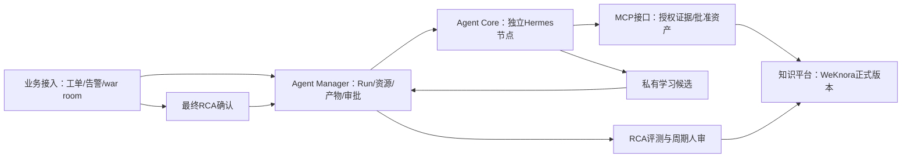

# Engine Hub 架构与后续工作入口

本轮集成：[PR #1](https://github.com/zcimon57-svj/hermes-webui-engine-hub/pull/1)；后续统一在此派生仓`main`继续，合并状态以PR为准。[提交/检查记录](../evidence/architecture-pr-submission-20261009.json)。

2026-10-09。五个一级模块固定为业务接入、Agent Manager、Agent Core、知识平台、MCP接口。本目录是当前架构说明；[目标与进度](../reviews/2026-10-09-reassessment/goals-progress-v2.md)、[结构化状态](../STATE.json)决定实现/验收状态。整体仍部分实现，文档合入不等于业务上线。

用户已确认：Hermes原生自进化采用简单受控改造，最终RCA门禁＋周期人审，外部项目仅参考；正式知识/Skill通过接口发布分发，各节点读取本地批准副本，不共享可写Home。用户本轮进一步授权该派生仓公开；旧PRIVATE要求和交付记录按历史时间解释，母仓不在公开范围内。

| 模块 | 当前职责与入口 |
|---|---|
| 业务接入 | [身份、业务范围、工单与RCA关联](business-access.md) |
| Agent Manager | [Run、节点路由、产物与审批状态](agent-manager.md) |
| Agent Core | [Hermes执行、私有状态、受控学习和本地Skill](agent-core.md) |
| 知识平台 | [WeKnora、批准版本、共享与撤回](knowledge-platform.md) |
| MCP接口 | [Agent取证/资产消费与服务API边界](mcp-interface.md) |

当前执行与隔离来自新增Engine Hub控制/交互层、真实Hermes Gateway、Bubblewrap与资源封装；原WebUI页面/API未整合，仅直接复用样式，见[源码归属](../reviews/2026-10-09-reassessment/isolation-implementation-analysis-v1.md)。本地ReferenceManager只用于开发合同验证，内部Manager接口及上线F30 NOT_RUN。

同引擎跨VM/容器的节点池、有限子任务、集中产物与迁移见[扩展分析](../reviews/2026-10-09-reassessment/multi-resource-routing-artifacts-v1.md)：仍为讨论建议，不把租约/汇聚等记为已实现，也不新引入外部框架。

下一步顺序：I01脚本管理凭据隔离 → I02真实同时双节点 → I03原生pending/RCA/实际评测/周期人审 → I04管理权限覆盖 → I05本地分类及多空间选择 → I06通用Skill/检索/状态适配。各项责任、通过条件和F11/F21/F30输入见目标文件。保持本机3GiB硬上限/2.5GiB高水位、0swap、192tasks和宿主准入，不自动恢复已停止资源。
