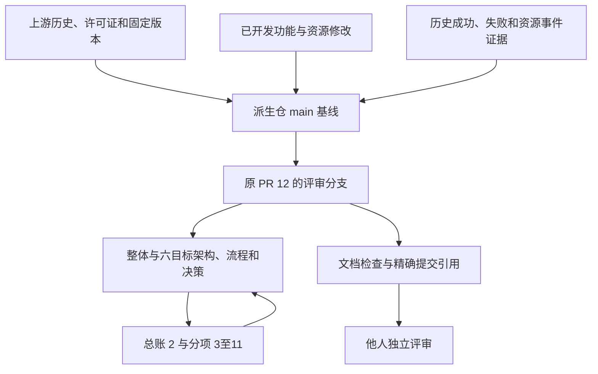
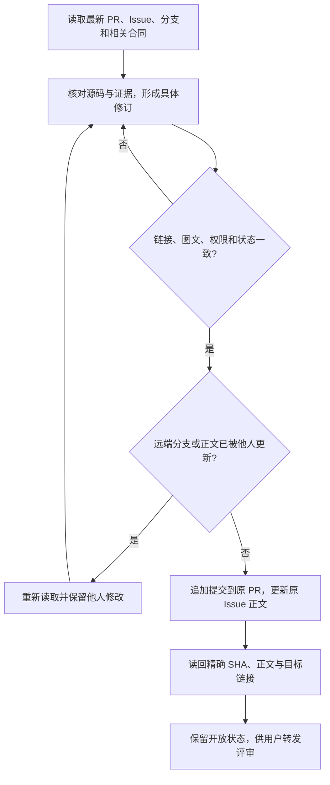
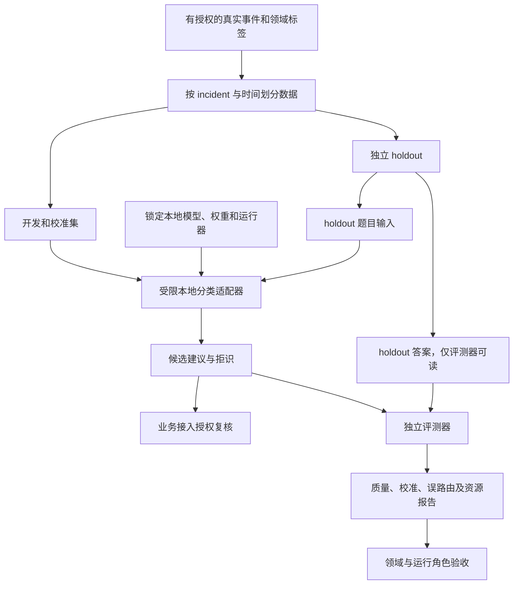
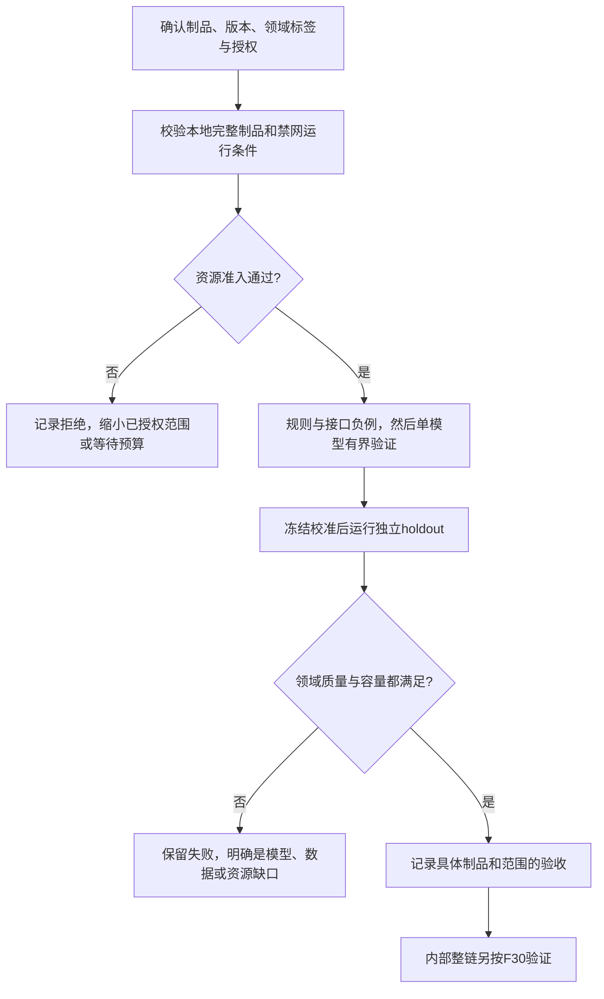
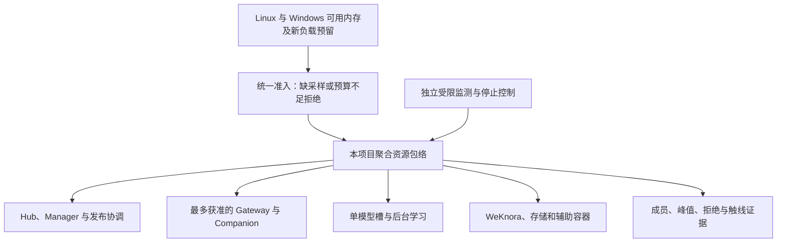
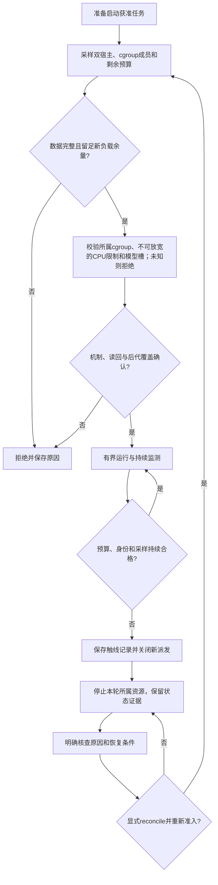

# 三项执行要求：交付、模型证据与资源预算

[评审入口](README.md) · [总账 #2](https://github.com/zcimon57-svj/hermes-webui-engine-hub/issues/2) · [决策表](decisions.md) · [验收矩阵](acceptance-matrix.md)

2026-10-09。本页约束 R01–R06 的实现和验收，不新增一级模块。当前状态分别保留 E01 已有交付、E02 历史真实 Luna 与本地生产分类待验、E03 事故补救后配置读回与真实新负载待验；图中的未来流程为待审执行方案。

## E01：可维护派生仓与可独立评审的交付

关联 [Issue #9](https://github.com/zcimon57-svj/hermes-webui-engine-hub/issues/9)、[PR #12](https://github.com/zcimon57-svj/hermes-webui-engine-hub/pull/12)、历史 F32。责任角色：仓库/文档维护者。当前记录 `DONE_VERIFIED` 指已有派生仓与交付历史，不等于六项目标已完成。2026-10-09 用户已授权公开；旧 PRIVATE 要求保留为历史记录，不能重新解释成当前必须私有。

### 交付对象与版本关系

[功能提交 cb17e336](https://github.com/zcimon57-svj/hermes-webui-engine-hub/commit/cb17e3364f58f4fbd53ccb2d78c82d39b4d38543)、[资源提交 ea1c9a01](https://github.com/zcimon57-svj/hermes-webui-engine-hub/commit/ea1c9a0144d9cd0ef4f2c479e30c1dfadebcabe1)与[已合入基线 6e6c4e89](https://github.com/zcimon57-svj/hermes-webui-engine-hub/commit/6e6c4e897c62078ff1f14f072abe3fd7d7c461b3)保留。PR #1 代表历史合入，不代表其他人已签收架构。原始版本锁、证据、失败记录与源码历史均不因本轮修文档被重写。

### 本轮与后续更新流程

应保存可追溯的基线、修改文件清单、PR/Issue 对应关系、文档验证结果和发布后的 SHA。分支链接方便持续评审，固定源码/提交链接用于复核事实；两者用途不同。评审资料里不加入凭据、私有宿主路径、实时会话数据库或无关项目内容。

| 决策 | 需要评审的内容 | 建议 |
|---|---|---|
| E01-D1 | 原 PR 与 Issue 如何避免重复或过时？ | 继续原 PR #12，Issue 正文自成一体；评审入口提供阅读顺序和双向链接 |
| E01-D2 | 哪些证据算交付、哪些算完成？ | 文档/提交验证与功能/领域验收分开，旧 PASS 保留版本和范围 |
| E01-D3 | 合同更新怎样让接手者看清？ | PR 列旧/新解释、修改依据与未决问题；不改变资源和已确认业务方向 |

| 验收ID | Given / When | Then / 所需证据 |
|---|---|---|
| E01-A1 | 已有原 PR 和他人可能更新；追加修订 | 使用最新头，保持父提交，不丢代码或他人正文；读回 SHA 和变更路径 |
| E01-A2 | 新评审者只打开 PR 或一个分项 Issue | 有目标背景、架构/流程、源码/证据、待决定问题和验收链接 |
| E01-A3 | 文档修订或后续合入 | 目标进度不会自动变 PASS，Issue不自动关闭，失败证据不改写 |
| E01-A4 | 当前公开仓库 | 历史/许可证保留；仅授权项目资料进入此次差异 |

状态、合并、评审人以 GitHub 现场为权威；本轮不自动合并、不请求或指定他人评审，用户自行转发链接。

## E02：真实模型证据与内部本地分类

关联 [Issue #10](https://github.com/zcimon57-svj/hermes-webui-engine-hub/issues/10)、[R02](r02-local-routing.md)、[R03](r03-native-evolution.md)、F06/F11。责任角色：Core/路由维护者、领域确认人、运行维护者。状态 `PAST_LUNA_TEST_DONE_LOCAL_PRODUCTION_CLASSIFIER_PENDING`。

### 验证对象与数据边界

现有证据是[真实 Luna 的 21 条合成分类题](../../evidence/luna-routing-20261008T152931.json)、[受限分类](../../evidence/luna-guarded-1791480044434422462.json)以及[Hermes/Luna/MCP 实际调用记录](../../evidence/luna-hermes-retry-run.json)。这些证明其版本和输入下发生过真实调用，不能证明本地生产分类已接入、真实故障诊断正确、学习收益通过或内部系统已上线。

原分类研究把 Jev 列为商业对照，把 Laya、GLiClass 等列为本地研究候选；当前没有最终型号/权重/运行器选择。不能将兼容接口等同于官方本地权重，不能从基础模型语言能力推导本域质量，不能替用户确认厂商的私有部署条件。候选研究中的旧预算按历史阅读，当前预算见 E03。

### 有界验证流程

| 评审问题 | 必须明确的内容 |
|---|---|
| E02-D1 制品选择 | 模型、底座/adapter、tokenizer、校准文件、运行器、平台及各自hash；转换后重新登记 |
| E02-D2 领域质量 | engine和space分别评估；误路由、拒识覆盖、校准、中文/混合语、长文、同引擎多实例；阈值由领域确认 |
| E02-D3 数据与真值 | incident/时间split、RCA确认与纠正版本、holdout不能回流选参或被受测Agent工具读到 |
| E02-D4 运行代价 | 冷加载与热请求峰值、线程/任务数、p50/p95、超时/取消/拒绝；后台学习同计预算 |

| 验收ID | Given / When | Then / 所需证据 |
|---|---|---|
| E02-A1 | 冻结离线制品；网络不可用 | 可从本地校验后运行，不自动下载或外发fallback；记录完整版本 |
| E02-A2 | 同引擎多实例、未知/歧义、无权及追问冲突 | 只建议授权候选；缺正确答案能拒识，业务接入再次校验 |
| E02-A3 | 真实领域数据和独立holdout | 报告质量/校准/高置信错误，不能仅报JSON格式或21题准确率 |
| E02-A4 | 冷启动、并发请求、取消和服务失败 | 记录资源峰值、拒绝/停止和回收，不能因测试方便放宽E03 |
| E02-A5 | 学习候选待晋升 | 实际评测执行有回执，RCA/候选/基线/人审绑定，布尔标记不能代替F11 |

缺数据或制品时，模型/领域项目继续待验；规则、协议、权限、离线制品校验和评测执行器等可推进工作分别列在对应 Issue，不统称缺环境。

## E03：资源不能打满，准入和运行约束共同生效

关联 [Issue #11](https://github.com/zcimon57-svj/hermes-webui-engine-hub/issues/11)、[R05](r05-multi-node-and-artifacts.md)、[资源源码](https://github.com/zcimon57-svj/hermes-webui-engine-hub/blob/6e6c4e897c62078ff1f14f072abe3fd7d7c461b3/engine_hub/resources.py)、F03/F19。责任角色：执行与运行维护者。状态 `INITIAL_FAILURE_REMEDIATED_PROTECTION_VERIFIED` 是历史事件和补救记录；真实双节点、本地模型、后台学习组合容量仍未验。

### 当前配置、运行对象与未验边界

| 项目 | 当前源码/历史读回口径 | 如何理解 |
|---|---|---|
| 聚合 memory.max | 3 GiB | 本轮所属服务、模型、容器及子进程共同计入；不是每节点各3GiB |
| memory.high | 2.5 GiB | 内核回收/节流阈值；项目watcher另行检测并停止，不能把high本身说成自动杀进程 |
| swap 与 pids/tasks | 0 swap、192 tasks | 不靠swap或无限线程提高通过率，子进程也在包络中 |
| CPU | 历史机制为单核亲和性；CPU controller未委派 | CPU放置约束，不是cpu.max带宽配额；不可由负载放宽的CPU启动门禁尚未实现/验收，不能据此恢复运行 |
| 双宿主预留 | Linux至少2GiB、Windows至少2GiB，外加本次负载预留 | 任一采样失败或余量不足均拒绝新工作 |
| 节点与模型并发 | 自动路径单热Gateway；手工最多两个仍须准入；模型生成单槽 | 同时两节点的重叠Run不要求两个模型调用同时生成；不能据配置就算容量验收 |
| 监测与触线 | 持续采样、记录原因、停止所属资源、显式reconcile | 历史停止证据不代表本轮探测了用户机器现况；不自动重启 |

原记录见[资源诊断](../../evidence/resource-diagnosis-20261009.json)、[Windows 资源核对](../../evidence/windows-resource-audit-20261009.json)与[v3已应用配置](../../reviews/2026-10-09-reassessment/resource-budget-v3-applied.json)。旧 F03 的 1 GiB 为历史范围，新 v3 的空组读回没有执行双节点/模型峰值。机制依据见[官方资源文档核查](research.md#sources-cgroup)。

### CPU 启动门禁：负载不能自行扩大预算

**防止负载解除CPU约束是启动先决条件，不是可选加固。** 启动节点、模型、学习作业或可执行 Skill 前，可信启动器必须核验本项目聚合CPU上限及所有后代的限制；工作负载不得修改约束、迁入更宽松的cgroup或借容器/子进程绕过。仅 `taskset`/继承 affinity、清理 capability 或事后 watcher 都不足：进程可修改自身亲和性，轮询停止之前仍可能扩大用核。

机制可以复用实际生效的 `cpu.max` 聚合带宽配额，或受保护的单逻辑CPU `cpuset`；后者限制可运行CPU集合，不能描述为带宽配额。若宿主未委派这些控制器，只能在可信沙箱确实禁止放宽CPU集合、改变限制或逃离资源包络，且覆盖线程、后代和所有执行入口后，采用经过独立验收的等效限制；不能默认把当前 affinity 降级路径视为该证明。不得为此擅改 Windows/WSL 全局配置。

机制不可用、无法读回或权限/后代覆盖未知时，拒绝相应运行启动并记录 `cpu_containment_unverified`；保留已有数据与 trip，不靠降低监测间隔或先启动再杀来通过准入。当前该门禁仍为待实现/待验证，服务继续停止。文档/源码核对可使用独立限时、限内存、单核的轻量过程，不启动受测业务负载，也不能作为运行门禁已通过的证据。

### 启动、运行、触线与恢复流程

不得停止无关任务、修改 Windows/WSL 全局设置、清空全局缓存或扩大包络来让测试通过。跨 VM 时，本地 flock 只约束一个宿主；需要 Manager 的全局模型/任务预算加各 host 的硬限制，两层分别验收。

| 决策 | 需要评审的内容 | 建议 |
|---|---|---|
| E03-D1 | 双节点与分类/学习阶段怎样安排？ | 先测可容纳的最小组合，每次记录预留和峰值；达不到即拒绝，不默认启动全部六节点 |
| E03-D2 | 怎样落实不可由负载放宽的CPU启动门禁？ | 必须验证实际聚合限制和后代覆盖；cpu.max、受保护cpuset或独立验收的等效沙箱择一落实，单纯affinity不合格，未知即拒绝 |
| E03-D3 | 触线后谁对账和恢复？ | Manager/运行维护者按持久原因显式reconcile，校验未决Run，不自动重发或恢复 |

| 验收ID | Given / When | Then / 所需证据 |
|---|---|---|
| E03-A1 | 宿主采样缺失、预算不足、已有资源压力 | 启动拒绝，有可追溯原因，不改变全局资源配置 |
| E03-A2 | 获准双节点或单模型有界运行 | 所有所属进程/容器/后代确实计入包络；记录真实并发时间与峰值 |
| E03-A3 | 在受控测试中触线、取消或失败 | 关闭新派发、保存原因、停止所属对象、保留未决状态和证据 |
| E03-A4 | 触线后重启或新请求 | 未显式reconcile前不自动恢复；未知副作用先核查 |
| E03-A5 | 跨host扩展 | 全局预算和各host限制都验证，本机flock不能冒充全局互斥 |
| E03-A6 | CPU机制缺失、读回失败、权限或后代限制未知 | 启动被拒绝并记录cpu_containment_unverified；未先启动节点/模型/脚本，不修改全局设置 |
| E03-A7 | 隔离测试宿主已有外层硬限制；线程、子进程及容器入口尝试放宽affinity、改限制或迁移cgroup | 内层限制不可扩大、后代仍在聚合预算；监测失效不解除硬限制，取消后受管进程回收；记录内核读回、成员与峰值，不能仅观察watcher最终停止 |

本轮没有启动模型、节点或容器，没有核查用户宿主最新空闲量；此次完成的是评审材料、来源和代码语义核对。
