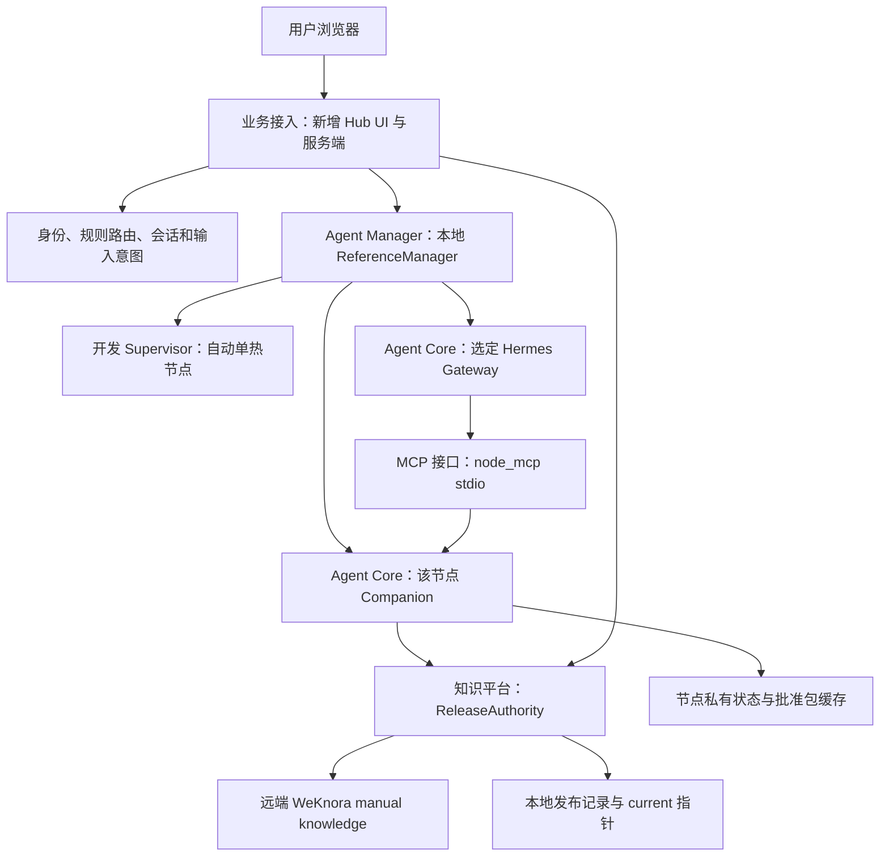
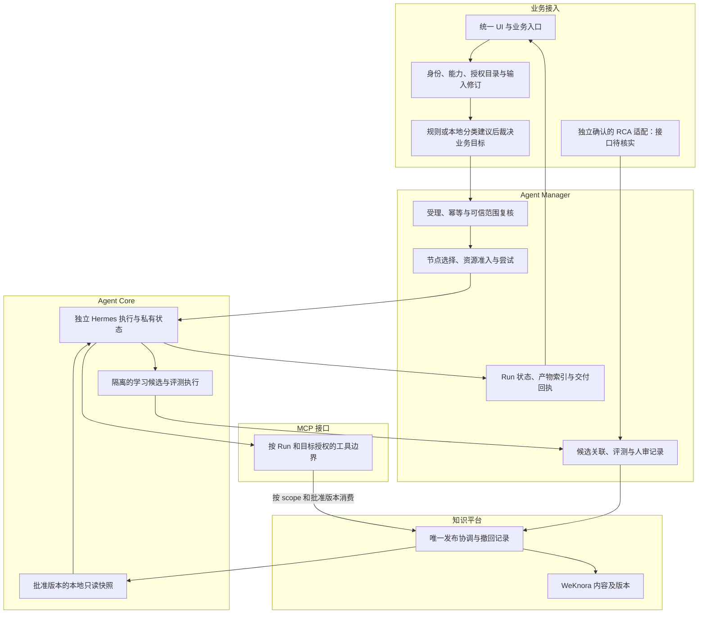
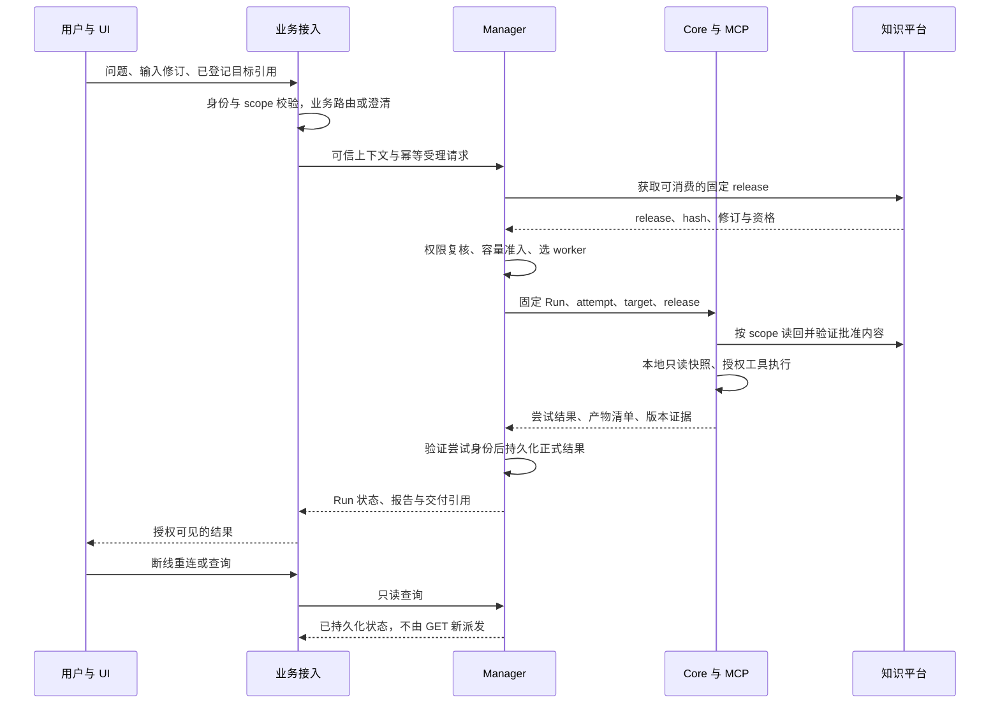
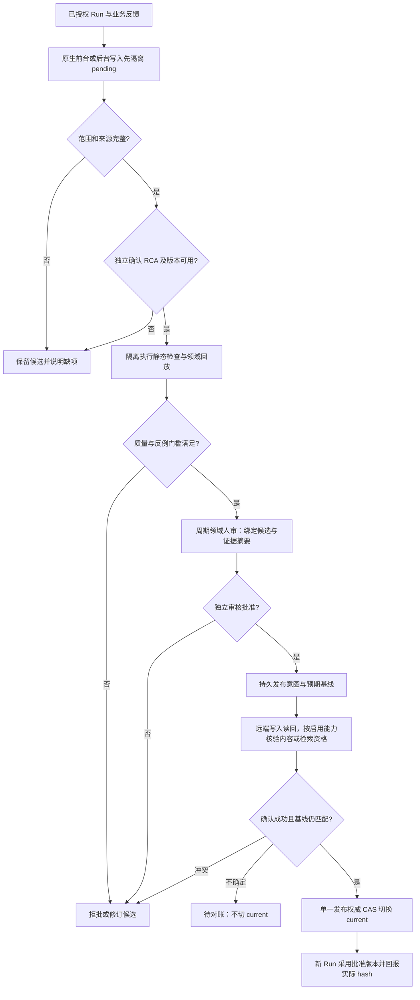

# 系统整体架构、状态权威与端到端流程

[评审入口](README.md) · [PR #12](https://github.com/zcimon57-svj/hermes-webui-engine-hub/pull/12) · [总账 #2](https://github.com/zcimon57-svj/hermes-webui-engine-hub/issues/2) · [审查发现](review-findings.md) · [决策表](decisions.md) · [验收矩阵](acceptance-matrix.md)

**文档状态：待独立评审的设计补充，2026-10-09。** 代码事实以公开主线 `6e6c4e897c62078ff1f14f072abe3fd7d7c461b3` 为基线，原 PR 文档头为 `faf6321077067da1585fb40a71c0d420bab5ee01`。本页中的“目标”“建议”“拟议字段”均不是已交付能力。总体仍为 `PARTIAL_IMPLEMENTATION_NOT_FULL_ACCEPTANCE`。旧实验与本轮静态审查见[证据解释](acceptance-matrix.md#evidence-levels)。

## 1. 评审对象与业务场景

Engine Hub 的目标是让同一入口服务四种数据库引擎的诊断、知识消费和受控学习：用户提供问题、工单或登记实例；系统先确定有权访问的业务目标，再选择可执行的 Hermes 节点；结果回到同一会话及业务入口。经确认根因、实际评测和领域人审的成果可以在同引擎的授权范围内复用。

一个具体例子：用户对登记的 PG 实例提交锁等待问题，路由确定其项目、空间和目标实例；Manager 选择有相应工具能力的 PG worker，固定批准的知识/Skill 版本；该节点经 MCP 读取授权证据并生成报告。后续追问仍使用原业务上下文；如果用户改问同引擎另一个实例，必须检测绑定冲突。工单结束后得到的最终 RCA 只进入独立评测依据，不因 Agent 已生成报告而自动成为真值或正式知识。

| 术语 | 含义及边界 |
|---|---|
| engine | MySQL、PG、Cassandra、Redis 等逻辑引擎类别，不是物理机器 |
| project / space | 项目与授权知识/会话空间；当前实现只有部分 engine/space 检查，完整项目维度待补 |
| target instance / resource | 被诊断的业务资源；不能从 worker 地址或引擎名称推导其身份 |
| worker node | Hermes 执行位置；换 worker 不得改变 target、owner、权限和批准版本 |
| conversation / input revision | 用户会话与一次输入修订；同一可信输入修订用于幂等受理 |
| business Run / attempt | Manager 所有的业务执行与尝试；当前代码的 `id`、`attempt` 不代表跨主机代际协议已完成 |
| release / native revision / hash | Hub 联合发布版本、WeKnora 内容修订、内容摘要，三个身份不能互换 |
| RCA | 经责任角色独立确认的最终根因记录；内部来源目前只有用户报告，实际接口、字段和真值尚未读取 |

## 2. 已确认方向与本次待审范围

已确认的一级模块只有五个：**业务接入、Agent Manager、Agent Core、知识平台、MCP 接口**。WebUI 是业务接入的交互面；评测器、发布协调器和节点伴随组件是相应模块的内部职责，不据此新增必需平台或外部框架。

已确认的约束是：保留现有 Manager、Hermes 与 WeKnora；原生学习经私有候选、确认 RCA、内部评测和周期人审后发布；外部进化/评测项目仅参考；批准资产按接口分发，各节点独立保存本地副本和私有状态；生产分类优先内部可部署的本地模型；保留上游历史、已有代码和失败证据；严格遵守资源包络。

本次要评审的是边界与实现合同是否足以满足这些要求，包括可信 scope 如何跨模块传递、脚本怎样与管理权限隔离、读请求怎样保持只读、候选如何不能提前生效、远端发布异常如何恢复，以及各项完成需要什么证据。具体型号、内部字段、容量和阈值不在资料中凭空定案。

## 3. 当前实现图：哪些进程和链路确实存在

下图依据 [service.py](https://github.com/zcimon57-svj/hermes-webui-engine-hub/blob/6e6c4e897c62078ff1f14f072abe3fd7d7c461b3/engine_hub/service.py#L10-L31)、[Manager](https://github.com/zcimon57-svj/hermes-webui-engine-hub/blob/6e6c4e897c62078ff1f14f072abe3fd7d7c461b3/engine_hub/manager.py) 与[伴随组件](https://github.com/zcimon57-svj/hermes-webui-engine-hub/blob/6e6c4e897c62078ff1f14f072abe3fd7d7c461b3/engine_hub/companion.py)。箭头表示当前调用，不表示已经通过全部权限或故障验收。

当前 Hub 是新增的入口与控制层，直接复用上游样式及 Hermes Gateway 执行能力，尚未完整接入原 WebUI 的 Profile、配置、SSO 和工作区交互。原根 `server.py` / `api/` 的上游能力不能被算作 Hub 已继承。[归属核对](../../reviews/2026-10-09-reassessment/isolation-implementation-analysis-v1.md)保留了这一事实。

当前存储采用各服务的 `Store` / SQLite，见 [common.py](https://github.com/zcimon57-svj/hermes-webui-engine-hub/blob/6e6c4e897c62078ff1f14f072abe3fd7d7c461b3/engine_hub/common.py#L62-L106)。它支撑本地开发记录，不是内部持久化、跨主机高可用或分布式事务已经成立的证据。内部 Manager 仍未接入；当前 ReferenceManager 必须显式标识其替身性质。

## 4. 目标架构图：五模块与权限边界

这是待审的职责图，不是部署数量图。首期可以保留轻量进程和已有存储；只有必须分离的执行身份/挂载边界需要落实，其他内部职责不要求各建一个微服务。

业务接入裁决“请求属于哪个已授权业务目标”；Manager 裁决“由哪个 worker、哪次 attempt 执行”，并在受理和派发时复核可信上下文；Core 执行固定上下文；MCP 服务在使用时复核目标和动作；知识平台只提供允许消费的批准内容。分类模型没有授权权力，节点密钥也不等于最终用户的对象权限。

## 5. 状态权威与持久数据

| 对象 | 唯一权威与写入者 | 当前实现及缺口 | 故障时的读取/恢复原则 |
|---|---|---|---|
| 用户、角色、能力与对象范围 | 业务接入的身份/授权层 | `auth.py` 与 Hub 用户记录；项目、管理列表及撤权覆盖不全 | 服务端重验；未知范围不能放行，UI 缓存不扩权 |
| 实例目录与业务路由 | 业务接入的受管目录及路由决策 | 登记实例、规则及 conversation 绑定已有；本地多空间分类未完成 | 记录目录/策略版本；冲突澄清，禁止默认落某引擎 |
| 输入意图与展示会话 | 业务接入 | `input_intents`、`conversations`、`run_refs` | 丢 UI 回执时读取已有 Manager 结果，不由读请求重发 |
| 业务 Run、attempt、取消和产物索引 | 一个 Manager | 本地 ReferenceManager 已有基础；内部协议、跨 VM 代际未验 | 受管恢复器处理未决写入；UI 只投影，旧尝试不能覆盖正式结果 |
| 原生执行会话、Memory、工作区 | 被指派的 Core 私有状态，明确唯一写者 | 节点目录已分开；脚本仍能继承 Companion 权限 | 恢复必要授权上下文，不复制完整 Home/凭据来迁移 |
| 正式知识与 Skill 内容 | WeKnora 远端内容 | 目前 manual knowledge 固定包适配 | 校验文档、修订、摘要与批准资格；索引就绪另验 |
| 联合 release/current/撤回 | 知识平台的单一 release coordinator | `assets.py` 在本地 SQLite 做指针 CAS | 远端写与本地事务分离，必须有发布意图和读回对账 |
| 候选、评测、人审依据 | Manager 关联记录与受管评测/审核身份；内容仍在知识平台或私有候选区 | 当前 `evaluate` 只接受 passed 标记 | 精确绑定候选 hash、RCA、数据/评测器、基线及审核权限 |
| Run 产物与业务交付 | Manager 索引与已有存储、业务系统回执 | 当前本地报告/摘要，不是跨 VM 产物服务或内部投递证明 | 结果存在、上传确认、回执确认分别记状态 |

**拟议字段规范。** 跨模块传递 `engine_id/project_id/space_id/owner_id/target_resource_ids`，以 `authorization_handle/policy_revision` 引用服务端确认的权限；Manager 补 `business_run_id/task_id（可选）/attempt_id/epoch/worker_node_id/worker_instance_id/input_revision/release_id/bundle_sha256`。现有代码仍使用 `engine/space/owner/node/id/attempt` 等字段。新字段是待审合同，需要明确适配和迁移，不能直接对当前 API 发这些字段并宣称兼容。

## 6. 正常问答、追问与结果恢复

追问先比较完整业务绑定。相同目标沿用已授权会话和节点策略；同引擎换实例、跨项目或切引擎触发冲突处理或新的安全会话。仅新建 conversation 不会隔离同一 Home 的原生 Memory；目标实现还需按 owner/project/space/目标资源解析获准 Memory，或建立真正隔离的执行状态，并验证旧 scope 的提示快照、工具上下文和工作区均不被加载。`input_revision` 相同但输入内容不同应冲突，不作为一次新工作静默执行。版本固定不代替后续撤权检查。

当前代码的读取链还有反例：Hub `run()` 最终调用 Manager `query()`，而 `refresh()` 在缺 `gateway_run` 时会派发。目标图中的只读语义尚需实施，见 [RF01](review-findings.md#rf01)。

## 7. 受控学习、评测与发布

评测题的输入只含诊断时可知信息，最终 RCA 和 holdout 答案仅给评测器；同一 incident 的不同告警、票据和多轮对话不能跨训练/校准/holdout 泄漏。一个经确认事件可产生有适用范围的案例；通用 Skill 仍需要反例与适用前提审查。

Hermes 锁定版本确有原生 write approval 接缝，但默认行为和失败路径不能满足本项目的全部约束；脚本、原生 `/approve`、后台任务、技能发现和检索都要进入统一的受管边界。[R03](r03-native-evolution.md)与[来源核对](research.md#sources-hermes-learning)说明具体差距。现有 UI 的 `passed=true` 不构成真实评测执行或领域质量证据。

发布不是跨服务原子事务。建议在现有协调层保留发布意图、固定 document ID/hash、状态和对账结果，远端未知时不盲目重发、不提前切指针；这是一种待审的轻量改造，不要求另上分布式事务框架。若新增问题驱动检索，还必须证明普通业务检索的候选集合、返回命中和 Agent 提示不会纳入未被本 Run 固定批准 manifest 覆盖的内容；远端孤立文档或索引物理存在不等于获准消费。内容读取与检索就绪按所启用能力分别验收。[R06](r06-assets-and-local-skills.md)详述缓存、索引就绪和发布可见性。

## 8. 故障、撤权与撤回

| 事件 | 建议处理与状态权威 | 不能据此做出的动作 |
|---|---|---|
| 无权限、未知实例或路由歧义 | 业务接入拒绝或澄清；保存非敏感原因 | 默认转某引擎、向模型提供无权候选 |
| worker 无容量或资源采样缺失 | Manager 保持未派发/拒绝原因 | 驱逐忙碌节点、放宽包络或改全局 WSL 配置 |
| 派发请求超时 | Manager 保存同一输入、目标和幂等身份，按已验证的接收方语义核查 | 无条件创建新 Run 或新副作用尝试 |
| 节点失联、结果晚到 | 当前实现不宣称自动跨机迁移；拟议 attempt/epoch 拒绝过期结果 | 旧 attempt 覆盖新结果、复制全 Home 到其他节点 |
| 用户取消或撤权 | 先持久化意图，关闭新工具/派发；已执行操作保留观察，输出资格重验 | 声称已撤销外部副作用或删除证据 |
| release 正常升级 | 新 Run 取新版本，在途 Run 保持固定版本 | 在途运行随 latest 漂移 |
| release 安全撤回、RCA 被纠正 | 暂停受影响的新消费，受管停止/复核在途操作与交付；保留历史 | 以固定版本为由继续绕过撤回 |
| WeKnora 拒绝、漂移或索引未就绪 | 返回明确失败/待就绪；权限与摘要合格后才消费 | 用旧缓存替代当前授权、把 publish 状态当检索已就绪 |

## 9. 实施与评审顺序

先评审并落实 R01/R04 的脚本执行身份、对象范围与纯读取语义，同时完成 [E03不可由负载放宽的CPU启动门禁](execution-requirements.md#cpu-admission-gate)，因为后续 Skill、学习和双节点验收都依赖它们。接着在既定预算内做真正的本机同时双节点场景，分别验证同引擎共享批准资产与私有状态隔离、跨引擎隔离。R02 本地分类、R03 受控学习和 R06 通用 Skill/检索按依赖分别推进；R03/R06发布须遵守[已发布内容保留规则](r06-assets-and-local-skills.md#immutable-published-content)。内部接口、真实领域数据和第二物理主机各自保留输入门槛，不把所有工作笼统标成“缺环境”。当前顺序同步到 STATE.next；更新规划不提高任何功能验收状态，不自动恢复运行。

资源事实是当前源码配置 3 GiB max、2.5 GiB high、0 swap、192 tasks 与单核亲和性；历史 F03 还是 1 GiB 的原范围记录。空 cgroup 读回不证明双节点加本地模型可以装下，CPU 亲和性也不等于 cgroup 带宽配额。[E03 Issue #11](https://github.com/zcimon57-svj/hermes-webui-engine-hub/issues/11)单独记录容量、拒绝和停止验收。

请从[决策表](decisions.md)选择需要确认的项，评论时写明目标/问题编号、认可或阻塞的具体理由、替代建议和关闭所需证据；架构认可、实现完成、领域验收分别记账。
