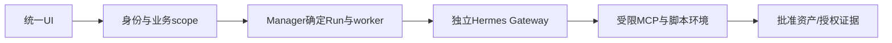

# R01 多引擎/节点隔离与统一入口

目标与进度：[Issue #3](https://github.com/zcimon57-svj/hermes-webui-engine-hub/issues/3)；[总账 #2](https://github.com/zcimon57-svj/hermes-webui-engine-hub/issues/2)。

状态：**待独立架构评审，未实施/未验收**。用户已确认的原则单独列出；详细接口、状态和验收边界由本PR评审。本轮不改运行代码、不引入外部进化/评测项目、不自动合并本PR。

## 目标和边界

一个UI进入授权引擎/项目/实例，独立节点的Home、工作区、凭据和运行互不越权。隔离分别覆盖业务/API、执行文件/进程和网络；共享内核/网络的限制必须可见，不能把Profile当安全租户。

## 当前代码与缺口

当前是新增Hub的身份/路由/页面，实际执行复用Hermes Gateway，启动层组合Bubblewrap。原WebUI完整Profile/SSO/文件浏览未接入。六节点串行测试存在，同时双节点未验；Companion脚本可见控制挂载是I01阻塞项。

## 拟议架构

- UI只提交业务问题/可信实例引用；后端构造scope，不接受任意节点URL、密钥或目录。
- 每worker独立Home/会话数据库、任务工作区、凭据；受管源码/正式Skill只读。私有状态不自动共享。
- 脚本执行从Companion管理身份剥离，仅挂载该Run允许的输入、批准包及临时输出；管理配置/发布密钥不进入脚本环境。
- 本地worker由独立进程与沙箱承载；跨VM/容器身份与网络边界单独验证。当前共享网络不被描述为强网络隔离。
- 发布资产通过受控接口分发为每节点副本；UI及节点均不能自主提升发布权限。

## 状态、恢复与审计

Run固定engine/space/owner、worker实例身份、输入修订和资产版本；后续请求按同一绑定校验。节点不可达、身份/版本漂移或资源不足应拒绝/记录，不静默落入默认引擎。工作区/进程隔离与API拒绝测试分别留证。

## 必须验收

- 跨引擎两节点及同引擎两节点同时运行，尝试读取/写入另一节点状态和管理凭据均拒绝。
- 单节点故障不改变另一节点身份/运行；取消/重启后的绑定与产物可追溯。
- 错误密钥、未授权scope、任意URL/路径参数、脚本越权负例保留。
- 保留共享内核/网络和每Issue隔离的NOT_RUN边界，不删失败场景。

## 评审问题

I01脚本沙箱最小输入/权限是否足够？统一UI需要继承哪些原WebUI能力，而不是只共用样式？跨VM网络与身份要求是否应单独设验收？

责任模块：业务接入、Agent Manager、Agent Core、MCP。先修I01，再完成I02。详见[源码归属](../../reviews/2026-10-09-reassessment/isolation-implementation-analysis-v1.md)。
