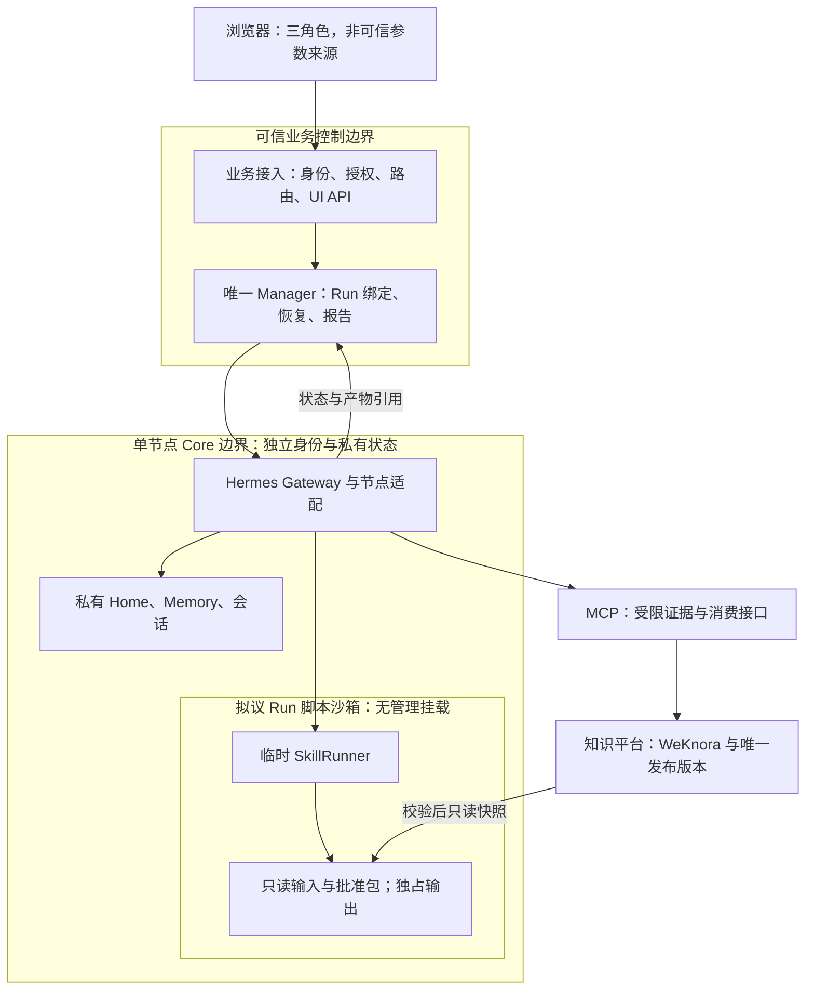
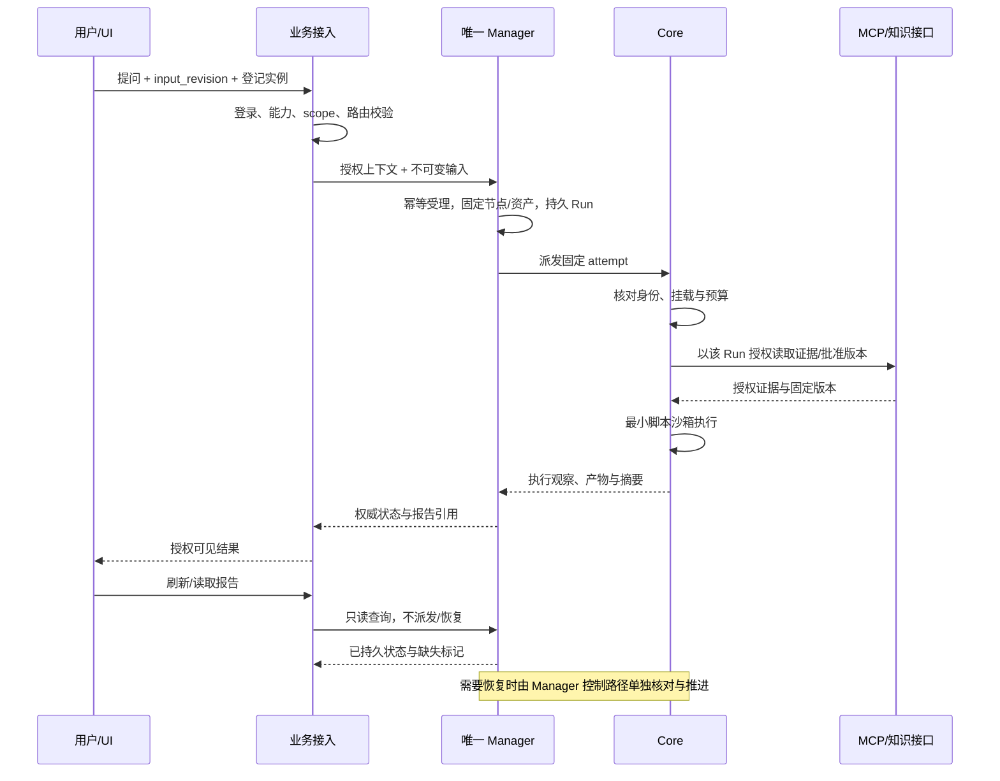

# R01 多引擎/节点隔离与统一入口：可独立评审设计

> **评审状态：PROPOSED；实现状态：PARTIAL_ISOLATION_NOT_ACCEPTED。** 本文补齐设计与代码依据，不表示方案已批准或新增验收已通过。2026-10-09 静态复核；未启动服务、模型、浏览器或越权攻击。已确认的五模块、三角色、单一业务 Manager 与私有状态隔离保持不变。

[评审入口](https://github.com/zcimon57-svj/hermes-webui-engine-hub/blob/docs/goal-architecture-review-20261009/engine_hub/architecture/goals/README.md) · [总设计](https://github.com/zcimon57-svj/hermes-webui-engine-hub/blob/docs/goal-architecture-review-20261009/engine_hub/architecture/goals/overview.md) · [决策表](https://github.com/zcimon57-svj/hermes-webui-engine-hub/blob/docs/goal-architecture-review-20261009/engine_hub/architecture/goals/decisions.md) · [依据](https://github.com/zcimon57-svj/hermes-webui-engine-hub/blob/docs/goal-architecture-review-20261009/engine_hub/architecture/goals/research.md) · [验收总表](https://github.com/zcimon57-svj/hermes-webui-engine-hub/blob/docs/goal-architecture-review-20261009/engine_hub/architecture/goals/acceptance-matrix.md) · [Issue #3](https://github.com/zcimon57-svj/hermes-webui-engine-hub/issues/3) · [PR #12](https://github.com/zcimon57-svj/hermes-webui-engine-hub/pull/12)

## 1. 用户要完成什么

同一位运维人员在一个入口处理 MySQL、PG、Cassandra、Redis 的问题。用户选业务实例或描述问题，界面展示其获准的会话、运行和报告；系统选择正确引擎及执行节点。用户不需要分别登录六个 Gateway，也不应通过切换 Profile 意外读取另一引擎或另一用户的状态。

一个具体场景：Chat 用户提交项目 A 的 PG 锁等待工单，Manager 将该输入修订绑定到 PG worker。追问继续同一业务会话；另一位用户同时处理 Cassandra 问题，两者的凭据、Memory、工作目录及取消操作相互独立。Viewer 打开共享报告只产生读取，不能因页面恢复而启动计算。批准 Skill 即使有缺陷，也不能利用执行它的进程读到节点管理密钥。

| 术语 | 本文含义 | 边界 |
|---|---|---|
| engine | 数据库领域：MySQL、PG、Cassandra、Redis | 逻辑路由与批准资产范围，不是物理主机 |
| project / space | 项目归属与业务授权空间 | 当前代码主要使用 `engine`、`space`；独立 `project_id` 是拟议规范字段 |
| target | 被分析的数据库实例、主机或业务资源 | 由业务目录登记；不能用 worker 身份替代 |
| worker / node | 运行 Hermes Gateway 的执行位置 | 每个节点具有独立身份、Home 和工作区；六节点不等于六台主机 |
| conversation / Run / attempt | 连续交互、一次业务输入的处理、一次执行尝试 | Manager Run 与 Gateway Run 分别标识；不能混用其终态 |
| Profile | Hermes 的状态配置分组 | 不是 OS 沙箱、网络隔离或业务授权 |
| Companion / SkillRunner | Core 内的节点管理适配与拟议临时脚本执行器 | 是五模块内部实现分工，不新增一级模块；SkillRunner 不要求新增常驻服务 |

四引擎六节点映射为 MySQL `node-01`、PG `node-03`、Cassandra `node-02/node-05`、Redis `node-04/node-06`；其来源及部署含义见[固定基线的源码归属分析](https://github.com/zcimon57-svj/hermes-webui-engine-hub/blob/6e6c4e897c62078ff1f14f072abe3fd7d7c461b3/engine_hub/reviews/2026-10-09-reassessment/isolation-implementation-analysis-v1.md#L49-L63)。

## 2. 已有实现、静态缺陷与待验证边界

本节代码均固定在 `6e6c4e897c62078ff1f14f072abe3fd7d7c461b3`；旧证据不因本次文档修改而重写。

| 事项 | 已核对的源码/证据 | 对评审的含义 |
|---|---|---|
| 统一页面 | [Hub static 映射](https://github.com/zcimon57-svj/hermes-webui-engine-hub/blob/6e6c4e897c62078ff1f14f072abe3fd7d7c461b3/engine_hub/server.py#L41-L56)提供新 Hub 页面，只映射上游 CSS | 原 WebUI 的完整 Profile、SSO、文件浏览、工具卡片没有因此自动接入 |
| 身份与可见性 | [角色与 visible](https://github.com/zcimon57-svj/hermes-webui-engine-hub/blob/6e6c4e897c62078ff1f14f072abe3fd7d7c461b3/engine_hub/auth.py#L8-L74)；[会话/问答绑定](https://github.com/zcimon57-svj/hermes-webui-engine-hub/blob/6e6c4e897c62078ff1f14f072abe3fd7d7c461b3/engine_hub/server.py#L116-L172) | 已有三角色、engine/space/owner 基础，不等于所有管理路径都闭合；详见 R04 |
| 节点文件/进程 | [bwrap 与独立目录](https://github.com/zcimon57-svj/hermes-webui-engine-hub/blob/6e6c4e897c62078ff1f14f072abe3fd7d7c461b3/engine_hub/scripts/lab.py#L99-L151) | 每节点独立 `/state`、`/workspace`，代码/依赖只读；未设置 `--unshare-net`，宿主内核与网络仍共享 |
| **I01：脚本继承管理挂载** | [Companion 的 `/control/config.json` 挂载](https://github.com/zcimon57-svj/hermes-webui-engine-hub/blob/6e6c4e897c62078ff1f14f072abe3fd7d7c461b3/engine_hub/scripts/lab.py#L113-L116)、[管理配置来源](https://github.com/zcimon57-svj/hermes-webui-engine-hub/blob/6e6c4e897c62078ff1f14f072abe3fd7d7c461b3/engine_hub/scripts/lab.py#L135-L160)、[脚本直接 subprocess 执行](https://github.com/zcimon57-svj/hermes-webui-engine-hub/blob/6e6c4e897c62078ff1f14f072abe3fd7d7c461b3/engine_hub/companion.py#L75-L110) | 清理环境变量、`prlimit`、只读包均不会去除继承的文件挂载。管理凭据可见性是静态确认缺口；利用攻击未运行 |
| 节点消费身份 | [Companion 按 key/端点鉴权](https://github.com/zcimon57-svj/hermes-webui-engine-hub/blob/6e6c4e897c62078ff1f14f072abe3fd7d7c461b3/engine_hub/companion.py#L158-L183) | 消费 key 只能调用部分 GET，但这一层没有独立验证最终用户/Run 对该 context 的权限。未来不能仅凭 context ID 或节点级 key 作为用户隔离证明 |
| **读路径与恢复耦合** | [Hub.run 调用 Manager.query](https://github.com/zcimon57-svj/hermes-webui-engine-hub/blob/6e6c4e897c62078ff1f14f072abe3fd7d7c461b3/engine_hub/server.py#L98-L110)；[refresh 在缺 gateway_run 时派发](https://github.com/zcimon57-svj/hermes-webui-engine-hub/blob/6e6c4e897c62078ff1f14f072abe3fd7d7c461b3/engine_hub/manager.py#L194-L205)；[GET 详情/报告调用 refresh](https://github.com/zcimon57-svj/hermes-webui-engine-hub/blob/6e6c4e897c62078ff1f14f072abe3fd7d7c461b3/engine_hub/manager.py#L283-L299) | 存在“读取 → 重发持久待派发请求”的调用链。幂等键降低重复受理风险，但不能证明 Viewer 读取没有触发执行；应纳入修复与回归 |
| **I02：现版本同时双节点** | [单热 Gateway 自动策略](https://github.com/zcimon57-svj/hermes-webui-engine-hub/blob/6e6c4e897c62078ff1f14f072abe3fd7d7c461b3/engine_hub/supervisor.py#L29-L54)；[手动最多两节点](https://github.com/zcimon57-svj/hermes-webui-engine-hub/blob/6e6c4e897c62078ff1f14f072abe3fd7d7c461b3/engine_hub/scripts/lab.py#L163-L173) | 当前自动路径忙碌时拒绝唤醒第二节点。六节点串行路由与“允许最多两节点”不证明双节点同时运行 |
| 生命周期基础 | [固定端点与身份摘要](https://github.com/zcimon57-svj/hermes-webui-engine-hub/blob/6e6c4e897c62078ff1f14f072abe3fd7d7c461b3/engine_hub/manager.py#L67-L82)、[持久派发与固定 release](https://github.com/zcimon57-svj/hermes-webui-engine-hub/blob/6e6c4e897c62078ff1f14f072abe3fd7d7c461b3/engine_hub/manager.py#L122-L192) | 已有本地 ReferenceManager 的幂等和恢复基础；内部 Manager、跨主机身份与新 attempt 迁移仍未验 |

lab生成的实验配置将 `memory_enabled` / `user_profile_enabled` 设为 false，且仅在配置文件不存在时写入（[lab.py](https://github.com/zcimon57-svj/hermes-webui-engine-hub/blob/6e6c4e897c62078ff1f14f072abe3fd7d7c461b3/engine_hub/scripts/lab.py#L143-L151)）；这不是所有Memory写入口被拦截的证明。单独Home或新conversation并不能证明同一worker上不同用户/项目的业务Memory已隔离。启用原生Memory前必须补状态scope解析与跨用户读取负例。

官方 Hermes [Profile 安全边界](https://github.com/NousResearch/hermes-agent/blob/345cd2b057a452236de401d3534b8502a7465e8d/website/docs/user-guide/profiles.md#L185-L203)明确区分状态分组与沙箱；[凭据查找说明](https://github.com/NousResearch/hermes-agent/blob/345cd2b057a452236de401d3534b8502a7465e8d/website/docs/user-guide/profiles.md#L65-L68)还描述了部分凭据可回读根配置。因此方案应检查真实进程、挂载、凭据查找与工具执行边界，不能仅检查 `HERMES_HOME` 字符串。

## 3. 拟议架构与安全边界

下图表示目标依赖与隔离要求，不代表已部署形态。实线是正常调用/数据供给；子图标注信任边界。业务接入、Manager、Core、MCP、知识平台仍是全部五个一级模块；UI、Companion、SkillRunner 均为其内部组成。

### 3.1 各边界必须承担什么

| 边界 | 放行依据与数据权威 | 失败处理 |
|---|---|---|
| 浏览器 → 业务接入 | 可信登录身份、角色能力、完整业务 scope；浏览器只能给登记实例 ID/输入文本 | 未登录 401；不可见对象统一 404；可见对象动作无权 403；不泄漏其它对象存在性 |
| 业务接入 → Manager | 版本化可信授权上下文，输入修订、会话归属；Manager 唯一持有 Run 状态与执行节点分配；业务路由由业务接入裁决，Manager 复核授权目标后受理 | 拒绝身份/scope/输入摘要不一致；同幂等键不同正文冲突，不覆盖旧请求 |
| Manager → Core | 固定 worker 身份/代际、Run/attempt、资产版本与预算 | 身份/端点漂移、撤权、容量不足时停止新派发并留证，不落默认引擎 |
| Core → 脚本 | 可信加载器提供该次运行的只读输入/批准包及独占输出；脚本没有节点管理身份 | 挂载未确认就拒绝执行；超时/超额终止本次受管进程树并保留失败结果 |
| Core/MCP → 目标与资产 | Run 授权 handle、目标 allowlist、只读动作与固定 release；不由模型扩权 | 禁止任意 URL/路径/key；上游身份失败/资产撤回时拒绝，缓存不补授权 |

**I01 推荐的最小实现**：在现有 Core 内为每次脚本调用创建独立子进程沙箱，移除 `/control`、完整 `/state`、其它 Run 目录、管理 socket 和宿主凭据；只挂载已校验的包、声明输入和临时输出。默认不提供脚本网络；确需网络的能力通过已授权 MCP 取证后传入，或另行评审限定出口。不要仅在同一个 Companion 环境里再套一层 `prlimit`。通过只读 bind mount/文件描述符固定验证后的对象，覆盖符号链接替换与验证后改包的竞态。

Gateway 自身仍需要模型/MCP 网络，这与脚本默认无网络是两层策略。若要求把恶意任意代码视为强敌手，则还需另验容器/VM、内核与网络策略；本轮单宿主 Bubblewrap 证据不支撑该结论。

### 3.2 数据与单一写入者

| 数据 | 唯一写入/裁决者 | 其它模块如何使用 |
|---|---|---|
| 身份、scope、共享授权与撤销版本 | 业务接入的身份/授权存储；内部接入后按内部身份权威适配 | Manager 接收可信 handle；节点取受限运行授权，不复制可任意修改的用户表 |
| 输入意图、界面草稿与展示引用 | 业务接入 | 同修订向 Manager 幂等提交；页面恢复只投影事实 |
| Run/attempt、分配、取消意图、报告与交付状态 | 唯一业务 Manager | Core 报告执行观察；UI 显示经授权的投影，不自建并行终态 |
| 节点会话、私有 Memory、工作区 | 对应节点/Run 的明确写入者；业务状态按 owner/project/space/target 区分 | node 只标明执行归属，复用 worker 不合并用户 Memory；不能共享写入 Home；恢复只交接批准摘要/检查点。状态 scope 见 [R02](https://github.com/zcimon57-svj/hermes-webui-engine-hub/blob/docs/goal-architecture-review-20261009/engine_hub/architecture/goals/r02-local-routing.md) |
| 正式知识/Skill 内容与发布指针 | WeKnora 内容及已选定的唯一发布协调逻辑 | 每节点读取固定 release/hash 副本；批准缓存不成为第二份 latest |
| 脚本输出 | 当前 attempt 的独占输出；验收入库后由 Manager 关联 | 未上传/未校验内容不能标为已交付；通用产物方案见 R05 |

## 4. 端到端流程与拟议接口

下表是**拟议字段合同**，不是已存在的 HTTP API。当前字段兼容映射应在实现 PR 中明确，避免擅自改变已接入客户端。

| 对象/接口 | 必须包含的拟议字段 | 校验与生命周期 |
|---|---|---|
| 受理输入 | `input_revision`、`conversation_id`、`text_sha256`、`engine_id`、`project_id`、`space_id`、`owner_id`、`target_resource_ids` | 业务接入构造 scope；同主体/修订同正文幂等，不接受客户端声明自己有权 |
| 运行授权 | `authorization_handle`、`policy_revision`、`action_set`、`expires_at` | 由可信服务发放/解析；绑定 Run、目标与受众；每次使用复核撤销，过期不刷新权限 |
| 派发绑定 | `business_run_id`、`attempt_id`、`worker_node_id`、`worker_instance_id`、`release_id`、`bundle_sha256`、`config_sha256` | 当前 `node/attempt/knowledge_release` 只是基础字段；跨实例代际字段尚未实现 |
| 脚本调用 | `context_id`、`package_sha256`、`entrypoint`、`input_manifest`、`output_limit`、`deadline` | 入口在包 allowlist 内；文件/进程边界在启动时验证；退出统一回收临时授权与资源 |
| 只读结果 | `status`、`observed_at`、`report_revision`、`artifact_manifest_ref`、`missing_evidence` | 状态可能过时，必须带观察时间；读取不能唤醒 worker、发模型请求或重发 Run |
| 取消/恢复 | `request_id`、`actor_id`、`reason`、`expected_revision` | 控制请求先持久化；重复取消返回相同结果；恢复由 Manager 判断，不能靠 UI GET 驱动 |

`project_id` 与 `space_id` 的层级和必填规则需要 R02/R04 一起定稿；在此之前不能把“新增一个字段”当项目级权限已经实现。

## 5. 错误、恢复与界面行为

1. **读与控制分离**：详情、下载、SSE/轮询返回持久状态及 `observed_at`。恢复工作由 Manager 已授权控制流程承担。Viewer 登录/登出可以修改认证会话，但不创建业务会话、Run、候选或执行动作。
2. **派发回执丢失**：Manager 保存原输入、端点与幂等键；先查原 Gateway/原尝试。只有固定版本的 Gateway 确认幂等语义可用时，才可按合同重送同一请求。若无法证明是否执行，记录结果未知，不能换节点重跑含副作用动作。
3. **节点身份/版本变化**：停止新派发，保留原绑定与证据。相同 `node_id` 不是相同进程实例；拟议代际校验见 R05。不能以新节点健康覆盖原节点的未知状态。
4. **取消**：先记录取消意图，再请求实际执行停止；节点失联时显示取消待确认。已收到取消的 Run 不因晚到结果恢复为成功；产物保留用于解释发生了什么。
5. **撤权**：后续读取立即按当前权限复核；新派发/新工具调用拒绝。正在执行的本地动作尝试受控取消，无法确认已停时保留未知状态；原报告不因撤权而从历史存储删除。详细策略在 R04 评审。
6. **资源触线**：遵守既有 3 GiB 总硬预算、2.5 GiB 高水位、192 tasks、0 swap、单核亲和性与宿主准入；保存 trip/回执，不自动重启。两节点测试也不能扩大包络。配置证据见[资源更新记录](https://github.com/zcimon57-svj/hermes-webui-engine-hub/blob/6e6c4e897c62078ff1f14f072abe3fd7d7c461b3/engine_hub/reviews/2026-10-09-reassessment/resource-budget-v3-applied.json)。

审计至少记录操作者/服务身份、scope、Run/attempt、节点代际、输入/资产摘要、请求/决定时间、结果与拒绝原因；普通页面仅返回授权且脱敏的部分，不写令牌或未经筛选的异常正文。

## 6. 备选方案与需要决定的问题

| 决策 | 备选与代价 | 推荐及待评审问题 |
|---|---|---|
| **R01-D1：统一 UI 的复用范围** | A：延续新 Hub，明确首期问答/报告/管理范围；B：逐项把上游 WebUI 组件接到授权适配器；C：直接代理全部原 API 会扩大未审端点 | 推荐 A 作为可验证基线，B 按业务优先级增量。评审必须列明本期必需的工具卡片、文件浏览、SSO等，不能用“完整复用”概括 |
| **R01-D2：脚本执行边界** | A：Core 中临时最小沙箱；B：更强 VM/容器执行环境；仅环境清理/限额不足以解决管理挂载 | 推荐先 A 关闭 I01；如果敌手包含恶意任意代码，再要求 B 的独立验收。批准脚本是否允许直接联网、必需的输入/输出列表是什么？ |
| **R01-D3：身份如何到达节点** | A：可信服务身份 + 按 Run 查询短期授权 handle；B：签名短期声明 + 撤销检查；仅全局服务 key 无法表达最终用户 scope | 推荐复用内部身份能力选择 A/B，不要求新增身份服务。F30 未读前本地只实现明确适配合同，谁签发、谁撤销、谁验证需写清 |
| **R01-D4：只读与恢复** | A：查询仅返回持久状态，Manager 控制流程恢复；B：查询隐式推进/重派发 | 推荐 A，修复本次发现的 GET → refresh → dispatch 调用链；是否接受短时状态延迟并显示观察时间？ |

请评审人按“同意 / 有条件同意 / 不同意 + 修改条件”逐项回复；原则已经确认，不要求重新投票五模块或另选 Manager。实现负责人：业务接入/UI、Core、Manager、MCP 维护者；不自动指定 GitHub 账号。

## 7. 验收矩阵：保留历史 F 编号并新增精确场景

下列是待执行的验收方案。历史 PASS 仅保留原测量范围；[当前重审](https://github.com/zcimon57-svj/hermes-webui-engine-hub/blob/6e6c4e897c62078ff1f14f072abe3fd7d7c461b3/engine_hub/reviews/2026-10-09-reassessment/goals-progress-v2.md#L29-L60)明确 I01/I02 未闭合。每次新运行要保存版本、身份、起止时间、原始结果和失败尝试。

| 场景 / 历史映射 | Given 前置 | When 操作 | Then 可观察通过条件 | 当前证据与责任 |
|---|---|---|---|---|
| R01-A01 / F01、F13–F18 | 三个独立账号及浏览器上下文；各有不同授权对象 | 从同一入口登录、提问/读取、切换已授权业务空间 | 只显示允许内容；Viewer 不创建业务状态；普通用户不用登录每个节点 | 历史有界基础；完整范围待验。业务接入 |
| R01-A02 / F02 | 六节点固定版本与登记身份，按预算逐个准入 | 每节点分别完成绑定/问答，并注入错误 engine/节点/key | 实际响应身份与登记一致；错误组合拒绝且不回默认节点 | 历史串行证据保留；不计并发。Core/Manager |
| R01-A03 / F03、F18、F19 | PG+Cassandra 两节点确实同时存活、运行窗口重叠 | 同时提问，并从 A 尝试读写 B 的状态/目录 | 各自真实输出/凭据/scope独立；跨节点访问失败；另一个 Run 不受影响 | 当前 I02 待验。Core/验证者 |
| R01-A04 / F03、F19 | Cassandra 的两个节点同时存活并采用同一批准 hash | 同时运行，修改各自私有状态，交换授权/路径负例 | 共享的只有获批内容；Home/Memory/工作区与取消互不影响 | 当前 I02 待验。Core |
| R01-A05 / F03、F17 | 拟议脚本沙箱含可检测的测试哨兵、管理密钥在沙箱外 | 脚本尝试读管理挂载/相邻 Run、调用管理 API、替换 symlink | 读取/修改均拒绝；真实系统调用/服务回执留证；不能只断言配置字符串 | I01 静态缺口已确认，攻击未运行。Core |
| R01-A06 / F15、F28、F29 | 持久 `dispatching` Run 没有 gateway_run，记录派发计数 | Viewer/Chat 读取详情、下载、事件与刷新 | 读取不增加任何派发、模型/工具动作或业务写；控制恢复可独立完成 | 本次发现调用链，待修复与回归。Manager/业务接入 |
| R01-A07 / F28、F31 | 已受理输入修订，制造 UI/派发回执丢失 | 刷新页面、重送同修订、重启受管进程 | 只关联同一受理结果；不同正文冲突；不会创建第二业务 Run | 历史部分；新读路径待验。Manager |
| R01-A08 / F20、F28 | A 运行，B 有独立工作；A失联/身份变更 | 查询 A、取消 A、继续访问 B | A 显示未知/取消待确认而非成功；B身份与运行不变；无默认引擎回退 | 现版本同时故障场景待验。Manager/Core |
| R01-A09 / F17、F27 | context 属于用户 A / 项目 A | 用户 B、其它 Run 或过期授权尝试消费同 context | 服务端按有效 Run 授权拒绝；知道 ID/持有节点级 key 不足以越权 | 新授权合同待实现。MCP/Core |
| R01-A10 / F03、F31 | 核实宿主余量及现行项目总预算 | 有界负载触线/启动前余量不足 | 拒绝/停止仅本项目负载、持久 trip，禁止自动恢复；保留已有数据 | 旧保护证据保留；双节点峰值未验。运行维护 |
| R01-A11 / F21 | 有第二授权主机、网络/身份与固定版本 | 跨主机读取、断线、重连、身份替换 | 达到独立网络/身份故障条件；不把本机进程结果外推 | NEEDS_SECOND_HOST。运行维护 |
| R01-A12 / F29、F30 | 内部 Manager/身份/MCP 真实接口可读 | 用相同输入/取消/恢复/投递合同接入 | 唯一内部 Manager 权威与回执一致；本地 reference 不冒充上线 | F30 NOT_RUN。内部维护者 |

I01 先完成，再在资源准入允许时补 I02；同一轮可并行完善只读恢复与 R04 授权合同。F21/F30 的外部输入缺失不能替代本机 I01/I02 未完成原因。文档合入与目标验收是两个事件，不自动关闭 Issue #3。
