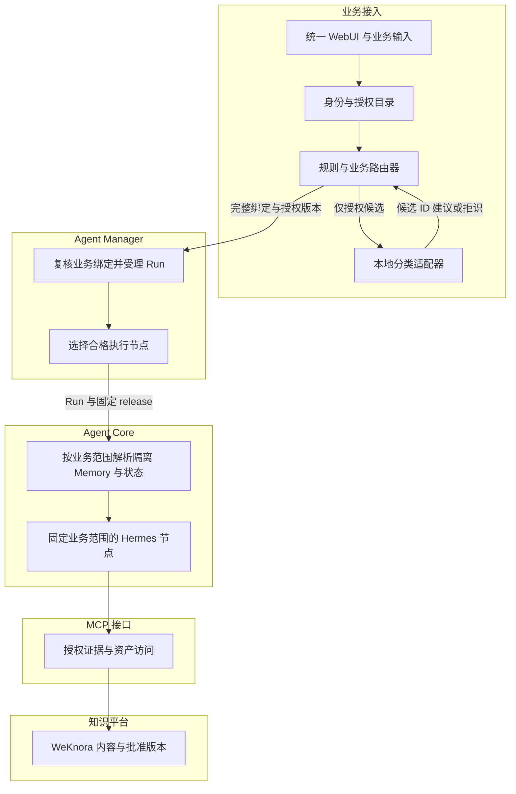
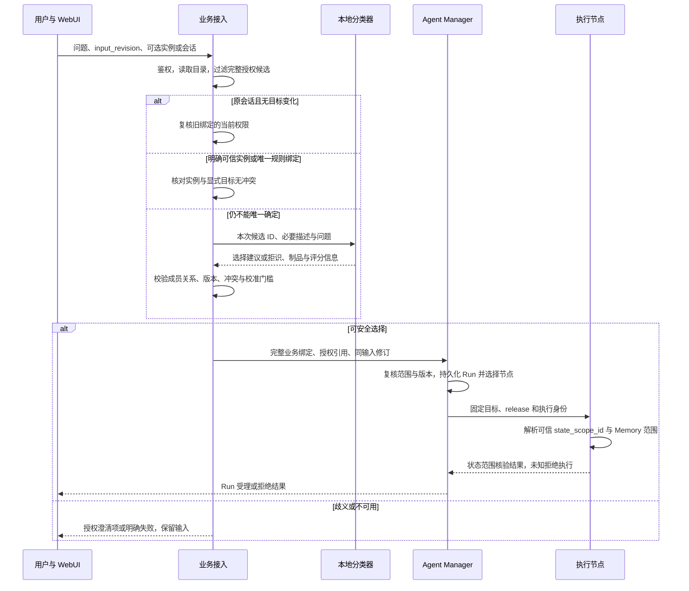

# R02 授权范围内的本地分类与空间路由

> **评审状态：设计待签收；当前实现为 `PARTIAL_LOCAL_CLASSIFIER_NOT_IMPLEMENTED`。** 本文补全可直接评审的职责、接口和验收要求，不表示本地模型、多空间选择或真实领域质量已经完成。本轮只修改评审资料，不运行模型或服务。

[本项 Issue #4](https://github.com/zcimon57-svj/hermes-webui-engine-hub/issues/4) · [架构评审 PR #12](https://github.com/zcimon57-svj/hermes-webui-engine-hub/pull/12) · [总账 #2](https://github.com/zcimon57-svj/hermes-webui-engine-hub/issues/2) · [整体架构](overview.md) · [待决策项](decisions.md) · [统一验收矩阵](acceptance-matrix.md) · [外部来源核验](research.md)

## 1. 要解决的用户问题与边界

用户应能说“这个实例查询为什么变慢”，由系统在其已有权限内找到正确业务空间，然后由 Manager 选择执行节点。用户无需知道 `node03`，也无需为每个物理节点登录一个 UI。**业务接入裁决业务上下文，分类器只提供建议；Manager 的节点选择只决定执行位置。** 这个顺序来自[执行合同 §4–5](https://github.com/zcimon57-svj/hermes-webui-engine-hub/blob/6e6c4e897c62078ff1f14f072abe3fd7d7c461b3/engine_hub/contracts/EXECUTION-v1.md#L54-L85)。

| 场景 | 应有行为 | 错误结果的影响 |
|---|---|---|
| 工单已绑定一个登记的 PG 实例 | 核对工单绑定、实例目录和授权，直接确定完整目标 | 仅识别为 PG，仍可能读到另一项目知识或错误实例 |
| 同引擎有多个实例/项目，问题只有“锁等待” | 只给出用户可访问的澄清选项；无业务映射时不猜空间 | 默认落到 `pg-ops`，会掩盖目标不明确 |
| 同一会话普通追问 | 保留原业务绑定，并重新检查当前授权 | 重新分类可能把跨产品术语误当成换引擎 |
| 同一会话明确改问另一实例，即使仍是 PG | 检测绑定变化，新建会话并解析隔离状态上下文；无法确认 Memory 范围时不执行 | 旧 Memory、工具身份和报告历史污染新目标 |
| 同时包含 MySQL、Redis，或用户无权访问某对象 | 本期先澄清/选择目标；有限授权子任务须按 R05 后续签收才开放 | 模型返回一个“最像”的目标，不等于用户授权或意图 |
| 本地分类器超时、未加载或预算不足 | 保留输入并明确分类不可用；规则能唯一确定时才继续 | 静默外发问题、切云模型或默认引擎违反本地要求 |

### 术语

| 名称 | 含义与权威 |
|---|---|
| `engine_id` | 逻辑技术引擎，如 `pg`、`cassandra`；不是节点 ID |
| `project_id` / `space_id` | 项目和受控上下文/知识范围；关系由服务端目录定义，不能由名称拼接推导 |
| `target_resource_ids` | 本次诊断的登记实例/资源 ID；由可信目录解析，不允许模型输出任意连接地址 |
| `worker_node_id` | Manager 选择的执行节点，不能改变上述业务目标 |
| 授权候选 | 已经过身份、capability、引擎、项目、空间过滤的完整目标元组；不是仅一组引擎名称 |
| 拒识 / 澄清 | 拒识表示不能安全给出路由；澄清是向用户请求缺失目标。二者均不创建业务 Run |

[旧候选研究](https://github.com/zcimon57-svj/hermes-webui-engine-hub/blob/6e6c4e897c62078ff1f14f072abe3fd7d7c461b3/engine_hub/reviews/2026-10-09-reassessment/local-classifier-analysis-v1.md)将 Jev 列为商用对照，Laya 及独立实现列为本地候选；本轮尚未确认最终要采用的具体模型 ID、版本、权重制品和部署合同。**不能把 Jev 直接写成已可本地部署的模型，或把任一候选写成已选定方案；本文不补猜其参数量、许可证或资源峰值。** 已确认的是生产分类需内部本地运行，候选研究仍须经固定官方来源核验和本域实测后选型。

## 2. 当前源码能证明什么

本轮固定源码基线为 [`6e6c4e89`](https://github.com/zcimon57-svj/hermes-webui-engine-hub/commit/6e6c4e897c62078ff1f14f072abe3fd7d7c461b3)。下表区分静态实现、历史实验和本次新增设计；不把旧 PASS 扩大为目标验收。

| 证据 | 当前事实 | 本轮需要补足的边界 |
|---|---|---|
| [`routing.py:10–18`](https://github.com/zcimon57-svj/hermes-webui-engine-hub/blob/6e6c4e897c62078ff1f14f072abe3fd7d7c461b3/engine_hub/routing.py#L10-L18) | 关键词规则只从允许引擎找匹配；无法唯一匹配则澄清 | 关键词不是可信实例事实；中文、否定、歧义和领域质量不能由这些规则保证 |
| [`routing.py:26–51`](https://github.com/zcimon57-svj/hermes-webui-engine-hub/blob/6e6c4e897c62078ff1f14f072abe3fd7d7c461b3/engine_hub/routing.py#L26-L51) | 拒绝 URL/key/Profile/node 注入，有实例映射和会话绑定；显式或分析引擎通常拼接 `engine-ops` | 未建立完整多空间候选；会话快捷分支在实例判断之前，已有会话中的同引擎换实例会被原绑定覆盖 |
| [`server.py:19–31`](https://github.com/zcimon57-svj/hermes-webui-engine-hub/blob/6e6c4e897c62078ff1f14f072abe3fd7d7c461b3/engine_hub/server.py#L19-L31) | 可选 `codex-luna`，按规则后模型调用 | 这不是内部离线模型服务的已交付接入 |
| [`server.py:116–163`](https://github.com/zcimon57-svj/hermes-webui-engine-hub/blob/6e6c4e897c62078ff1f14f072abe3fd7d7c461b3/engine_hub/server.py#L116-L163) | `_ask` 最终检查 engine/space；同输入修订保存意图；只按引擎变化新建会话 | 分类前的候选仍只有 `user.engines`；待补空间级候选、同引擎换空间、权限/目录版本复核 |
| [`codex_luna.py:73–86`](https://github.com/zcimon57-svj/hermes-webui-engine-hub/blob/6e6c4e897c62078ff1f14f072abe3fd7d7c461b3/engine_hub/codex_luna.py#L73-L86) | 模型 schema 枚举允许引擎，输出 selected/candidates/reason | 无完整目标元组、校准置信度或领域拒识阈值；格式合法不等于正确路由 |
| [`manager.py:122–171`](https://github.com/zcimon57-svj/hermes-webui-engine-hub/blob/6e6c4e897c62078ff1f14f072abe3fd7d7c461b3/engine_hub/manager.py#L122-L171) | 本地 reference Manager 校验 allowed_engines，选节点并固定 release/bundle | 正式 Manager 还须核验业务范围与授权版本；本地接口不能当内部 F30 通过 |
| [历史 F04–F07](https://github.com/zcimon57-svj/hermes-webui-engine-hub/blob/6e6c4e897c62078ff1f14f072abe3fd7d7c461b3/engine_hub/acceptance-local-r1.json) / [Luna 小样本](https://github.com/zcimon57-svj/hermes-webui-engine-hub/blob/6e6c4e897c62078ff1f14f072abe3fd7d7c461b3/engine_hub/evidence/luna-routing-20261008T152931.json) | 留存了 21 条合成分类题的实验结果 | F06 真实领域分布、内部本地模型质量和完整空间识别仍未验收 |

## 3. 拟议分层架构与数据权威

图内框仍是既定五个一级模块。分类器是业务接入的一个受限适配器；其本地推理可使用 Core 的受控运行资源，不形成另一套调度或授权权威。

| 数据/决定 | 唯一责任方 | 其他模块如何使用 |
|---|---|---|
| 用户身份、授权范围、`policy_revision` | 业务接入的身份/策略服务 | Router 与 Manager 在受理/使用处核验；不接受客户端自报权限 |
| 资源→引擎/项目/空间映射、`catalog_revision` | 服务端业务目录；实际内部目录接口待接入 | 前端只显示授权子集；模型只读本次必要候选描述 |
| 业务路由决定与候选集摘要 | 业务接入 Router | Manager 接收完整可追溯结果；Core 不重新猜目标 |
| Run、节点选择、attempt 与恢复 | 一个现有 Agent Manager | 本地 reference 只验证合同，不能与内部 Manager 同时竞争派发 |
| 私有 Memory 状态根与注入范围 | Core 的可信状态解析器（拟议） | 从已核验的 owner/engine/project/space/resource 绑定确定，不以新 conversation ID 冒充 Home 隔离；共享批准知识另走 R06 |
| 模型权重、tokenizer、推理配置、校准数据版本 | 已批准的分类器制品登记 | 每个决策保存制品摘要；不把模型文件放进用户 Home 自动更新 |
| 正式知识/Skill 和 current release | 知识平台：WeKnora 内容＋单写发布协调 | 分类器不决定 KB URL 或发布版本；Manager 在已授权空间选固定 release |

## 4. 处理流程与一致性

1. **先构造完整候选，再分类。** 候选必须包含 engine/project/space/resource 元组。仅按引擎过滤后向模型提供全量实例列表会泄露未经授权的目录；分类完成后的权限拒绝不能替代前置过滤。
2. **规则可靠性分层。** 登记实例和已验证工单绑定是事实；问题中的关键词只是语义线索。冲突时记录冲突而非按先出现的词选引擎。普通用户显式指定引擎也只能选择已授权的空间；没有唯一映射则继续澄清。
3. **追问不隐式换空间。** 普通追问复用绑定。任何显式目标与既有绑定不一致，包括同引擎换实例，都应走明确切换流程；推荐新建会话并保留 `switched_from`，同时重新解析该业务范围的隔离状态上下文。新 conversation ID 仅隔离会话身份，不能单独保证旧 Memory 不被加载。具体边界见下节；不能清空或覆盖旧 Memory 来制造隔离。
4. **处理分类与执行之间的变更。** 模型返回时核对候选集与目录版本，Manager 受理/派发时复核授权。权限收回或实例重绑后不能使用旧建议；返回 `route_stale` 并重新生成候选，不能扩大为当前全部候选。
5. **输入修订幂等。** 选择结果与 `input_revision`、问题摘要、候选集摘要一起持久化。同一修订重试复用已受理结果；用户改变问题或目标需新修订，不能悄悄替换已经执行的路由。

### 4.1 新会话与 Memory 边界必须分别成立

当前 Companion 的 Memory 文件是[节点 Home 下的 `memories/MEMORY.md`](https://github.com/zcimon57-svj/hermes-webui-engine-hub/blob/6e6c4e897c62078ff1f14f072abe3fd7d7c461b3/engine_hub/companion.py#L112-L119)，[MCP 取证](https://github.com/zcimon57-svj/hermes-webui-engine-hub/blob/6e6c4e897c62078ff1f14f072abe3fd7d7c461b3/engine_hub/node_mcp.py#L15-L28)也直接读取这个 Home 的文件，不按 owner/project/space 解析。锁定 Hermes 的[原生 Memory 文档](https://github.com/NousResearch/hermes-agent/blob/345cd2b057a452236de401d3534b8502a7465e8d/website/docs/user-guide/features/memory.md#L14-L20)同样将 MEMORY/USER 文件置于 HERMES_HOME；[新会话会重新加载该 Home 的记忆快照](https://github.com/NousResearch/hermes-agent/blob/345cd2b057a452236de401d3534b8502a7465e8d/website/docs/user-guide/features/memory.md#L38-L57)。因此当前“创建新 conversation”不构成完整的 Memory 隔离；现有实验关闭原生 Memory，也不能作为将来启用后隔离已通过的证据。

拟议由 Core 增加可信状态解析：从 Manager 核验的 `owner_id/engine_id/project_id/space_id/target_resource_ids` 生成 `state_scope_id`，选取该范围独立的状态根或受控 Memory provider，并把解析结果绑定本次执行上下文。业务运行只加载匹配 scope 的私有 Memory；同引擎改实例或跨 space 后，不得继续读取旧目标的私有 Memory，也不得通过 MCP 文件读取绕过注入限制。节点位置不能成为业务私有 Memory 归属的唯一键。

独立 Profile/Home 与受控 Memory provider 是待评审的实现选择，二者都须验证实际提示注入和工具读取边界；[Profile 名称本身不是操作系统沙箱](https://github.com/NousResearch/hermes-agent/blob/345cd2b057a452236de401d3534b8502a7465e8d/website/docs/user-guide/profiles.md#L185-L193)。已批准的同引擎共享知识仍经 R06 明确授权加载，不靠共享私有 Home 实现。若目标范围的状态根、授权或版本无法确定，拒绝本次运行并保留旧会话/旧 Memory，而不是先启动后清理。该能力当前未实现，也不由路由单元测试代替 Core 集成验收。

## 5. 拟议接口合同

下列字段是待实施的规范建议，不是已有 HTTP API。当前 `engine/space/owner/node/conversation` 分别映射到拟议 `engine_id/space_id/owner_id/worker_node_id/conversation_id`；适配层负责兼容，不直接修改内部 Manager 的未知接口。

### 5.1 分类请求/响应

| 对象 | 最小字段 | 验证与责任 |
|---|---|---|
| `RoutingRequest` | `routing_request_id`, `input_revision`, `text`, `text_sha256`, `owner_id` | 业务接入生成 ID；实际身份从认证上下文取得。问题只保留本地分类必需内容 |
| 授权快照 | `authorization_handle`, `policy_revision`, `catalog_revision`, `candidate_set_sha256` | 服务端生成不透明引用或可核验凭证；不把权限列表当客户端可修改的权威 |
| 候选列表 | `candidate_id`, `engine_id`, `project_id`, `space_id`, `target_resource_ids`, 允许显示的别名/描述 | 候选 ID 在本次集合内唯一；不可包含任意 URL、密钥或未授权资源存在性 |
| 历史/显式目标 | `prior_binding`, `requested_target` | 必须对应当前可见会话/目录；区分“继续原目标”与“明确切换” |
| 执行状态解析（分类器不可决定） | `state_scope_id`, `state_binding_revision` | Core 从 Manager 的可信完整业务绑定解析并核验；不接受前端或模型任意指定 Home/Profile/Memory 路径 |
| `ClassificationResult` | `decision: SELECT/CLARIFY/ABSTAIN`, `selected_candidate_id`, `reason_code`, `ranked_candidate_ids` | 结果 ID 必须属于本次候选；多余字段、未知 ID、冲突或不完整结果拒绝 |
| 质量/运行记录 | `model_artifact_sha256`, `classifier_revision`, `calibration_revision`, `latency_ms`, 可选 `score` / `score_kind` | 原始相似度、模型自报置信和校准概率分开；缺失校准不伪装成可信概率 |

分类器服务只负责建议；业务接入才能生成最终 `RouteDecision`。后者绑定上述摘要、完整业务元组、规则/模型依据及授权版本；Manager 还须自行复核当前范围。模型不返回 worker、KB URL、凭据或任意工具参数。

### 5.2 失败语义（拟议）

| 情况 | 建议业务结果 | 恢复 |
|---|---|---|
| 未知或不可访问实例 | `target_unavailable`，不暴露是不存在还是无权限 | 用户选择其他授权目标或由目录责任人修复 |
| 多个合理候选/文本与实例冲突 | `clarification_required` / `target_conflict` | 展示仅授权候选，确认后使用新输入修订 |
| 响应包含未授权 ID、越界字段或 schema 错误 | `classifier_result_rejected` | 留审计，规则可独立唯一确定才继续；否则失败 |
| 目录/授权在分类后变化 | `route_stale` | 重新读取权限和目录；已创建的 Run 交 Manager 按撤权合同处理 |
| 模型超时、队列满、资源准入失败 | `classifier_unavailable` / `classification_budget_exceeded` | 保留问题；有限重试或人工选择授权目标，不自动外发 |
| 本地制品不匹配或依赖缺失 | `classifier_artifact_unavailable` | 运维安装并核验已批准制品后显式恢复；业务请求不首次下载 |

## 6. 模型选择、质量与资源的决策依据

| 方案 | 优势 | 实际代价/局限 | 建议 |
|---|---|---|---|
| 可信目录＋明确规则＋必要澄清 | 成本小、可解释，确定目标时不依赖模型 | 对自然语义、多别名和复杂描述覆盖有限 | 作为始终保留的基础路径 |
| 本地编码器/分类模型或相似度匹配 | 可隔离运行；能把候选描述纳入判断 | 必须验证动态候选、中文、分差与拒识；相似度不自动等于概率 | 纳入选型，与本域标注集比较后决定 |
| 小型本地生成模型＋受限 schema | 可表达语义和拒识理由 | 加载峰值、延迟、虚假高置信与候选注入需要专项验证 | 满足资源和质量门槛后可选，不预先承诺具体型号 |
| 远端商业分类服务 | 可作为已有实验或经授权的比较基线 | 不能证明内部离线需求；数据和调用路径需额外约定 | 不作为生产隐式 fallback |

**阈值不能先拍一个数再找例子证明。** 领域维护者先给可接受误路由风险、必须拒识的类型和覆盖目标；用开发集构造规则/模型，用独立校准集确定阈值或分差，用冻结 holdout 签收。按 incident/时间拆分，避免同一事故的工单、告警、追问同时进入训练和验收；报告 engine 正确率、完整目标正确率、接受覆盖率、接受样本误路由率、拒识质量、跨权限尝试、分类混淆与样本量。

本机总预算仍是 **3 GiB 硬上限、2.5 GiB 高水位、192 tasks、0 swap、同一核亲和与宿主准入**，不是分类模型单独有 3 GiB。部署制品应锁定权重/tokenizer/量化/运行时/线程/上下文和候选上限。先验证冷加载峰值、热请求峰值和共存开销，再确定队列和并发；当前不能宣称任一候选模型已通过。[资源约束与状态](https://github.com/zcimon57-svj/hermes-webui-engine-hub/blob/6e6c4e897c62078ff1f14f072abe3fd7d7c461b3/engine_hub/STATE.json)。

## 7. 需要评审人明确决定的问题

| 决策 | 推荐方案 | 责任角色与验收输入 |
|---|---|---|
| R02-D1：项目、空间、实例的权威目录来自哪里？ | 一个服务端目录适配器；先固定离线合同数据，内部接入另验 | 业务目录/身份维护者提供实际字段、版本与更新语义 |
| R02-D2：同引擎换实例如何处理会话和 Memory？ | 新建会话，同时按可信 owner/project/space/resource 绑定解析隔离状态；无法确认即拒绝 | 业务/架构/Core 确认状态根或 Memory provider、提示注入及工具读取边界；不能只验 conversation ID |
| R02-D3：模型与拒识门槛如何选？ | 用真实领域校准/holdout 选型；确认 Jev/Laya 的确切身份后再比较 | 领域维护者给数据、代价权重和签收门槛，运维给资源实测 |
| R02-D4：分类建议在权限变化后是否还能用？ | 受理/派发重核验，版本冲突重路由 | 身份与 Manager 维护者确认 `authorization_handle/policy_revision` 合同 |
| R02-D5：跨引擎问题是否自动拆解？ | 本期默认澄清；有限授权子任务机制按 R05 单独签收后开放 | 业务确认允许的任务拆分范围，不用分类器偷偷扩大任务 |

## 8. Given / When / Then 验收矩阵

本表是新增目标验收，不改写旧证据。除明确引用的历史有限实验外，本轮均为 **待实现/待验证**。

| ID / 旧 F 映射 | Given | When | Then / 必须保存的证据 |
|---|---|---|---|
| R02-A1 / F04 | 两个同引擎实例属于不同项目，用户只可见一个 | 输入登记实例和对应工单 | 直接确定完整授权元组；保存目录/策略版本、决策和 Manager 接收值 |
| R02-A2 / F04/F17 | 实例不存在、不可见、或与显式引擎冲突 | 直接调用路由/问答接口 | 不默认进入 `engine-ops`，不泄露不可见实例；未创建 Run |
| R02-A3 / F05 | 多空间、别名、否定、长文、诱导与歧义题 | 模型选候选或拒识 | 服务端检查候选成员、冲突和阈值；非法 ID 被拒；保留每题原因 |
| R02-A4 / F07/F08/F17 | 原会话绑定 PG-A，原 Home/Memory 含 A 的私有标记；PG-B 为同引擎另一实例或另一 space | 普通追问；显式切换 PG-B 并检查实际提示、Memory provider 和 MCP 文件读取 | 普通追问保持绑定；切换不被忽略，新会话与可信 state_scope_id 一致；任何路径不能读到 A 的私有 Memory/工具身份；状态解析未知即拒绝，旧数据仍保留 |
| R02-A5 / F05/F17 | 分类开始时可访问，返回前权限撤销/目录重绑 | 尝试受理与派发 | 旧建议失效；Manager 不以旧范围继续；有 race 顺序证据 |
| R02-A6 / F06 | 真实领域标签、校准集和冻结 holdout 已签收 | 完整离线分类评测 | 分别给 engine/space/resource 结果、覆盖与误路由，不把 21 合成题或 JSON 合法率当通过 |
| R02-A7 / F06/E03 | 固定模型制品，禁网，总资源预算生效 | 冷加载、并发、长输入、超时、服务中断 | 测得峰值/延迟/拒绝结果；不自动下载、不外发、不默认选引擎 |
| R02-A8 / F07/F29 | 同输入修订重试且 Manager 回执丢失 | 再提交同一请求；随后改变目标但复用修订 | 前者只对应一个业务 Run；后者明确幂等冲突，不修改既有目标 |

F06 的本地模型真实领域签收输入、F30 的内部目录/Manager 接入仍单列。文档或 PR 合入不自动关闭 Issue #4。
