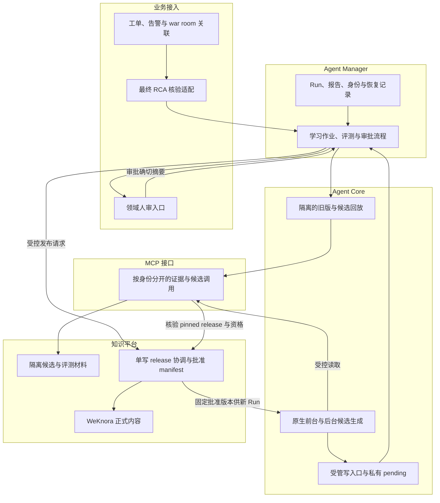
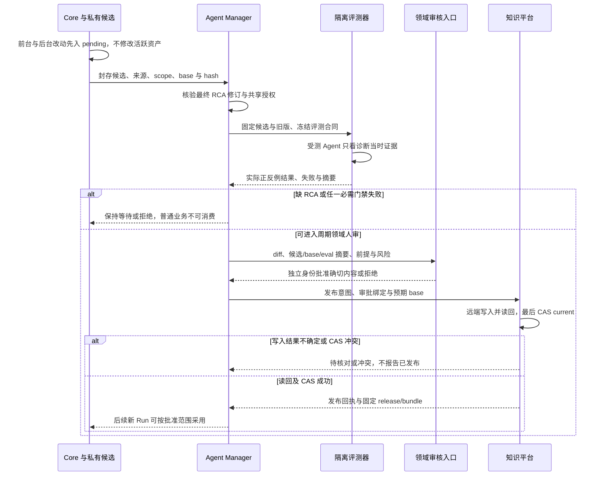

# R03 原生学习候选、RCA 评测与同引擎批准成果共享

> **评审状态：路线已确认，详细设计待签收；`PARTIAL_GOVERNANCE_ONLY`。** 当前有候选/人工标记评测/发布治理骨架，原生前台和后台业务学习接入、实际领域评测及完整审批绑定仍待实现。本轮只修正文档与评审入口，不启用学习或修改运行代码。

[本项 Issue #5](https://github.com/zcimon57-svj/hermes-webui-engine-hub/issues/5) · [架构 PR #12](https://github.com/zcimon57-svj/hermes-webui-engine-hub/pull/12) · [总账 #2](https://github.com/zcimon57-svj/hermes-webui-engine-hub/issues/2) · [整体架构](overview.md) · [版本与消费 R06](r06-assets-and-local-skills.md) · [隔离前置 R01](r01-isolation-and-ui.md) · [决策](decisions.md) · [验收](acceptance-matrix.md) · [调研证据](research.md)

## 1. 业务目标、示例与不能混淆的对象

保留 Hermes 从诊断、用户纠正和反思中提出改进的能力；改进在影响后续业务前，必须先成为私有候选，经已确认最终 RCA、真实评测和周期领域人审后，才发布为同引擎可复用版本。原始 trace、用户点赞、命令成功和报告完成都只是学习信号，不是正确根因的证明。[已确认路线与质量合同](https://github.com/zcimon57-svj/hermes-webui-engine-hub/blob/6e6c4e897c62078ff1f14f072abe3fd7d7c461b3/engine_hub/reviews/2026-10-09-reassessment/evolution-quality-contract-v2.json)。

例如一次“慢查询在重启后恢复”，最多先形成带实例、版本、时间和证据的案例。要晋升为通用排障 Skill，必须排除“恢复症状就等于证实根因”的推断，覆盖锁等待、执行计划退化、资源耗尽等反例，并验证不会把未经授权的重启动作推荐成默认修复。**根因判断、适用范围和工具动作权限必须分别合格。**

| 对象 | 作用 | 可否被普通业务 Run 消费 |
|---|---|---|
| 私有运行状态 | 会话、临时文件、执行记录和原有授权的个人状态 | 按原会话权限使用；不因此成为共享知识 |
| `private pending` | 原生反思提出的业务 Memory/Skill 完整改动；尚未被批准 | 不进入默认提示、RAG、Skill 索引、活跃 Memory 或其它工单 |
| 封存候选 | 内容/来源/范围摘要不可变的待评测包 | 仅隔离评测身份读取，不参与普通消费 |
| 已确认 RCA | 原业务系统中经责任人确认的最终根因及其版本/证据 | 评测器作为参考答案读取；受测 Agent 不能提前看到 holdout 答案 |
| 已批准版本 | 准确绑定候选、基线、评测和审核身份的发布 manifest | 发布完成且资格有效后，在批准范围内使用 |

私有 Memory 的实际加载与读取还须满足 R02 的 `state_scope_id` 边界：新建会话不会自动隔离节点 Home。按可信 owner/project/space/resource 解析独立状态是待实施项；私有候选之外的已存 Memory 也不能因同节点运行而跨范围注入。

本路线**只参考外部自进化/评测项目，不引入其服务、依赖或调度器**。领域审核是现有流程中的角色，不新增第四类默认 UI 用户；`evaluate/approve/publish` 等能力应独立授权，普通 Admin 不自动获得发布权。

## 2. 固定源码审查：已交付接缝与尚未闭合的门禁

本仓固定基线为 [`6e6c4e89`](https://github.com/zcimon57-svj/hermes-webui-engine-hub/commit/6e6c4e897c62078ff1f14f072abe3fd7d7c461b3)，Hermes 锁定为 `345cd2b057a452236de401d3534b8502a7465e8d`。历史 F08–F12 仅按原实验范围保留。

| 来源 | 能直接确认的事实 | 评审结论 |
|---|---|---|
| [`companion.py:121–142`](https://github.com/zcimon57-svj/hermes-webui-engine-hub/blob/6e6c4e897c62078ff1f14f072abe3fd7d7c461b3/engine_hub/companion.py#L121-L142) | 私有草稿绑定 owner/conversation/context，保存内容摘要，更新有旧摘要检查 | 可复用为候选接缝；不是原生前后台写自动接入的证据 |
| [`server.py:305–340`](https://github.com/zcimon57-svj/hermes-webui-engine-hub/blob/6e6c4e897c62078ff1f14f072abe3fd7d7c461b3/engine_hub/server.py#L305-L340) | 手工候选关联已完成 Run/报告，并调用草稿、候选、评测和发布服务 | “完成 Run”不等于已确认 RCA；真实 RCA 字段和接口未读取 |
| [`assets.py:98–134`](https://github.com/zcimon57-svj/hermes-webui-engine-hub/blob/6e6c4e897c62078ff1f14f072abe3fd7d7c461b3/engine_hub/assets.py#L98-L134) | 保存远端 draft 和摘要；`evaluate` 仅记录客户端的 `passed` 与 evidence | **没有实际评测执行器；`passed=true` 不可当质量证据** |
| [`assets.py:136–167`](https://github.com/zcimon57-svj/hermes-webui-engine-hub/blob/6e6c4e897c62078ff1f14f072abe3fd7d7c461b3/engine_hub/assets.py#L136-L167) | 拒绝作者自批，比较 base，核对内容摘要，发布读回后更新指针 | 已有有限治理检查；未绑定 RCA/数据集/评分器摘要及权限版本。SQLite 事务与远端 HTTP 不是同一事务 |
| [`scripts/lab.py`](https://github.com/zcimon57-svj/hermes-webui-engine-hub/blob/6e6c4e897c62078ff1f14f072abe3fd7d7c461b3/engine_hub/scripts/lab.py) / [当前状态](https://github.com/zcimon57-svj/hermes-webui-engine-hub/blob/6e6c4e897c62078ff1f14f072abe3fd7d7c461b3/engine_hub/STATE.json) | 实验配置关闭原生 Memory，工具集限制为 `mcp-ops`，原生学习管线仍 pending | 关闭功能只能缩小当前可达路径，**不能充当已实现的业务写屏障** |
| [Hermes `write_approval.py:43–59`](https://github.com/NousResearch/hermes-agent/blob/345cd2b057a452236de401d3534b8502a7465e8d/tools/write_approval.py#L43-L59) / [`memory_tool.py:64–77`](https://github.com/NousResearch/hermes-agent/blob/345cd2b057a452236de401d3534b8502a7465e8d/tools/memory_tool.py#L64-L77) | 原生写审批默认关闭；配置异常可返回关闭，Memory gate 导入失败可放行 | 需要显式配置、启动校验及执行处拒绝未知；不能依靠“开启一个开关”证明所有入口被拦截 |
| [Hermes `write_approval_commands.py:77–104`](https://github.com/NousResearch/hermes-agent/blob/345cd2b057a452236de401d3534b8502a7465e8d/hermes_cli/write_approval_commands.py#L77-L104) / [`memory_tool.py:249–259`](https://github.com/NousResearch/hermes-agent/blob/345cd2b057a452236de401d3534b8502a7465e8d/tools/memory_tool.py#L249-L259) | 原生 approve 会重放 pending，成功后删除记录；Memory 重放绕过原 gate | 这是原生交互审批合同，不自带 Hub 的 RCA、领域评测、完整包 hash 和发布事务绑定 |
| [Hermes hooks 文档 `531–575`](https://github.com/NousResearch/hermes-agent/blob/345cd2b057a452236de401d3534b8502a7465e8d/website/docs/user-guide/features/hooks.md#L531-L575) | `pre_tool_call` 有阻断/审批能力；post hook 是事后观察 | 可做工具调用接缝，但不能覆盖 CLI approve、脚本/终端直写和所有同步入口 |

I01 仍是前置阻塞：[脚本进程](https://github.com/zcimon57-svj/hermes-webui-engine-hub/blob/6e6c4e897c62078ff1f14f072abe3fd7d7c461b3/engine_hub/companion.py#L89-L104)继承 Companion 执行环境，[旧重审](https://github.com/zcimon57-svj/hermes-webui-engine-hub/blob/6e6c4e897c62078ff1f14f072abe3fd7d7c461b3/engine_hub/reviews/2026-10-09-reassessment/goals-progress-v2.md)已标明管理控制目录/凭据边界缺口。本文不把静态缺口称为已复现攻击，也不以消费 API 的拒写测试替代操作系统边界验证。

## 3. 拟议五模块架构与唯一责任

图中“批准 manifest”由知识平台的单写协调器登记，正文引用 WeKnora 内容；MCP 按调用身份区分评测候选读取与普通批准内容读取。并不是宣称 WeKnora 已有本项目的原子联合发布 API。详细分工如下。

| 数据/决定 | 唯一权威 | 其他模块保存什么 |
|---|---|---|
| 工单/告警/war room 最终 RCA、确认人及修订 | 原业务系统；业务接入仅做适配核验 | 不透明来源 ID、确认修订、内容摘要及授权引用；不复制成另一套“最终根因”编辑库 |
| Run、学习/评测作业调度、取消与恢复 | 一个 Agent Manager | UI 展示投影；Core 上报执行证据；不再引入外部进化调度器 |
| 节点私有 pending 与原始运行状态 | 相应 Core/工单 scope 的唯一写入者 | Manager 保存关联和摘要；未明确共享的私有正文不汇总进公共知识 |
| 封存候选、评测制品和发布绑定 | 知识平台保留不可变制品；Manager 持久化流程引用 | 引用同一 `candidate_bundle_sha256/evaluation_sha256`，禁止两份可修改的“通过状态” |
| 审核决定 | 服务端确认的独立领域审核身份；Manager 记录决定 | 发布协调器核验精确绑定与当前权限，不能只信 UI 的角色名或布尔值 |
| current release / 发布与撤回 | 知识平台单写发布协调器 | Manager 保存 Run 固定版本；节点缓存不拥有 latest；WeKnora 为内容权威 |

内部 RCA 数据尚未读取，确认状态、版本和 API 均未知。下节的 `RcaReference` 是**适配器需要归一化的建议字段**，不代表现有内部系统已经支持这些名称或状态。F11/F30 仍保留。

## 4. 从前后台 pending 到批准发布的流程

### 4.1 原生写入边界必须如何覆盖

| 写入入口 | 拟议处理 | 必须证明的失败路径 |
|---|---|---|
| 前台 Memory/Skill 工具写 | 原生拦截处生成完整私有候选；业务类内容不能 inline 直接生效 | gate 配置/导入异常、用户点击原生 approve 不能跳过 Hub 门禁 |
| 后台反思、整理和子任务学习写 | 同样进入 pending，绑定父 Run、节点和来源；受共享资源预算限制 | 无前台会话、进程重启或异常退出不能落回直接写活跃目录 |
| CLI `/approve`、工具内部重放 | 接受原生操作意图作为候选动作；只有 Hub 批准的完整摘要可走发布 | 旧 pending、审批后改正文、失效身份或基线变化均拒绝 |
| 文件/终端/脚本直写与同步导入 | 正式内容目录只读；生成进程只可写私有候选，发布身份与控制目录不可达 | 任意写工具不经过原生 hook 时仍不能改变活跃 Memory/Skill 或伪造发布 |
| 手工 UI 候选/评测/发布 API | 走同一来源、实际评测与审批绑定；不能手填 `passed=true` 晋升 | 直接 HTTP 绕 UI、生成者自批、篡改评测引用必须拒绝 |

实现前需列出锁定 Hermes 版本的真实入口清单，并逐项验证覆盖。原生 `pre_tool_call`、write approval 与目录保护相互补充；只写提示词“不要学习”、关闭 Memory、给目录取名 approved、或事后回滚，都不能证明未审核内容从未参与过业务消费。后台资源开关同样要核验实际运行，不能把配置文件存在当执行边界。

### 4.2 状态与重入（均为拟议）

候选流程使用 `PRIVATE_PENDING → WAIT_RCA → WAIT_EVAL → WAIT_REVIEW → APPROVED`，发布另记录 `PREPARING → REMOTE_WRITE_PENDING → READBACK_PENDING → COMMITTED`。失败进入明确的 `REJECTED/EVALUATION_FAILED/PUBLISH_CONFLICT`；外部结果未知留在待核对状态。状态变更绑定版本，旧 worker 的迟到结果不得推进新一轮候选。

只有 `COMMITTED` 且远端内容、审批和当前授权有效才可被普通新 Run 消费；“评测已完成”“人已点批准”“远端某文档 status=publish”都不单独表示本联合版本已发布。撤回不删除历史，用 `REVOKED` 资格覆盖控制新消费。

## 5. 拟议记录与接口字段

这些是建议的数据合同，不是内部 API 已实现声明。沿用统一命名 `engine_id/project_id/space_id/owner_id/target_resource_ids`，以及 Manager 的 `business_run_id/task_id/attempt_id/epoch/input_revision`。现有 `engine/author/base` 等字段由兼容适配映射。

| 记录 | 必须包含 | 防止什么问题 |
|---|---|---|
| `CandidateManifest` | `candidate_id`, `candidate_revision`, `candidate_bundle_sha256`, 完整文件/内容摘要，`base_release_id/base_bundle_sha256`，业务 scope，`source_run_ids/report_sha256`，共享授权，前提、例外、适用产品版本 | 小段 diff 无法复建；审批后追加脚本；私有来源被扩大共享；不同基线共用审批 |
| `RcaReference` | `incident_id` 与业务来源引用、`rca_revision/rca_sha256`、确认身份/时间、scope、证据引用、核验结果 | 把用户报告的“已有 RCA”当已读真值；把 Agent 自己结论当独立参考答案 |
| `EvaluationSpec` | 数据集/incident split、诊断时间点与工具快照、评分器代码/模型/配置摘要、旧版/候选摘要、独立签收的硬门槛 | 候选自行生成答案、修改题集或删失败题后仍沿用“通过” |
| `EvaluationResult` | `evaluation_id/evaluation_sha256`、逐题输入与实际运行引用、根因/对象/因果链/权限结果、critical failures、未执行项 | 平均分掩盖越权/错误根因；文本相似度冒充工具回放 |
| `ApprovalRecord` | 审核身份与当前 `authorization_handle/policy_revision`、决定/时间，精确绑定 candidate/base/RCA/eval 摘要 | 生成者自批、内容或领域真值改变后复用旧审批、权限撤销后发布 |
| `PublicationIntent` | `publication_id`、预期 base、确切批准摘要、每份远端文档 ID/期望内容摘要/修订、步骤状态与尝试记录 | 远端部分成功后盲重发，或只记录本地 success |
| `PublicationReceipt` | `release_id/bundle_sha256`、CAS 结果、远端读回证据、批准关系、撤回资格版本 | UI 展示已发布但执行节点消费另一个版本 |

内容变化产生新候选修订并重评；RCA 修正、基线变更、评测合同变更或审核权限失效都使旧批准不可直接发布。给审批绑定更多字段不能代替实际评测；实际评测也不能替代授权与发布一致性。

## 6. 领域评测怎样避免“看起来学会了”

| 门禁 | 要检查的事实 | 不足时如何记录 |
|---|---|---|
| G0 来源/范围 | 原始证据可定位，敏感内容处理，分享同意与目标 scope 一致 | 缺来源或无授权保持私有，不自动转共享 |
| G1 静态/程序安全 | 包完整、路径/依赖、引用、能力、禁止动作和密钥风险 | 静态失败停止；静态通过不宣称业务正确 |
| G2 领域正确性 | 根因类别、受影响对象、因果链、成立前提、反例与产品版本 | 未确认、冲突、仅由 Agent 复制的 RCA 不作独立真值 |
| G3 实际对照回放 | 同一诊断时点下旧版与候选的真实行为；正、反、边界、权限题 | 无工具快照只报告文本/离线评测，完整回放保持 NOT_RUN |
| G4 周期人审 | 领域审核者看完整 diff、失败、风险和退回方案，批准准确摘要 | 无人审/超期不自动批准；关键错误不能用平均分抵消 |
| G5 发布后监测 | 新 Run 实际采用版本与效果、RCA 纠正、撤回与缓存使用 | 关联资产暂停新消费并进入复核，历史证据保留 |

最终 RCA 只提供给评测器的受控答案侧；受测 Agent、其普通检索库、工具快照和候选生成过程不能获得 holdout 答案。同一 incident 的告警、工单、会话、追问归入同一 split，按事件/时间隔离。用 holdout 反复调参后应重新冻结未见集；没有新 holdout 时如实报告开发集结果。

质量阈值、严重错误定义与周期由领域维护者签收；本文不虚构业务准确率门槛。单个成功案例优先发布为范围明确的案例知识，通用 Skill 需要额外反例与泛化验证。外部模型 judge 可以辅助发现问题，但不是领域真值权威。

## 7. 发布失败、并发与恢复

**当前 CAS 在 `ReleaseAuthority` 的本地 Store 事务中，不在 WeKnora 内。** `BEGIN IMMEDIATE` 包裹了远端 HTTP 调用；本地回滚不能撤销已经成功的远端 publish，因此现在的实现不构成跨服务原子发布。[实现位置](https://github.com/zcimon57-svj/hermes-webui-engine-hub/blob/6e6c4e897c62078ff1f14f072abe3fd7d7c461b3/engine_hub/assets.py#L136-L167)。

推荐保留轻量单写协调器：先用短事务登记不可变发布意图，逐步执行远端工作并持久化结果，完成准确读回后在本地单事务比较预期 base、创建 release 并切换唯一指针。普通消费只接受该指针及其显式批准历史，不能直接搜索到未被 manifest 纳入的远端文档。无需为本轮设计直接引入新数据库或分布式事务产品；跨 VM 多写/故障切换若需要，必须另有持久共享权威、租约/fencing 和故障验收。

| 失败/竞争 | 拟议行为与恢复 | 发布可见性 |
|---|---|---|
| 创建/发布远端内容超时，无法判断是否成功 | 将步骤标为结果未知，按已登记文档 ID/期望摘要读回；远端不支持安全幂等或可定位查询时保持待核对，不能盲目新建/重发 | current 不变；不对用户报成功 |
| 一个文档成功、另一个失败 | 保存逐文档回执，恢复时校验相同意图/摘要；失败文档未核对前不提交联合版本 | 已发布但无 manifest 引用的文档仍为隔离孤儿 |
| 审核后候选或基线改变 | 拒绝旧审批；生成新候选/评测/审核记录 | 不自动 rebase 后套用原批准 |
| 两个候选同 base 发布 | 单写协调在最终指针 CAS 仅允许一个胜出；败者保留远端证据 | 败者任何远端文档都不能进入正常检索 |
| 协调器重启或回执丢失 | 按 `publication_id` 恢复已登记步骤；COMMITTED 的重复请求返回同一回执 | 不重新创建 release 或执行未经核对的远端写 |
| RCA 更正/撤回 | 失效关联评测与批准，暂停依赖资产的新消费；重新审查后决定新版本/回退 | 在途 Run 记录旧固定版本，按明确撤回策略停止后续工具使用或请求取消 |
| 回退到旧 release | 核验旧内容/权限/撤回资格，CAS 更新 current；保存回退原因 | 只改变未来采用，不声称撤销已执行业务动作 |
| 孤儿清理 | 由知识维护者在确认无引用、无待核对写后按保留策略处理 | 清理不是恢复前提；不得删除诊断所需证据 |

## 8. 备选方案与待决定问题

| 方案/决策 | 推荐 | 代价或剩余问题 / 责任角色 |
|---|---|---|
| R03-D1：只启原生写审批，还是统一候选门禁？ | 复用原生接缝＋统一候选/approve 适配＋操作系统只读边界 | 前后台、CLI、脚本与同步入口需逐项闭合；Core 负责，I01 先完成 |
| R03-D2：最终 RCA 怎样映射与确认？ | 原业务系统保有真值，适配器记录版本/确认人与摘要 | 内部接口和字段未知；业务/RCA 维护者给实际只读样本与授权 |
| R03-D3：何时允许晋升？ | 静态、实际领域评测、独立周期人审都通过；无审核不晋升 | 领域维护者确认周期、严重错误与数据集；未创建调度任务 |
| R03-D4：谁执行评测并防答案泄漏？ | Manager 调度受控 Core 评测，答案侧与受测 Agent 分离 | 需要诊断时点快照、split 与独立审核；缺工具快照明确缩小口径 |
| R03-D5：怎样完成发布与未知结果恢复？ | 单写协调、持久发布意图、远端读回后 CAS | 发布维护者确认远端幂等能力、孤儿隔离与恢复时限；跨 VM HA 另验 |
| R03-D6：发现错误后怎样处理在途 Run？ | 新消费立即拒绝；在途留审计并按严重性停止后续工具/取消 | Manager/业务明确撤回时效与取消策略；不伪造回滚外部动作 |
| 引入外部进化/评测平台 | 本轮不采用，项目只参考 | 已确认范围；不能以“更完整”为由另加产品或长驻服务 |

## 9. Given / When / Then 验收矩阵

以下新增目标项均为待实施/待验证。历史 F08–F12 的治理/串行消费证据保留，F11 真实领域质量、F30 内部接入仍未通过。

| ID / 旧 F 映射 | Given | When | Then / 必须保存的证据 |
|---|---|---|---|
| R03-A1 / F08/F09 | 前台、后台、CLI approve、文件/脚本、同步等真实入口清单 | 分别尝试写业务 Memory/Skill；再使 gate 配置/导入失败 | 完整改动只进私有 pending；活跃资产未变；故障拒绝；记录每条入口覆盖 |
| R03-A2 / F08/F24/F26 | 一个私有未批准候选及同名批准 Skill | 普通 RAG/Skill 发现、其它用户/节点/项目读取 | 未批准正文、索引和支持文件均不可消费，不能覆盖同名批准内容 |
| R03-A3 / F09/F11 | 缺 RCA、未确认 RCA、复制自 Agent 或冲突 RCA | 尝试评测和晋升 | 不进入独立真值集；保留 WAIT_RCA/拒绝原因，不接受 UI passed 标记 |
| R03-A4 / F11 | 格式合法但根因错、根因对但动作越权、缺关键前提的候选 | 实际正反例/旧新版本回放 | 必需门禁失败并拒绝晋升；保存逐题行为和反例，平均分不能抵消 |
| R03-A5 / F11 | 冻结 incident split 与仅评测器可读 RCA | 生成候选、运行受测 Agent 和检索 | 无 holdout/未来答案泄漏；同事件不跨 split；缺快照标明文本范围 |
| R03-A6 / F09/F12 | 已评测候选、独立审核者 | 改候选文件/base/RCA/eval 摘要，或撤销审核者权限后发布 | 任一变更使旧批准失效；生成者不能自批；结果可追溯 |
| R03-A7 / F12/F23/F25 | 两个同 base 候选、远端部分成功、响应超时 | 并发发布和协调器重启 | 唯一 CAS 胜者；未知写先读回核对，非盲重发；孤儿不能正常检索 |
| R03-A8 / F10/F19/F24 | 同引擎两节点及另一个引擎；一份批准 release | 两节点实际新 Run 消费 | 同引擎采用相同批准 hash，私有 Home 不共享，跨引擎和未授权项目拒绝；同时双节点能力仍按 R05 单独实测 |
| R03-A9 / F12/F26/F31 | 已发布候选后来收到 RCA 纠正/撤回 | 新 Run、旧 Run 下一次工具读取与缓存命中 | 新消费拒绝、旧 Run 按撤回合同处理；历史/报告/失败证据保留，不能靠缓存延续资格 |

完成本文评审只代表设计问题被明确答复，不代表 R03 交付、F11 通过或 Issue #5 可以关闭。
