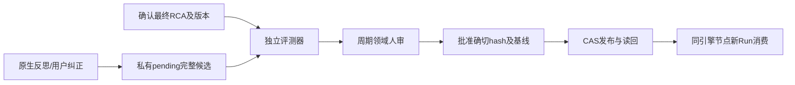

# R03 原生自进化候选与同引擎批准成果共享

目标与进度：[Issue #5](https://github.com/zcimon57-svj/hermes-webui-engine-hub/issues/5)；[总账 #2](https://github.com/zcimon57-svj/hermes-webui-engine-hub/issues/2)。

状态：**待独立架构评审，未实施/未验收**。用户已确认的原则单独列出；详细接口、状态和验收边界由本PR评审。本轮不改运行代码、不引入外部进化/评测项目、不自动合并本PR。

## 用户已确认的原则

Hermes原生反思保留；业务知识/Skill先私有候选，以工单/告警/war room确认的最终RCA、实际评测和周期领域人审控制晋升。外部进化/评测项目仅参考。不共享可写Home；只共享同引擎获批版本。

## 当前代码与缺口

当前已有候选、人工审核/CAS/撤回/回退及远端消费骨架；UI passed=true不是真正评测。原生Memory关闭，工具集仅mcp-ops；自动原生学习/候选与评测执行器尚未接入。

## 拟议流程与状态

状态：WAIT_RCA → WAIT_EVAL → WAIT_REVIEW → APPROVED → PUBLISHED；失败/拒绝/未知保持未发布。原生前台/后台写、Memory/Skill及approve入口进入同一受管写口；不允许先修改活跃目录再等审核。候选只用于隔离评测，不进入默认Skill发现/RAG。

最小记录：incident/Run/报告关联、engine/project/instance、RCA版本、base release、候选包hash、前提/例外、题集/评分器版本、评测结果、人审身份/决定与发布回执。审批后内容/基线变化需重评重审。

最终RCA只给评测器，受测Agent只看诊断当时证据；同事故告警/票据/追问归同一split。未确认、冲突或照抄Agent但无独立核实的RCA不当独立答案。单事件先沉淀范围明确的案例，通用Skill需反例/泛化审查。

## 门禁与回退

静态结构/引用/依赖/权限检查、根因/因果链与前提核对、旧新版本真实正反例回放、周期领域人审必须分别通过。关键错误/越权动作不能被平均分抵消，生成者不自批。

批准后由独立发布身份CAS更新WeKnora指针并读回；新Run固定版本，旧Run按既有撤回/取消合同处理。RCA纠正使关联评测失效、依赖资产待复核并暂停新消费，保留历史。

## 必须验收与评审问题

格式正确但根因错误、根因正确但动作越权、缺RCA、答案泄漏、评测失败、无人审核、修改审批hash、CAS冲突、撤回与缓存复用负例必须保留；同引擎两节点消费同获批hash，私有草稿和跨引擎访问拒绝。

需评审：原生哪些写入入口被统一拦截，直接脚本/同步如何限制？评审周期与角色、RCA确认字段、无工具快照时的降级评价口径是什么？I01需先修，F11/F30数据仍未读取。责任模块：Core、业务接入/MCP、Manager、知识平台及领域人审。
