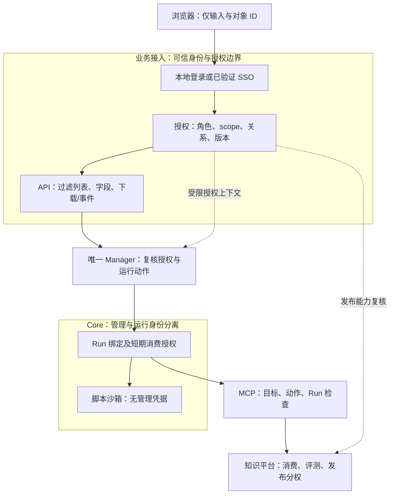
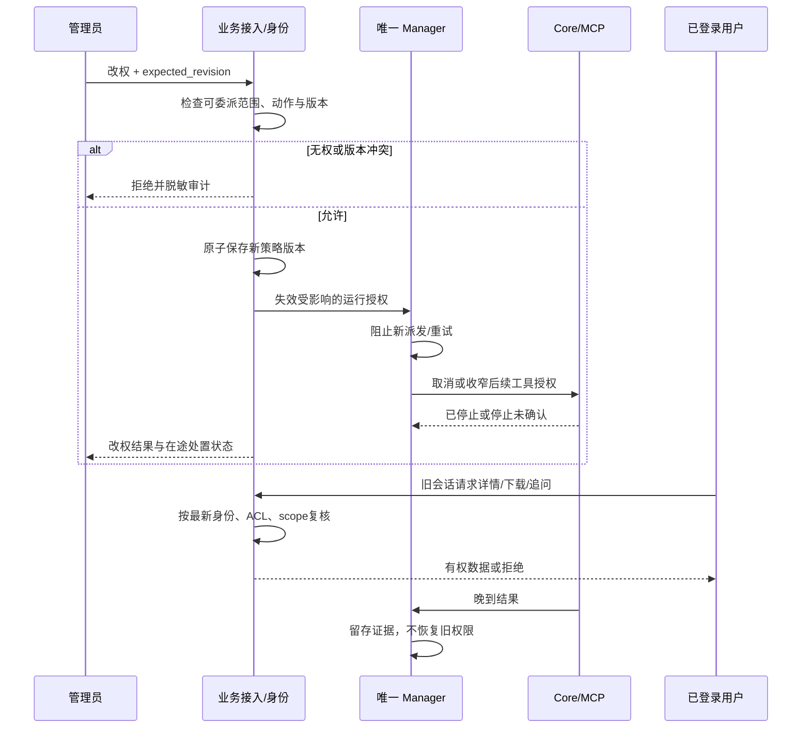

# R04 Admin / Viewer / Chat：权限、管理范围与撤权设计

> **评审状态：PROPOSED；实现状态：BASIC_ROLES_VERIFIED_MANAGEMENT_PARTIAL。** 三个默认 UI 角色已确认；完整对象授权、管理接口和在途撤权细节待评审/实现。2026-10-09 仅做源码与文档复核，未运行浏览器、服务或权限攻击。

[评审入口][entry] · [总设计][overview] · [决策表][decisions] · [调研依据][research] · [验收总表][acceptance] · [Issue #6](https://github.com/zcimon57-svj/hermes-webui-engine-hub/issues/6) · [PR #12](https://github.com/zcimon57-svj/hermes-webui-engine-hub/pull/12)

## 1. 业务场景与授权模型

项目 A 的 Chat 用户可以提问、追问并停止自己的长回答。Viewer 可以阅读向自己共享的报告，刷新页面不应创建会话或触发执行。项目 A 的 Admin 负责该项目授权范围内的用户、配置与运行；“管理员”不等于可以浏览项目 B、读取所有人的私有对话或发布领域知识。

业务授权由两件事共同决定：**这个身份可以做什么动作，以及这个对象是否在其获准范围内**。第三个条件是对象与操作者的关系，例如“本人运行”或“明确共享只读”。这保持三个角色的简单交互模型，不把每个项目×引擎组合创造为新角色。

| 概念 | 权威与作用 | 不应混同 |
|---|---|---|
| 身份 subject | 服务端认证的用户或服务 | 客户端用户名/角色 header、模型声称的身份 |
| 角色 role | 固定 admin / viewer / chat 默认动作集合 | 全局数据访问权、生产 MCP 修复权限 |
| capability | 明确授予的候选、评测、批准/发布等动作 | 第四类 UI 角色、Admin 的隐含附带权利 |
| scope | engine/project/space/target 的授权范围 | UI 当前选中项、节点自报标签 |
| owner / share | 私有对象所有者、显式共享关系 | 同引擎成员自动互读、共享读者自动获得写权 |
| 管理/消费身份 | 管理节点/调度/发布，或仅消费本 Run 资料 | 把全局服务 key 转交脚本/浏览器 |

已有权威需求见[权限合同][contract]。[OWASP 官方授权指南](https://cheatsheetseries.owasp.org/cheatsheets/Authorization_Cheat_Sheet.html#validate-the-permissions-on-every-request)支持服务端每次请求校验，并将对象授权覆盖到下载/静态资源；本方案据此补齐边界，不引入外部权限框架。

## 2. 当前代码究竟覆盖了什么

固定源码基线：`6e6c4e897c62078ff1f14f072abe3fd7d7c461b3`。下表缺口是静态路径核对，不等于本次运行过攻击，也不抹去历史基本角色用例。

| 范围 | 已实现事实与源码 | 剩余缺口与影响 |
|---|---|---|
| 登录/三角色 | [auth.py][src-auth]有独立用户、会话、过期/禁用检查、非 GET 的 CSRF 校验 | 原 WebUI SSO/可信代理未整合；已有 enabled 检查不代表已有禁用用户管理 API |
| 对象可见性 | [require/visible/owned][src-visible]结合 engine、可选 spaces、owner/shared_with | owned 实际检查可见性，不只 owner；写操作必须再检查动作及所有权 |
| 会话/共享/取消 | [问答 owner 校验][src-ask]；[共享与取消][src-share] | 共享登记只查目标 engine，未在该步检查其 space，最终读取仍有 space 检查。Admin 管理他人 Run 先经过私有可见性，管理与内容权限未分别建模 |
| Viewer 防写 | [统一非 GET 拒绝][src-viewer]，logout 例外 | **HTTP 动词不足以证明无执行副作用**：详情/下载经[Hub.run][src-hub-run]调用[Manager.refresh][src-refresh]，缺 gateway_run 时可能重派发 |
| 节点/配置列表 | [nodes][src-nodes]、[config][src-config]按 engine 过滤；PATCH 仅 node/enabled，限制 spaces 的用户不能改引擎配置 | 不是完整配置/项目管理；需区分项目对象与跨项目节点，不能只补前端筛选 |
| 节点状态 | [node state GET/PUT][src-state]检查 state capability 后按 engine 选节点 | 未复核 spaces，也没有 config PATCH 的项目限制；整节点 Memory/workspace 不能当项目局部对象授权 |
| 用户管理 | [users GET/POST][src-users]支持列表/新建，新建有 engine/space 子集检查 | GET 只按引擎集合筛选；没有现有用户改角色、改范围、禁用路径；可委派能力仍需明确 |
| 下载/事件 | [Run 详情/事件/下载][src-run-routes]先检查可见性 | 当前事件是有限快照，不是已验长期 SSE/WebSocket；未来长连接/存储下载需检查撤权 |
| 服务/脚本身份 | [Manager 服务 key][src-manager-auth]；[Companion key/端点检查][src-consume] | 全局或节点 key 不能表达最终用户/Run scope；I01 脚本继承管理挂载仍未修，详见[R01][r01] |

## 3. 角色 × 动作 × 对象矩阵

这是目标权限，不是当前端点覆盖声明。所有“允许”均须通过有效身份、scope与对象关系检查。

| 动作 / 对象 | Viewer | Chat | Admin |
|---|---|---|---|
| 登录、登出、读自己的身份 | 允许；仅认证状态写入 | 允许 | 允许 |
| 浏览授权概况/批准资产 | 允许，scope过滤 | 允许，scope过滤 | 允许，scope过滤 |
| 读取本人/明确共享的会话和报告 | 允许 | 允许 | 允许，不自动读其它私有内容 |
| 创建会话、提问、追问 | 拒绝，包括页面自动创建 | 允许，追问本人会话 | 包含Chat能力 |
| 取消本人Run | 拒绝 | 允许 | 允许 |
| 管理范围内他人Run | 拒绝 | 拒绝 | 明确run.manage；最小管理视图，不自动读私有正文 |
| 改写共享会话、冒充owner | 拒绝 | 拒绝 | 拒绝；管理不改变内容归属 |
| 用户/配置/节点管理 | 拒绝 | 拒绝 | 授权对象及可委派能力；跨项目节点动作需节点管理授权 |
| 扩展诊断/日志 | 拒绝 | 拒绝 | 仅授权且脱敏字段，不默认明文凭据 |
| 节点Memory/工作区管理 | 拒绝 | 拒绝 | 单独节点状态管理范围，不能由项目问答权推导 |
| 领域候选生成 | 默认拒绝 | 默认拒绝 | 默认拒绝；显式candidate能力才可使用授权来源 |
| 评测/批准/发布/撤回 | 默认拒绝 | 默认拒绝 | 默认拒绝；显式evaluate/publish能力与分离身份 |
| 生产修复/危险MCP写动作 | 拒绝 | 拒绝 | 默认拒绝；本期只读工具合同不由UI角色扩权 |

评测/批准测试账号沿用 Admin 角色并显式获得限定scope的附加能力，不新增第四类UI角色；Viewer的只读限制不能被extra capability覆盖。worker与服务账号是机器身份。生成者不能自批；批准绑定候选、基线和评测摘要，见[R03][r03]与[R06][r06]。

### 对象范围的组合规则

推荐统一判断：有效身份 ∧ 动作能力 ∧ 可信目录中的engine/project/space/target ∧ owner/shared/管理授权关系 ∧ 当前策略版本。未知维度不解释为全局权限。

- **普通读取**：列表先过滤再聚合计数；详情、下载、搜索、事件、缓存遵守同一对象规则。汇总不能泄漏无权对象数量/存在性。
- **私有内容**：owner或显式共享读者可读。共享时验证接收者范围，之后每次读取仍复核；读者不能追问、转授或取消作者Run。
- **管理员**：只改变被授权对象。跨项目共用worker的排空、Memory写入、凭据轮换要求覆盖整节点的管理授权，不能因同为PG引擎就开放全部节点状态。
- **用户委派**：新权限是操作者可委派集合的子集，不只engine子集；未知capability拒绝。禁用/改权增加策略版本；不复用已删除用户ID继承旧权限。
- **正式知识**：候选源须可读且获准用于学习；发布权不包含抓取所有Memory。新release范围不能超过批准范围。

## 4. 五模块中的授权实施位置

授权函数可以是现有Python模块/适配器，不要求新建鉴权服务。内部上线复用真实身份权威，本地账号仅证明本地机制。

| 权威对象 | 模块/写入者 | 使用规则 |
|---|---|---|
| 身份/角色/可委派能力/策略版本 | 业务接入的身份权威 | 每次受理从可信来源解析，拒绝未验证的代理身份header |
| 目录/scope关系 | 业务接入的可信资源目录 | 节点标签/模型输出不能扩权 |
| 共享ACL | 业务接入的对象授权记录 | 唯一ACL；run_refs、Manager/缓存投影只作版本化派生，撤回失效 |
| Run/attempt及动作执行 | 单一业务Manager | 受理、派发、取消、恢复、报告提交复核动作及资源归属 |
| 节点消费/管理凭据 | Core受管部署/节点适配 | 管理身份不进入脚本；消费能力绑定Run，结束/到期撤销 |
| 正式资产审批/发布 | 知识平台与Manager既有审批链 | 内容/批准摘要一致，用户授权和服务权限同时满足 |

当前UI/Manager各存部分投影，不能让两份shared_with成为竞争权威；拟议接口应传ACL/策略修订并查询唯一来源，不能仅依赖缓存副本。

## 5. 管理与撤权流程

**推荐在途策略**：撤scope或禁用后拒绝受影响的新派发、工具/资产消费和读取；Manager尝试停止当前执行。已发出的外部动作无法靠改用户表撤回，必须区分停止确认与停止待核查。合法历史证据留存，撤权主体不再可读。仅撤销共享读者时，不应停止原作者仍有权的Run。

Chat降为Viewer时，如果仍有会话读权，可读已有报告，但不能追问或取消。按被撤销动作判断受影响运行，不删除所有用户历史数据。前述在途策略是拟议行为，需要R04-D3定稿。

## 6. 拟议接口与错误合同

下表是待实现规范字段/逻辑操作，不声称已经存在这些HTTP端点。路径和身份适配以内部接口核对、实现PR为准。

| 操作/对象 | 拟议字段 | 校验与一致性 |
|---|---|---|
| 身份快照 | subject_id、role、capabilities、scope_grants、delegable_grants、enabled、policy_revision | 浏览器只展示非敏感字段，服务端版本决定授权 |
| 资源scope | engine_id、project_id、space_id、target_resource_ids、owner_id | 可信目录/持久对象给出，拒绝客户端自报labels |
| 用户更新 | target_subject_id、patch、expected_revision、reason、request_id | 管理与可委派子集检查；CAS冲突409，不让旧页面覆盖新权限 |
| 共享更新 | object_id、reader_ids、expected_acl_revision | owner或明确共享管理能力；接收者范围合法；说明替换/增删语义 |
| 节点配置/状态更新 | node_id、config_revision、allowed_patch、reason | 整节点管理范围、字段清单、读回确认，非任意路径/命令接口 |
| 运行委托 | business_run_id、attempt_id、authorization_handle、audience、policy_revision、expires_at | 服务身份+业务授权；绑定Run/动作/目标/受众，不可跨Run使用 |
| 审计 | request_id、actor_id、service_id、action、object_ref、scope、policy_revision、decision、reason_code、at | 记录成功/拒绝，无令牌或无权对象正文；审计读取也授权 |

建议无有效身份返回401；对象不可见/不存在统一404；可见对象动作不足403；版本冲突409。授权依赖无法验证时拒绝操作，不以缓存旧允许补权；外部响应脱敏，内部审计保留准确原因。

缓存按主体、对象范围、动作、策略/ACL修订绑定。长期事件连接需在继续发送前或按明确短期机制复核撤销，不能只建连时检查；当前短响应快照不代表该行为已验。身份适配方负责可信代理/TLS信任边界，不能信任直接客户端的用户/组header。

## 7. 备选、推荐与评审决定

| 决策 | 备选与权衡 | 推荐/待明确事项 |
|---|---|---|
| **R04-D1：角色与范围组合** | A三角色+动作/scope/关系；B每项目引擎新增角色；C只有角色 | 推荐A。明确project→space→target关系和项目Admin资源种类；不扩为复杂企业多租产品 |
| **R04-D2：Admin与私有正文** | A最小管理元数据+独立内容授权；B默认看所有正文；C只能管理共享给自己的Run | 推荐A。可取消哪些人Run、可见哪些管理字段、正文是否需显式共享？ |
| **R04-D3：撤权/共享撤回/在途** | A立即阻止受影响新动作并尝试取消；B旧Run一直沿用旧权限 | 推荐A，区分撤共享读者与撤执行主体。停止未确认如何显示、何时核查？ |
| **R04-D4：服务授权传递** | A内部身份+短期Run handle；B签名声明+撤销检查；仅全局key不足 | 先核对内部接口再选A/B。谁签发/撤销/验证？如何防脚本读取管理配置？不要求新服务 |
| **R04-D5：首期管理范围** | A补既有用户改权/禁用、项目列表、节点边界/CAS；B先建复杂组织/SSO管理产品 | 推荐A，真实SSO另验F30。现有spaces=null全引擎语义如何显式迁移，避免静默扩权？ |

本次不修改用户/角色/配置。原则定稿后，代码修改须同步合同与正反验收。责任为身份、业务接入、Manager、Core与知识维护者，不自动分派GitHub账号。

## 8. 逐场景 Given / When / Then 验收

| 场景 / 历史映射 | Given 前置 | When 操作 | Then 可观察通过条件 | 当前状态/责任 |
|---|---|---|---|---|
| R04-A01 / F13、F18 | 三独立账号/cookie/浏览器上下文 | 同时登录、刷新、切空间 | 身份/角色/scope不串；登出只影响目标认证会话 | 历史有界基础，完整回归待验。身份/UI |
| R04-A02 / F14、F17 | 仅项目A Admin，同引擎有B | 直调节点/实例/用户/配置/诊断列表和详情 | B元数据与计数不可见；整节点动作需对应管理授权 | I04待实现。业务接入 |
| R04-A03 / F14、F17、F27 | 项目Admin，node状态跨项目 | 对node Memory/workspace GET/PUT | 不能凭state+engine越权；合法范围CAS/读回完整 | 静态路径缺口。业务接入/Core |
| R04-A04 / F15 | Viewer打开所有入口 | 直调写API及boot/自动保存 | 业务写全拒绝，认证登出例外；业务状态不变 | 历史部分，完整待验。UI/API |
| R04-A05 / F15、F28、F29 | 可读dispatching Run，无gateway_run | GET详情/下载/事件/刷新 | 不触发派发/模型/工具；Manager控制恢复独立工作 | GET→dispatch待修。Manager |
| R04-A06 / F16 | A只读共享会话给Chat B | B追问/转授/取消A；A取消自己 | B写拒绝；A取消及实际停止/待确认状态准确 | 历史部分，完整待验。API/Manager |
| R04-A07 / F14、F17 | Admin有管理权但无某正文读权 | 取消范围内Run并尝试下载正文 | 管理动作可用，正文仍拒绝 | R04-D2待定/实现。身份/Manager |
| R04-A08 / F17、F18 | 合法共享给B，C跨space | 共享给C、撤回B、旧下载/事件重试 | C不能扩权；B新读拒绝；原作者Run可继续 | ACL链待实现。API |
| R04-A09 / F14、F17 | Admin仅可委派A项目部分能力 | 新建/改权至更大scope或publish；合法禁用 | 越权拒绝；合法CAS/审计完整，旧版本冲突 | 新建部分，更新待实现。身份 |
| R04-A10 / F13、F17、F28 | Chat运行中被禁用/降级/撤scope | 旧cookie新请求、后续工具、晚到结果 | 按撤销动作拒绝/取消；保留停止未确认；旧授权不复活 | 策略待评审/实现。身份/Manager/MCP |
| R04-A11 / F17、F27 | 分离管理/消费key，context属A Run | 脚本读管理挂载；B/其它Run/旧handle消费A | FS和API对象授权分别拒绝并留证 | I01阻塞，攻击未运行。Core/MCP |
| R04-A12 / F14、F17 | 普通Admin、生成者、独立审核者 | 默认发布、自批、错hash发布、合法批准 | 前三项拒绝；独立获权人按固定摘要批准 | 治理基础有界，完整链待验。知识平台 |
| R04-A13 / F13、F17、F30 | 匿名/过期身份、伪造代理header | 直接客户端或未信任代理访问 | 不信自报角色；内部SSO仅在验证边界生效 | 本地基础；F30未验。身份 |

历史基础见[acceptance-local-r1][history]与[证据索引][evidence]。上述新场景均没有因静态审查变为PASS；I04是实现缺口，F30是内部环境待验。文档合入不自动关闭Issue #6。

[entry]: https://github.com/zcimon57-svj/hermes-webui-engine-hub/blob/docs/goal-architecture-review-20261009/engine_hub/architecture/goals/README.md
[overview]: https://github.com/zcimon57-svj/hermes-webui-engine-hub/blob/docs/goal-architecture-review-20261009/engine_hub/architecture/goals/overview.md
[decisions]: https://github.com/zcimon57-svj/hermes-webui-engine-hub/blob/docs/goal-architecture-review-20261009/engine_hub/architecture/goals/decisions.md
[research]: https://github.com/zcimon57-svj/hermes-webui-engine-hub/blob/docs/goal-architecture-review-20261009/engine_hub/architecture/goals/research.md
[acceptance]: https://github.com/zcimon57-svj/hermes-webui-engine-hub/blob/docs/goal-architecture-review-20261009/engine_hub/architecture/goals/acceptance-matrix.md
[r01]: https://github.com/zcimon57-svj/hermes-webui-engine-hub/blob/docs/goal-architecture-review-20261009/engine_hub/architecture/goals/r01-isolation-and-ui.md
[r03]: https://github.com/zcimon57-svj/hermes-webui-engine-hub/blob/docs/goal-architecture-review-20261009/engine_hub/architecture/goals/r03-native-evolution.md
[r06]: https://github.com/zcimon57-svj/hermes-webui-engine-hub/blob/docs/goal-architecture-review-20261009/engine_hub/architecture/goals/r06-assets-and-local-skills.md
[contract]: https://github.com/zcimon57-svj/hermes-webui-engine-hub/blob/6e6c4e897c62078ff1f14f072abe3fd7d7c461b3/engine_hub/contracts/permissions-v1.json
[src-auth]: https://github.com/zcimon57-svj/hermes-webui-engine-hub/blob/6e6c4e897c62078ff1f14f072abe3fd7d7c461b3/engine_hub/auth.py#L8-L55
[src-visible]: https://github.com/zcimon57-svj/hermes-webui-engine-hub/blob/6e6c4e897c62078ff1f14f072abe3fd7d7c461b3/engine_hub/auth.py#L58-L74
[src-ask]: https://github.com/zcimon57-svj/hermes-webui-engine-hub/blob/6e6c4e897c62078ff1f14f072abe3fd7d7c461b3/engine_hub/server.py#L116-L157
[src-share]: https://github.com/zcimon57-svj/hermes-webui-engine-hub/blob/6e6c4e897c62078ff1f14f072abe3fd7d7c461b3/engine_hub/server.py#L219-L254
[src-viewer]: https://github.com/zcimon57-svj/hermes-webui-engine-hub/blob/6e6c4e897c62078ff1f14f072abe3fd7d7c461b3/engine_hub/server.py#L174-L201
[src-hub-run]: https://github.com/zcimon57-svj/hermes-webui-engine-hub/blob/6e6c4e897c62078ff1f14f072abe3fd7d7c461b3/engine_hub/server.py#L98-L110
[src-refresh]: https://github.com/zcimon57-svj/hermes-webui-engine-hub/blob/6e6c4e897c62078ff1f14f072abe3fd7d7c461b3/engine_hub/manager.py#L194-L205
[src-nodes]: https://github.com/zcimon57-svj/hermes-webui-engine-hub/blob/6e6c4e897c62078ff1f14f072abe3fd7d7c461b3/engine_hub/server.py#L58-L74
[src-config]: https://github.com/zcimon57-svj/hermes-webui-engine-hub/blob/6e6c4e897c62078ff1f14f072abe3fd7d7c461b3/engine_hub/server.py#L265-L283
[src-state]: https://github.com/zcimon57-svj/hermes-webui-engine-hub/blob/6e6c4e897c62078ff1f14f072abe3fd7d7c461b3/engine_hub/server.py#L291-L303
[src-users]: https://github.com/zcimon57-svj/hermes-webui-engine-hub/blob/6e6c4e897c62078ff1f14f072abe3fd7d7c461b3/engine_hub/server.py#L343-L362
[src-run-routes]: https://github.com/zcimon57-svj/hermes-webui-engine-hub/blob/6e6c4e897c62078ff1f14f072abe3fd7d7c461b3/engine_hub/server.py#L244-L264
[src-manager-auth]: https://github.com/zcimon57-svj/hermes-webui-engine-hub/blob/6e6c4e897c62078ff1f14f072abe3fd7d7c461b3/engine_hub/manager.py#L254-L288
[src-consume]: https://github.com/zcimon57-svj/hermes-webui-engine-hub/blob/6e6c4e897c62078ff1f14f072abe3fd7d7c461b3/engine_hub/companion.py#L158-L183
[history]: https://github.com/zcimon57-svj/hermes-webui-engine-hub/blob/6e6c4e897c62078ff1f14f072abe3fd7d7c461b3/engine_hub/acceptance-local-r1.json
[evidence]: https://github.com/zcimon57-svj/hermes-webui-engine-hub/blob/6e6c4e897c62078ff1f14f072abe3fd7d7c461b3/engine_hub/evidence/INDEX.md
