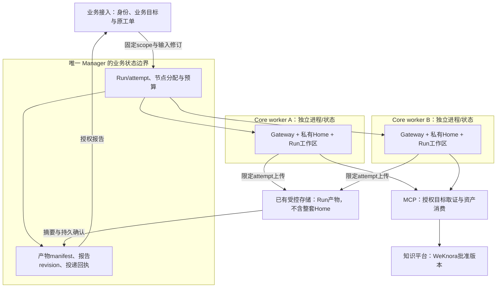
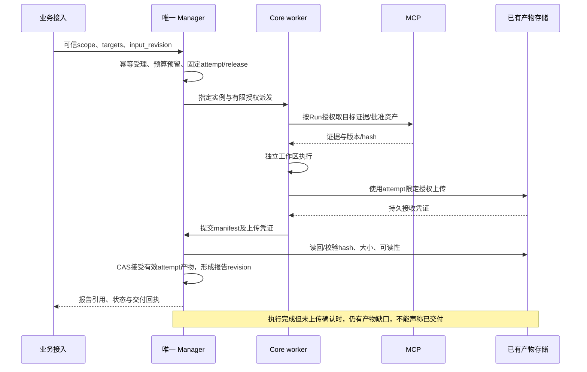
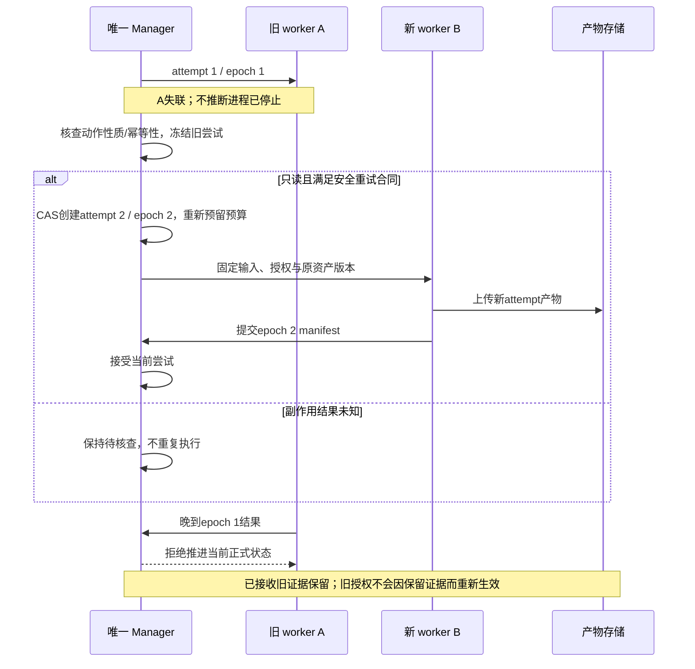

# R05 同引擎多节点：节点选择、容量、故障与产物设计

> **评审状态：PROPOSED；实现状态：SIMULTANEOUS_TWO_NODE_PENDING。** 当前六节点定义和历史串行结果存在，现版本同时双节点尚未验收。跨主机注册/租约、恢复迁移、通用产物和有限子任务均是拟议扩展，不因本文出现字段或图就成为已实现能力。

[评审入口][entry] · [总设计][overview] · [决策表][decisions] · [调研依据][research] · [验收总表][acceptance] · [Issue #7](https://github.com/zcimon57-svj/hermes-webui-engine-hub/issues/7) · [PR #12](https://github.com/zcimon57-svj/hermes-webui-engine-hub/pull/12)

## 1. 多个节点究竟解决什么问题

| 用户场景 | 处理方式 | 为什么 |
|---|---|---|
| 同时收到多个独立Cassandra工单 | 每个业务Run选同引擎池中的一个独立worker | 提高吞吐，保持会话/状态归属清楚；无需多个Agent共同回答每个问题 |
| 单个PG工单涉及数据库实例、应用日志与多个主机 | 业务接入确定获准target集合，一个Run通过MCP取多目标证据 | target是被诊断对象，worker是执行位置；一目标不必对应一Agent |
| 一个工单确有需要并行/专门环境的独立分析工作 | 可选parent Run下有限task，各自产证据，由Manager统一汇聚 | 应有可衡量业务收益和明确预算；这是后续决策，不作为首期默认必需 |
| 原worker损坏但用户还要追问或保留报告 | 从集中权威读取已提交产物；批准后建立新attempt/会话执行绑定 | 不要求原VM永远存在，也不复制完整Home冒充无损迁移 |

**两层裁决不变**：业务接入基于可信身份/目录确定业务引擎、project/space、目标资源；模型只建议已授权候选。**唯一业务Manager**复核该范围，再选择执行worker并持有Run/attempt、产物索引与交付。WebUI、节点与分类器不另建竞争调度权威。

| 术语 | 含义与拟议字段 | 与其它身份的区别 |
|---|---|---|
| 引擎池 | engine_id下的可用worker集合 | 不是业务scope授权本身 |
| 目标资源 | target_resource_ids，来自可信业务目录 | 被诊断数据库/主机，不是运行Agent的VM |
| 节点/实例代际 | worker_node_id + worker_instance_id | 逻辑node重建后的新实例与旧进程分别识别 |
| Run / task / attempt | 一次业务输入 / 可选分工 / 一次具体执行尝试 | 当前代码attempt固定1，不具备下述迁移管理 |
| epoch / lease | 单个Run或task分配的递增代际 / 有效授权时间 | 心跳失联或lease过期不能证明旧进程已经停止 |
| artifact / manifest / report / delivery | 文件/证据、不可变产物清单、报告修订、投递回执 | worker执行完成、文件上传、正式报告、外部工单接收是不同事件 |

## 2. 当前源码与证据边界

本次源码固定于`6e6c4e897c62078ff1f14f072abe3fd7d7c461b3`，只做静态复核，无新服务或故障测试。

| 能力 | 固定源码事实 | 未完成/不能外推 |
|---|---|---|
| 简单节点选择 | [eligible][src-eligible]按engine、enabled、非终态Run数和健康筛选；轮换按历史累计Run数 | 不是基于实时CPU/RAM、目标可达性、动态租约的调度；不能称跨主机弹性池已实现 |
| 会话绑定与版本 | [submit][src-submit]固定原会话节点、release/摘要；先持久再派发 | attempt恒为1，未实现跨节点attempt迁移；会话忙碌时拒绝，不是已有持久队列 |
| 单热自动路径 | [supervisor][src-supervisor]在其它节点有活动/未知Run时拒绝启动新节点 | 现版本两个并发Run不会自动唤起两个热Gateway；手动最多两节点不构成运行证据 |
| 实际启动边界 | [lab.start_node][src-start]允许最多两个Gateway，受宿主准入约束 | 六个配置项不是六台主机，也不是当前六节点常驻 |
| 取消待派发Run | [cancel先持久取消后调用refresh][src-cancel]，而refresh在缺gateway_run时先dispatch再stop | 静态存在“取消请求触发重派发”路径；需分离查询原尝试与新的执行，不把本次静态分析说成真实副作用复现 |
| 故障与恢复 | [reconcile][src-reconcile]记target_unavailable；[endpoint_snapshot][src-endpoint]检查固定端点/身份摘要 | 没有跨机注册、心跳租约、节点实例代际或旧attempt fencing；读取状态也不能假定自动迁移 |
| 报告/交付 | [refresh][src-report]将Gateway输出及SHA保存本地Store，回执明确local-reference/external NOT_RUN | 没有通用文件上传/manifest、任务汇聚或真实外部业务交付回执 |
| 同引擎正式资产 | [RemoteSkillProvider][src-snapshot]按固定版本/hash分别缓存 | 共享批准内容不等于共享Memory、Home或所有业务文件 |
| 本机资源 | [资源更新记录][resource]约束3GiB总硬上限、2.5GiB高水位、192tasks、0swap、单核亲和性 | 空cgroup参数核对不是双节点/模型峰值验收；本地flock不能成为跨VM模型互斥 |
| 历史F19/F20 | [acceptance-local-r1][history]保留原有界PASS，F19 scope已说明最终受限宿主单热轮换、资源变化后同时容量NOT_RUN | 历史PASS不应删除，但不能作为当前双节点并发或F21第二主机验收 |

[当前重审][progress]将I02明确列为本机待实现/待验证；F21是第二物理主机输入，F30是内部Manager输入。三项不能相互替代。

## 3. 拟议架构：已有模块内补齐节点池和产物责任

图中集中存储表示Manager管理的产物保存能力，可复用已有内部文件/对象存储；轻量首期也可使用受Manager管理的集中目录，不强制增加新存储产品或常驻服务。两个worker是目标结构，不是本次同时运行证据。

### 3.1 节点选择的顺序与不变量

1. 业务接入给出已经授权的engine/project/space/targets和输入修订；Manager复核，不能改变业务目标来获得空闲worker。
2. 从可信登记的节点中筛选：引擎/scope、版本/依赖、工具能力、目标网络可达且有权限、enabled/draining、健康观察有效。
3. 同时检查host硬预算及Manager全局/引擎/Run/模型额度；节点自报空闲不足以放行。预留失败时有限排队或明确拒绝，不能无界积压。
4. 当前attempt固定节点实例。追问优先原节点；忙碌时保留会话并排队/拒绝，不能无提示切节点丢失安全状态。显式换引擎则由业务接入创建新的安全绑定。
5. 先持久化分配、预算预留、attempt/epoch与固定资产，再发请求；节点收到请求时验证自己的实例身份及派发授权。

队列、资源评分、lease字段均是拟议；首期建议先以受控并发数和有界排队实现可验证容量，实时多指标择优另行逐步补齐。固定会话节点与公平排队可能冲突，需在R05-D2明确超时与拒绝策略。

### 3.2 哪些数据归谁

| 数据 | 权威/写入者 | 生命周期和访问 |
|---|---|---|
| 用户与目标目录、scope | 业务接入 | 新受理及派发时复核，节点扩容不扩大目标权限 |
| worker登记/可信实例/健康观察 | Manager登记适配；可信部署方提供身份 | 动态登记是扩展；节点不能自报引擎标签即获得资产和管理权 |
| Run/task/attempt、分配epoch、预算、取消 | 唯一Manager | 持久后派发，终态与资源释放分别核实 |
| 暂存输出 | 当前worker/attempt | 独立目录和写权限；达到持久上传确认前不能销毁唯一副本并宣称完成 |
| 文件内容与manifest | 已有受控存储保存内容，Manager裁决manifest | 按Run/task/attempt、不可变hash登记；路径由服务端生成，下载重新授权 |
| 正式报告与业务投递 | Manager的report_revision与delivery | 只能引用获准、完整、当前有效attempt产物；交付成功不自动关闭工单/RCA |
| 正式知识/Skill | WeKnora与唯一发布指针 | 固定release供各节点读取；报告/trace不自动成为公共知识 |
| Home/凭据/Memory/会话/私有草稿 | 对应节点或Run私有写入者，业务Memory按owner/project/space/target隔离 | node只标执行归属，复用worker不能合并用户Memory；不共享可写Home，不打包整个Home迁移。状态scope见[R02][r02]，受控学习按R03/R06发布 |

## 4. 正常运行与产物提交流程

### 拟议字段合同

以下字段尚未全部实现；当前字段为`engine/space/owner/node/attempt`等，实现PR须给出兼容映射。

| 记录/逻辑接口 | 最小拟议字段 | 拒绝与幂等规则 |
|---|---|---|
| Worker登记 | worker_node_id、worker_instance_id、engine_id、scope_grants、host_id、endpoint_ref、identity_ref、capabilities、runtime_version、capacity、observed_at、lease_expires_at、draining | 可信部署方登记；未知身份/过期健康不能分配；不把密钥返回UI |
| Run/attempt分配 | business_run_id、task_id(可选)、attempt_id、epoch、input_revision、authorization_handle、worker实例、target_resource_ids、release_id、bundle_sha256、config_sha256、deadline | 受理与分配先持久化；相同幂等键不同正文冲突；每attempt节点固定 |
| 容量预留 | reservation_id、host_id、engine_id、run_id、资源向量、model_slots、expires_at、released_at | Manager分配且可核对回收；失联不直接等于资源已释放；跨host保持总预算 |
| 产物项 | artifact_id、run/task/attempt/epoch、owner与scope、target引用、node实例、kind、storage_ref、sha256、size_bytes、evidence_at、input/asset/tool版本 | 每项来源可追溯；不可由客户端任意指定路径覆盖；超scope/超限拒绝 |
| Manifest提交 | manifest_id、items、upload_receipts、expected_attempt_epoch、manifest_sha256 | 只接受当前有效尝试；上传接收不等于manifest发布；同id同hash幂等、不同hash冲突 |
| 报告/投递 | report_revision、manifest_id、completeness、missing_tasks、delivery_id、destination_ref、receipt | 正式报告单一裁决；缺必需证据不得标完整；同报告/目的幂等投递 |

所有拟议API鉴权遵循[R04][r04]：服务身份与最终业务scope同时验证，生产节点只取得本次Run/attempt必要权限。产物路径分区不是授权机制；下载/预览/SSE同样不能绕过ACL。

## 5. 故障、重试、取消与恢复

### 5.1 防止旧实例覆盖新结果

epoch必须由Manager持久化且单调推进。若未来引入修改业务状态的工具，动作接收端也需验证有效授权/代际或可靠幂等；只在报告提交时挡住旧attempt，不能防止旧worker重复修改业务。**当前工具仍按只读合同，本设计不授权新增生产写动作。**

### 5.2 逐类异常处理

| 事件 | 必须保留的事实 | 拟议处理 |
|---|---|---|
| 派发超时/回执丢失 | 原输入、节点、attempt、幂等键及观察时间 | 查询原尝试；仅在上游幂等合同核实后重送同请求，不自动换worker |
| 节点失联/心跳过期 | 最后观察、原实例、可能仍运行的任务 | 停止新派发；是否重试由动作性质/预算决定；租约过期不当成kill回执 |
| 节点重建同node_id | 旧与新worker_instance_id | 新实例不能继承旧attempt的推进权，原私有状态恢复另验 |
| 上传成功但回执丢失 | artifact_id/hash与存储可查询身份 | 幂等查询/读回再提交；不重复覆盖，未核实不显示交付成功 |
| 执行成功但文件缺失 | 执行终态与缺失manifest分开 | 显示产物缺失/未交付，禁止销毁唯一待提交证据后记成功 |
| 用户取消 | 持久取消意图、派发封锁、各尝试停止观察 | 停止新任务与新尝试；失联显示取消待确认；晚到结果不恢复业务成功 |
| host资源trip | 触线原因、被停止单元与剩余预算观察 | 不自动恢复；只处理本项目资源；重启需显式reconcile及重新准入 |
| 权限或release撤回 | 策略/发布版本、失效原因 | 拒绝后续消费/派发；旧缓存不补权，历史内容保留但按权限读取 |

只读查询应返回持久状态/观察时间，不隐式触发派发或恢复；当前GET→refresh→dispatch缺口与R01/R04一起修。读回确认、取消和恢复需明确控制面职责，不能由页面轮询承担可靠性。

### 5.3 恢复的最小检查点

可转移：已授权输入修订、用户可读会话摘要/历史、已提交证据引用、固定批准版本及明确声明可恢复的工具检查点。不可默认转移：运行中线程、模型内部隐藏状态、临时socket、未确认副作用、整个Home、其它用户Memory或节点凭据。新attempt必须记录恢复来源和丢失信息；不宣称任意Agent活跃会话可无损迁移。

## 6. 多目标、可选子任务与总容量

**首期建议**是独立Run的同引擎双worker并发，以及可追溯产物提交。只有明确场景受益时才增量支持一个parent下有限task：声明required/optional、目标scope、固定输入/release、预算、超时与产物要求。Manager汇聚前核对引用和冲突；必需task失败时保留PARTIAL/失败及缺口，不能用其它task成功替代。每个task只获得必要目标/资料，汇聚报告的读者必须有权读取其中证据；不允许用汇总绕过私有权限。

现有3GiB是**本机整个项目**包络，不是每worker各3GiB。双节点与单模型并发是不同维度：可以同时存在两个Gateway，模型生成仍受单并发限制；是否实际两个模型调用并行不是本期双节点成立的必需条件。验收仍要证明两个真实Run生命周期有重叠且不会串状态，不能把两个空闲PID代替运行证据。

跨host后需分别施加真实本机硬限制，并由现有Manager裁决engine/Run/task/模型总额度；每VM各放一个本地flock不能形成全局锁。亲和性是降级运行约束，不能描述为已生效cpu.max硬配额，也未证明恶意代码不能主动扩大自身CPU集合。[Linux cgroup文档](https://docs.kernel.org/6.12/admin-guide/cgroup-v2.html)与[sched_setaffinity官方man-pages](https://man7.org/linux/man-pages/man2/sched_setaffinity.2.html)区分了CPU带宽、允许CPU集合和线程亲和性；本方案不外推当前宿主资源证明。

## 7. 备选与必须评审的决定

| 决策 | 备选/代价 | 推荐及需明确问题 |
|---|---|---|
| **R05-D1：首期交付范围** | A双节点独立Run+产物；B同时实现跨VM、迁移、parent/task全部能力 | 推荐A先补I01/I02；跨VM/有限task保留后续审定。哪些业务实例必须多目标，哪些确需多Agent？ |
| **R05-D2：满载与会话固定** | A有界排队；B显式拒绝；C静默迁移 | 推荐可配置A/B，禁止C。队列上限、等待时间、每用户公平性、模型单并发如何与两个活跃Run协调？数值待预算实测 |
| **R05-D3：产物保存** | A复用内部存储；B首期Manager集中目录；C仅节点临时目录 | 推荐按现有环境选A/B，不新建必需产品。谁负责持久性/保留期限/读回/下载授权？ |
| **R05-D4：失败恢复** | A只读且可证幂等的有限新attempt；B所有超时自动换节点 | 推荐A。哪些工具有恢复检查点？结果未知怎样核查，谁允许恢复，旧epoch在哪些动作端生效？ |
| **R05-D5：内部Manager与分布式预算** | A复用实际Manager的登记/租约/额度；B另建生产调度权威 | 推荐A；先做版本化适配。F30实际接口有哪些？跨host模型预算由何接口分配/回收，不能用本机reference冒充内部实现 |

## 8. Given / When / Then 验收矩阵

| 场景 / 历史映射 | Given 前置 | When 操作 | Then 可观察通过条件 | 当前状态/责任 |
|---|---|---|---|---|
| R05-A01 / F19、F03 | 同引擎两真实worker，固定版本与同批准hash，预算准入 | 并发两独立Run且记录重叠窗口 | 各自身份/私有目录/产物独立，同批准hash一致；不是串行或仅两个PID | I02待验。Core/Manager |
| R05-A02 / F19、F20、F18 | 跨引擎两worker同时运行 | 双请求、错误key/路径/context尝试 | 业务与执行身份不串、对方状态不可写；单模型配额仍成立 | I02待验。Core/MCP |
| R05-A03 / F20、F28 | 会话固定A，A满载/排空，B有空闲 | 追问、容量超限、重复提交 | 有界排队/明确拒绝，不能静默迁移；同修订幂等 | 简单拒绝基础，队列待设计。Manager |
| R05-A04 / F20 | 已核准目标scope、不同能力/版本节点 | 提交需要特定目标/能力的Run | 业务目标不因空闲改变；只选可信且有权/有容量节点 | 完整筛选待实现。业务接入/Manager |
| R05-A05 / F20、F28、F31 | A失联而B运行正常 | 查询/取消A，并继续B | A未知或停止待确认，B身份/工作不变；GET不驱动重派发 | 现版本故障并发待验。Manager |
| R05-A06 / F20、F31 | 只读可恢复任务，旧attempt失联 | 新attempt接管后旧实例晚到 | 当前epoch唯一可提交；旧证据不覆盖正式结果；原输入/release可追溯 | attempt/epoch扩展待实现。Manager/Core |
| R05-A07 / F20、F28 | 动作结果不确定且不能证明幂等 | 超时/重启/换节点请求 | 保持待核查，不盲目重执行；后续写工具不由本期授权 | 扩展故障合同待验。Manager/MCP |
| R05-A08 / F28、F31 | 两attempt各有文件，同名文件与不同hash | 并发上传、重复提交、伪造路径/摘要 | 路径/内容互不覆盖；同id同hash幂等；冲突/越权拒绝 | 通用产物待实现。Manager/存储 |
| R05-A09 / F28、F31 | worker已完成但上传失败或回执丢失 | UI读取、节点回收、幂等读回 | 执行与交付状态分离；未确认不记成功；成功上传可恢复引用 | 通用manifest待实现。Manager |
| R05-A10 / F20、F28 | 运行或可选parent下多个task，其中一项失联 | 取消parent并送晚到结果 | 停新派发，追踪每项停止；未知保留；晚到不恢复成功 | 多task扩展待决定。Manager |
| R05-A11 / F17、F27、F31 | 已提交并确认集中产物，原worker移除 | 授权用户下载；无权用户猜ID | 前者仍可读校验hash，后者拒绝；无需原Home存活 | 产物独立持久性待验。存储/API |
| R05-A12 / F03、F19 | 两节点与模型共享既定本机预算 | 准入不足/触线/并发模型请求 | 总量不翻倍、拒绝/停止只影响本项目、留下trip并不自动恢复 | 旧保护基础，双节点峰值未验。运行维护 |
| R05-A13 / F21、F20 | 第二授权主机、网络/身份/版本准备齐 | 跨host登记、断网、重建、全局额度竞争 | 实例代际/授权/集中证据正确；全局模型额度不因多机放大 | F21 NEEDS_SECOND_HOST。运行维护 |
| R05-A14 / F29、F30 | 真实内部Manager接口可核查 | 执行同受理/派发/取消/报告/交付合同 | 内部唯一权威与原业务投递一致，reference仅测试身份 | F30 NOT_RUN。内部维护者 |

本机I01/I02优先完成；跨机与子任务项按评审范围再实施。历史F19/F20有界证据保留，新矩阵均不得因静态文档检查标PASS。文档合入不自动关闭Issue #7或外部业务工单。

[entry]: https://github.com/zcimon57-svj/hermes-webui-engine-hub/blob/docs/goal-architecture-review-20261009/engine_hub/architecture/goals/README.md
[overview]: https://github.com/zcimon57-svj/hermes-webui-engine-hub/blob/docs/goal-architecture-review-20261009/engine_hub/architecture/goals/overview.md
[decisions]: https://github.com/zcimon57-svj/hermes-webui-engine-hub/blob/docs/goal-architecture-review-20261009/engine_hub/architecture/goals/decisions.md
[research]: https://github.com/zcimon57-svj/hermes-webui-engine-hub/blob/docs/goal-architecture-review-20261009/engine_hub/architecture/goals/research.md
[acceptance]: https://github.com/zcimon57-svj/hermes-webui-engine-hub/blob/docs/goal-architecture-review-20261009/engine_hub/architecture/goals/acceptance-matrix.md
[r04]: https://github.com/zcimon57-svj/hermes-webui-engine-hub/blob/docs/goal-architecture-review-20261009/engine_hub/architecture/goals/r04-access-control.md
[src-eligible]: https://github.com/zcimon57-svj/hermes-webui-engine-hub/blob/6e6c4e897c62078ff1f14f072abe3fd7d7c461b3/engine_hub/manager.py#L84-L117
[src-submit]: https://github.com/zcimon57-svj/hermes-webui-engine-hub/blob/6e6c4e897c62078ff1f14f072abe3fd7d7c461b3/engine_hub/manager.py#L122-L173
[src-supervisor]: https://github.com/zcimon57-svj/hermes-webui-engine-hub/blob/6e6c4e897c62078ff1f14f072abe3fd7d7c461b3/engine_hub/supervisor.py#L29-L54
[src-start]: https://github.com/zcimon57-svj/hermes-webui-engine-hub/blob/6e6c4e897c62078ff1f14f072abe3fd7d7c461b3/engine_hub/scripts/lab.py#L163-L173
[src-reconcile]: https://github.com/zcimon57-svj/hermes-webui-engine-hub/blob/6e6c4e897c62078ff1f14f072abe3fd7d7c461b3/engine_hub/manager.py#L244-L252
[src-endpoint]: https://github.com/zcimon57-svj/hermes-webui-engine-hub/blob/6e6c4e897c62078ff1f14f072abe3fd7d7c461b3/engine_hub/manager.py#L67-L82
[src-report]: https://github.com/zcimon57-svj/hermes-webui-engine-hub/blob/6e6c4e897c62078ff1f14f072abe3fd7d7c461b3/engine_hub/manager.py#L194-L227
[src-snapshot]: https://github.com/zcimon57-svj/hermes-webui-engine-hub/blob/6e6c4e897c62078ff1f14f072abe3fd7d7c461b3/engine_hub/companion.py#L17-L47
[resource]: https://github.com/zcimon57-svj/hermes-webui-engine-hub/blob/6e6c4e897c62078ff1f14f072abe3fd7d7c461b3/engine_hub/reviews/2026-10-09-reassessment/resource-budget-v3-applied.json
[progress]: https://github.com/zcimon57-svj/hermes-webui-engine-hub/blob/6e6c4e897c62078ff1f14f072abe3fd7d7c461b3/engine_hub/reviews/2026-10-09-reassessment/goals-progress-v2.md#L29-L60
[history]: https://github.com/zcimon57-svj/hermes-webui-engine-hub/blob/6e6c4e897c62078ff1f14f072abe3fd7d7c461b3/engine_hub/acceptance-local-r1.json

[r02]: https://github.com/zcimon57-svj/hermes-webui-engine-hub/blob/docs/goal-architecture-review-20261009/engine_hub/architecture/goals/r02-local-routing.md
[src-cancel]: https://github.com/zcimon57-svj/hermes-webui-engine-hub/blob/6e6c4e897c62078ff1f14f072abe3fd7d7c461b3/engine_hub/manager.py#L194-L242
