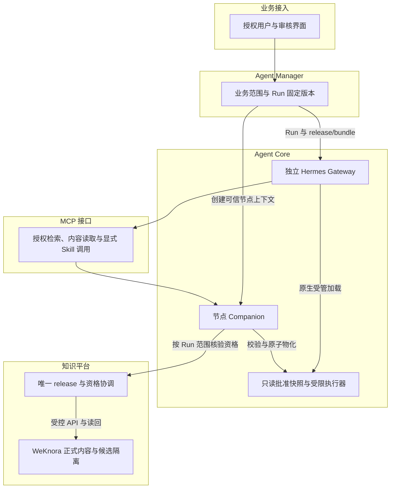
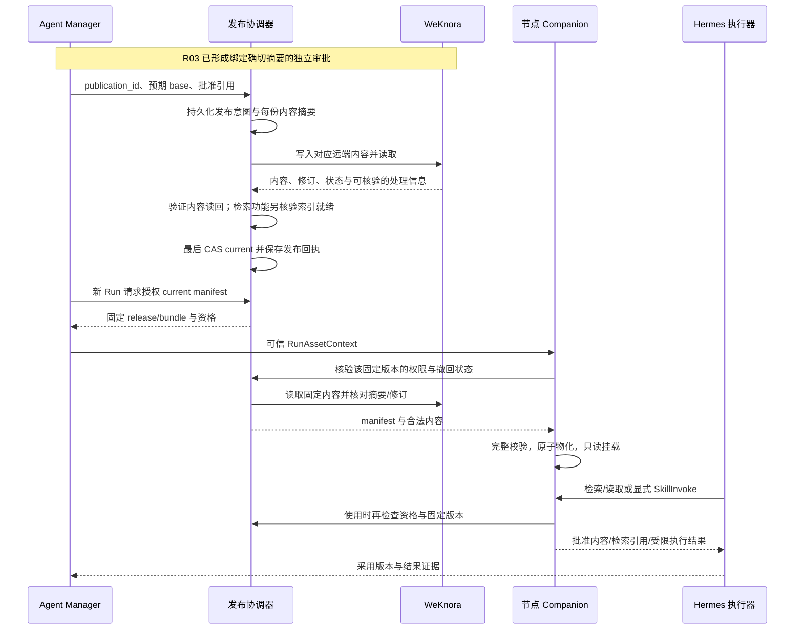

# R06 远端知识/Skill 权威、联合版本与本地批准消费

> **评审状态：`VERSION_CHAIN_VERIFIED_GENERIC_ADAPTER_PARTIAL`；详细设计待签收。** 历史证据覆盖真实远端读写和固定验证包链；通用 Skill 选择/加载/执行、问题驱动检索、完整 scope 与依赖管理尚未完成。本轮补齐设计和验收，不运行服务、模型或脚本。

[本项 Issue #8](https://github.com/zcimon57-svj/hermes-webui-engine-hub/issues/8) · [架构 PR #12](https://github.com/zcimon57-svj/hermes-webui-engine-hub/pull/12) · [总账 #2](https://github.com/zcimon57-svj/hermes-webui-engine-hub/issues/2) · [整体架构](overview.md) · [学习晋升 R03](r03-native-evolution.md) · [执行隔离 R01](r01-isolation-and-ui.md) · [多节点 R05](r05-multi-node-and-artifacts.md) · [决策](decisions.md) · [验收](acceptance-matrix.md) · [调研](research.md)

## 1. 目标与典型使用过程

正式知识与 Skill 内容由 WeKnora 远端保存；批准发布通过一个单写协调器确定唯一版本。Manager 为每个 Run 固定版本，节点经受控 MCP/HTTP 读取，在本节点或本 Run 的只读快照中使用。节点私有 Memory、会话、凭据和工作区继续各自持久化，**不共享可写 Home，也不让缓存成为另一个正式库**。[执行合同 §8](https://github.com/zcimon57-svj/hermes-webui-engine-hub/blob/6e6c4e897c62078ff1f14f072abe3fd7d7c461b3/engine_hub/contracts/EXECUTION-v1.md#L113-L124)。

| 用户场景 | 必须观察到的结果 |
|---|---|
| 领域人员批准一个 Cassandra 排障 Skill 的新版本 | UI 能看到候选/base/评测/审批关系、远端读回及 release 回执；下一 Run 真正使用新版 |
| Cassandra 两个节点执行同类问题 | 各自私有 Home/Session 不同，批准的同引擎内容 hash 相同；不必互相挂载目录 |
| 一个 Run 执行期间发布新版 | 在途 Run 保留固定版本；新版只供后续合格 Run 采用 |
| 用户询问一个尚未被固定验证包覆盖的问题 | 在授权、已批准、固定 release 的知识集合内检索；返回可定位来源和版本 |
| Skill 含多个脚本、模板、引用及第三方依赖 | manifest 声明完整文件与入口，加载与执行真实使用这些内容；缺依赖拒绝，不在业务 Run 自动安装 |
| 缓存仍有已撤回内容或远端权限失效 | 有字节不等于有资格；新的消费拒绝并保留原因 |

## 2. 当前实现与源码边界

固定本仓源码 [`6e6c4e89`](https://github.com/zcimon57-svj/hermes-webui-engine-hub/commit/6e6c4e897c62078ff1f14f072abe3fd7d7c461b3)。本节是静态核对和历史证据解释，不是本轮重新运行验收。

| 来源 | 当前真实能力 | 尚未覆盖 |
|---|---|---|
| [`assets.py:9–48`](https://github.com/zcimon57-svj/hermes-webui-engine-hub/blob/6e6c4e897c62078ff1f14f072abe3fd7d7c461b3/engine_hub/assets.py#L9-L48) | WeKnora manual knowledge 创建/读取/发布读回；有 `hybrid-search` 客户端方法 | 存在 search 方法不表示普通问答已调用它，更不保证按固定 release 检索 |
| [`assets.py:51–65`](https://github.com/zcimon57-svj/hermes-webui-engine-hub/blob/6e6c4e897c62078ff1f14f072abe3fd7d7c461b3/engine_hub/assets.py#L51-L65) | 包校验要求 `SKILL.md`、`scripts/probe.py`、`references/method.md`，可有依赖声明 | 是固定验证包合同，不是所有 Hermes/WeKnora Skill 的通用格式 |
| [`assets.py:73–96`](https://github.com/zcimon57-svj/hermes-webui-engine-hub/blob/6e6c4e897c62078ff1f14f072abe3fd7d7c461b3/engine_hub/assets.py#L73-L96) | Store 读取 current/release；内容读取核验 publish、摘要和记录过的 remote revision | 可变文档 ID 不等于不可变 release；尚无通用索引版本/检索就绪合同 |
| [`assets.py:136–190`](https://github.com/zcimon57-svj/hermes-webui-engine-hub/blob/6e6c4e897c62078ff1f14f072abe3fd7d7c461b3/engine_hub/assets.py#L136-L190) | 单个 Store 内比较 base 并更新发布指针，支持撤回/回退 | **CAS 属于 Hub 的本地协调存储，不是 WeKnora 原生跨文档事务**；远端部分成功和未知结果恢复需补足 |
| [`assets.py:193–219`](https://github.com/zcimon57-svj/hermes-webui-engine-hub/blob/6e6c4e897c62078ff1f14f072abe3fd7d7c461b3/engine_hub/assets.py#L193-L219) | writer 与 node 消费密钥分开，节点按 engine 限制 | 消费边界仍主要是 engine，项目/空间/用户范围尚未贯穿 release 与节点上下文 |
| [`companion.py:17–47`](https://github.com/zcimon57-svj/hermes-webui-engine-hub/blob/6e6c4e897c62078ff1f14f072abe3fd7d7c461b3/engine_hub/companion.py#L17-L47) | 每次访问远端版本，按 Skill 摘要缓存，核对声明文件，chmod 文件/目录 | 仅 chmod 不是独立执行身份或只读挂载；通用加载还需原子物化、完整 manifest 和同名覆盖检查 |
| [`companion.py:75–119`](https://github.com/zcimon57-svj/hermes-webui-engine-hub/blob/6e6c4e897c62078ff1f14f072abe3fd7d7c461b3/engine_hub/companion.py#L75-L119) | 固定执行 `scripts/probe.py`，返回 method/reference 与一份固定知识；检查 Python/包版本；workspace 只有 `node-evidence.txt` | 未实现问题驱动检索、通用 Skill 入口或通用工作区管理；有依赖检查不等于第三方依赖已实测 |
| [`node_mcp.py:15–45`](https://github.com/zcimon57-svj/hermes-webui-engine-hub/blob/6e6c4e897c62078ff1f14f072abe3fd7d7c461b3/engine_hub/node_mcp.py#L15-L45) | 仅有 `ops_evidence(context_id)`，经 HTTP 调 Companion consume | 当前标为只读的工具会触发固定 probe 执行，MCP/HTTP“读”不能推导任意脚本无副作用 |
| [历史 F22–F27](https://github.com/zcimon57-svj/hermes-webui-engine-hub/blob/6e6c4e897c62078ff1f14f072abe3fd7d7c461b3/engine_hub/acceptance-local-r1.json) / [目标重审](https://github.com/zcimon57-svj/hermes-webui-engine-hub/blob/6e6c4e897c62078ff1f14f072abe3fd7d7c461b3/engine_hub/reviews/2026-10-09-reassessment/goals-progress-v2.md) | 保留固定包、真实远端链和历史消费证据 | 不把这些 PASS 外推为通用 Skill、真实领域质量或当前同时双节点通过 |

### 第一方调研如何影响设计

| 官方来源与版本 | 核验发现 | 对本设计的约束 |
|---|---|---|
| [Hermes `skill_utils.py:337–413`](https://github.com/NousResearch/hermes-agent/blob/345cd2b057a452236de401d3534b8502a7465e8d/agent/skill_utils.py#L337-L413) / [`802–810`](https://github.com/NousResearch/hermes-agent/blob/345cd2b057a452236de401d3534b8502a7465e8d/agent/skill_utils.py#L802-L810) | 锁定版支持 external dirs/create dir/project skills；create_dir 会进入普通发现根，project/local 搜索优先于 external | 下载到 external dir 并不确保批准 Skill 胜出；把 pending 放进 create_dir 会被普通发现。需把候选移出发现根，固定目录并处理同名覆盖 |
| [Hermes `skills_tool.py:181–223`](https://github.com/NousResearch/hermes-agent/blob/345cd2b057a452236de401d3534b8502a7465e8d/tools/skills_tool.py#L181-L223) / [`461–480`](https://github.com/NousResearch/hermes-agent/blob/345cd2b057a452236de401d3534b8502a7465e8d/tools/skills_tool.py#L461-L480) | 索引 first-wins；skill_view 有项目优先/歧义处理 | 通用适配验收必须覆盖发现与实际加载是否同一个 hash，不能只检查文件存在 |
| [WeKnora 邻近源码 Skill API](https://github.com/Tencent/WeKnora/blob/1edcd54b43606d9079bb36650efe3f68707a79ea/docs/api/skill.md#L1-L18) | 该版本有 sandbox 安装、文件列表/内容接口 | 不能因此宣称锁定镜像的原生 Skill 已可用或与 Hermes 自动兼容 |
| [WeKnora `knowledge.go:257–280`](https://github.com/Tencent/WeKnora/blob/1edcd54b43606d9079bb36650efe3f68707a79ea/internal/types/knowledge.go#L257-L280) / [`knowledge_create.go:988–1113`](https://github.com/Tencent/WeKnora/blob/1edcd54b43606d9079bb36650efe3f68707a79ea/internal/application/service/knowledge_create.go#L988-L1113) | 邻近源码 manual metadata 有 version；发布先更新内容/状态，再异步处理索引；不是带 expected-version 的联合发布 CAS | 内容读回、索引就绪和 Hub 指针提交必须分别定义；不能用 version 字段或 HTTP 200 代替这些证明 |

[版本锁](https://github.com/zcimon57-svj/hermes-webui-engine-hub/blob/6e6c4e897c62078ff1f14f072abe3fd7d7c461b3/engine_hub/versions.lock.json)明确运行镜像源标记 `d97ad7a4`，邻近公开源码为 `1edcd54b...`；本轮未能用官方仓库解析前者为同一完整源码提交。因此邻近源码只用来提出兼容核验要求，**不作为该运行镜像真实行为的实证**。应在后续环境验收补齐完整镜像来源/构建和实际 API 矩阵。

## 3. 拟议分层架构与读取链路

当前已实现链路是 **Hermes stdio MCP → Companion HTTP → 发布服务/WeKnora HTTP**。图中的问题检索、显式通用 Skill 调用、完整 scope 和受限执行器为拟议增强，不是新增的第六个一级模块。

| 对象 | 权威与写入者 | 可以有的副本 | 不允许的双权威 |
|---|---|---|---|
| 知识/Skill 正文及支持文件 | WeKnora；受控候选/发布身份写入 | 节点按摘要可重建的只读快照 | UI 本地正式库、节点自建 latest |
| current、release manifest、撤回资格 | 知识平台单写发布协调器；当前原型 Store/SQLite | 读缓存与审计副本 | WeKnora、UI、各节点各自决定 current |
| Run 固定版本 | Manager 的持久 Run 记录 | 节点可信 context、报告 adoption 证据 | 工具随时解析 latest 并静默换版 |
| 原生会话、私有 Memory/工作区 | 各节点/工单唯一写入者 | 经授权的产物副本见 R05 | 六节点共享可写 Home，或中央 UI 挂载全部 Home |
| 评测/审批证据 | 按 R03 保存不可变制品和流程引用 | 发布 manifest 只引用准确摘要 | 缓存里自行写一个 approved 标志即获得正式资格 |

## 4. 版本模型和拟议接口字段

**内容修订、联合 release、缓存地址、执行身份是四种不同对象。** 一个远端 `knowledge_id` 可以被更新；只有 ID 无法证明 Run 固定了内容。一个文件摘要也不说明当前用户仍有权使用，或该版本尚未撤回。

下表为拟议字段，未声称已有 API 支持。现有 `engine/release/bundle_sha256/context` 由兼容层映射，内部接口需要另外核验。

| 记录 | 最小字段 | 谁核验 |
|---|---|---|
| `ReleaseManifest` | `release_id`, `scope_key`, `engine_id`, `project_id/space_id` 或明确引擎共享范围、`base_release_id`, `candidate_bundle_sha256`, `approval_ref`, `bundle_sha256` | 发布协调器保证每个明确 scope/channel 只有一个 current；节点不能新增独立权威 |
| 内容引用 | `remote_document_id`, `knowledge_base_id`, `remote_revision`, `content_sha256`, 来源/引用、`asset_kind` | 远端读回核验摘要/修订；KB 属于可信映射，不接收用户任意 URL |
| Skill 文件 manifest | Skill ID/版本、`SKILL.md`、文件路径/摘要/大小、脚本/模板/引用、声明入口、能力需求、平台/运行时/依赖锁 | 候选静态门禁与节点物化双重核验；不默认必须有 probe.py |
| 检索就绪记录 | `release_id`、内容摘要集合、索引观测/版本引用、ready 证据及时间 | 由实际锁定 WeKnora API/观测合同决定字段；没有可验证信号就不能声称检索已ready |
| `RunAssetContext` | `business_run_id`, `attempt_id`, `epoch`, `owner_id`, 完整 engine/project/space/resource scope，`authorization_handle/policy_revision`, `release_id/bundle_sha256` | Manager 创建，Companion 核验作用域/节点/版本；不能只信一个裸 context_id |
| `AssetRead/Search` | Run 上下文引用、资产/查询、固定 release、查询预算 | 服务端按 scope 和批准 manifest 过滤，禁止候选或孤儿文档进入命中 |
| `SkillInvoke` | 同一上下文、`skill_id`, 已声明入口、按 schema 校验的参数、幂等/调用 ID、资源预算 | 显式动作调用；消费身份不拥有发布/节点管理权限 |
| 采用回执 | Run/attempt/节点身份、release/bundle、实际文件/运行时摘要、引用与结果摘要 | Core 上报，Manager 留存；至少两个节点可对照真实采用内容 |

scope 的产品含义需 R02/R04 一起签收：同引擎共享资产可以明确授权多个空间，项目私有资产只能在其范围内消费；“同引擎”不能自动解释为“同引擎全部项目均可访问”。当前按 engine 建指针可作为已有基础，但新增 scope 必须纳入授权、缓存资格和发布 CAS 的键，而不是只在 UI 过滤。

## 5. 发布、读取、检索和执行流程

### 5.1 发布与消费的最低一致性

发布前必须按 R03 绑定 candidate/base/RCA/eval/approval 摘要。`publication_id` 对应持久发布意图；逐文档远端写与读回完成后再最终 CAS current。远端写返回未知时先核对既有文档 ID 与摘要，不盲重发；无远端幂等或可定位查询能力时保持待核对。协调器重启以同一意图恢复，不能靠重新创建整批文档“解决”不确定性。

当前单写 SQLite 可继续作为有界单实例实现基础，但不可因此声称跨 VM 多副本发布高可用。若切换/扩展发布协调器，需保证旧写入者被 fencing，所有写方使用同一持久权威和 CAS 条件；数据库产品选型不是本轮必须决定项。

**published 内容读回与检索就绪分别验收。** 邻近 WeKnora 源码显示索引可能异步处理，实际镜像仍需核验。只读固定文档功能可以有明确的独立能力状态；宣称问题驱动检索可用时，必须验证目标版本分块/索引已就绪、旧修订不会混入、必要命中可见，并在不就绪时明确返回 unavailable，而不是拿旧缓存冒充新内容。

### 5.2 问题驱动检索不能破坏批准边界

1. Manager 固定 release，MCP/Companion 从可信上下文取得用户 scope；查询不得自选任意 KB、候选状态或远端 URL。
2. 检索域由批准 manifest 的文档/版本集合决定，先尽可能用服务端过滤，再对每条命中核验授权、文档 ID、修订/摘要和撤回资格。只检查 `status=publish` 不足：CAS 失败或部分发布可能留下无批准 manifest 的远端文档。
3. 候选与正式内容即使暂存同一 WeKnora KB，普通检索仍必须排除候选、私有来源和孤儿；若锁定 API 不能可靠过滤固定版本，采用明确的批准文档 allowlist/受控集合读取，或保持通用检索未开放。不能靠后置删除文本片段证明没有召回/提示泄漏。
4. 回答引用保留文档 ID、修订/内容摘要、release 与可见引用；无法核验命中的版本时拒绝该命中。受测/业务 Agent 不读取 holdout 最终 RCA。

### 5.3 通用 Skill 的原生本地消费

优先复用锁定 Hermes 的目录/`skill_view` 能力，增加清楚的受管适配；不在每节点复制一套可变全量知识库。批准包在独立临时位置下载，验证完整 manifest、文件摘要和路径，再原子移入按内容寻址的只读快照。声明之外的额外文件、符号链接/危险路径以及不允许的入口必须拒绝，防止索引发现了未经审查的内容。

把快照加入 `external_dirs` 只是接入步骤；原生 project/local 路径的优先级可能覆盖同名批准 Skill。推荐每个 Run 只暴露其批准集合，禁用未审业务 Skill 的发现路径；命名冲突时明确拒绝或使用解析到准确批准 ID 的适配，不允许私有同名文件优先胜出。

私有 pending 必须保存在 local/create_dir/external/trusted-project/plugin 等所有正常 Skill 发现根之外；受管写入口先持久化非活跃候选记录，不把候选 SKILL.md 放进原生 `create_dir`。锁定版会自动把 create_dir 纳入发现集合，改目录名字不能实现隔离。业务运行不暴露可写 create_dir；批准目录仅由独立物化身份受管写入并在运行时只读。

若实现必须复用原生候选目录，则应在索引与 `skill_view`/实际加载两条路径强制排除未审内容，分别通过负例后才能开放，不能只在列表 UI 隐藏。所有业务写入仍按 R03 先待审，不直接写活跃目录。

文件 chmod 可减少误改，但不能替代独立执行身份/只读挂载。脚本进程只得到批准文件、自己的工作区和最小必要工具能力；不能继承发布密钥、`state_admin_key` 或 `/control`。**I01 修复前不开放通用可执行 Skill。** 依赖由维护者预置在锁定运行环境；业务请求不安装、不升级，缺失或摘要不符即拒绝。具体入口类型与第三方依赖组合需实测后逐步开放。

读取内容与执行 Skill 应有不同接口语义。当前 GET consume 会执行固定 probe；拟议通用执行使用显式动作请求和调用 ID，记录输入/结果、预算、取消与失败，避免浏览器预取、缓存或重试一个读取请求时触发重复动作。MCP 只是协议，工具名“read-only”不会自动约束脚本副作用。

## 6. 失败、撤回与恢复矩阵

| 故障 | 拟议处理 | 需要保留的证据 |
|---|---|---|
| 远端创建/发布超时，结果未知 | 保留意图和文档 ID，读回核对；不能安全确定时不重发、不切 current | 期望摘要、请求 ID/尝试、已知回执与待核对状态 |
| 部分发布或最终 CAS 失败 | 无 manifest 引用的文档隔离为孤儿，不进入正常检索；后续在证据保留规则下清理 | 同 base 竞争结果、各文档状态、引用检查 |
| 内容 publish 成功但索引未ready/失败 | 固定内容读取与检索能力分开报告；需检索的 Run 不冒用旧索引 | 处理/索引观测、失败原因、版本一致性结果 |
| 缓存缺失/下载中断/并发物化 | 临时目录验证后原子提交；残缺缓存不参与发现或执行 | 包摘要、完整文件清单、物化结果 |
| 缓存文件损坏、额外文件、路径/同名覆盖 | 拒绝加载，保存最小诊断；重新受控物化，不原地“修补后继续” | 期望/实际摘要、解析到的实际 Skill 来源 |
| 缺依赖/版本不合、执行超时或输出超限 | 明确失败，停止该调用，不自动安装或换入口 | 锁定环境/入口、时间/内存/输出限制与退出状态 |
| 撤回、授权收回、RCA 更正、远端内容漂移 | 新消费拒绝；缓存不赋权；在途 Run 按严重性停止后续使用/请求取消 | 固定版本、资格变更、最后成功核验与停止结果 |
| 发布新版本 | 后续 Run 可选新版本，在途 Run 保持已固定版本 | 新旧 Run 的 release/bundle 与采用回执 |
| 回退 | 核验目标仍合格后 CAS 指针；不更改历史包、报告或已执行动作 | 预期 base、目标、原因和回退读回 |
| 远端临时不可用 | 默认拒绝新消费；未来若需要离线资格租约，需另行签收有效期与撤回风险 | 无资格信号时的明确拒绝，不声明缓存永远可用 |

当前原型每次 consume 都回源核验，是有界安全默认；缓存加速并不要求引入离线授权。长期缓存保留时间与资格有效时间须分开：字节可以保留用于复现，资格失效后仍不可业务使用。

## 7. 备选与待决策

| 决策 | 推荐 | 取舍与责任角色 |
|---|---|---|
| R06-D1：WeKnora 原生 Skill API 还是当前 manual 包适配？ | 先验证锁定运行镜像接口；保留明确版本的薄包适配，兼容后再切换 | 原生 API 存在不等于 Hermes 包/运行时兼容；知识/Core 维护者给实测矩阵 |
| R06-D2：怎样划分 release scope？ | 每个明确引擎共享/项目范围有唯一发布权威；Run 固定完整组合 | 与 R02/R04 统一 project/space 语义；不能 engine-only 后再声称完整项目隔离 |
| R06-D3：如何保证原生加载的是批准文件？ | 每 Run 受管批准目录、只读挂载、显式解析和冲突拒绝；pending 放在全部发现根之外 | Core 确认 local/create_dir/external/project/plugin 的索引及加载范围，业务运行 create_dir 禁写，批准物化身份独立 |
| R06-D4：发布什么时候显示可用？ | 内容读回、批准指针提交和需要的检索ready分别有回执 | 业务/知识维护者确认固定读取与检索两种能力的显示；禁止“200即全部可用” |
| R06-D5：未知写、并发与跨主机如何处理？ | 单写协调＋持久意图＋读回＋最后 CAS；跨主机 HA 独立验收 | 知识维护者确认远端幂等能力与 fencing 需求；不提前引入复杂平台 |
| R06-D6：依赖、离线和撤回窗口怎么定？ | 已预置锁定依赖；当前不做离线授权；新消费按实时资格拒绝撤回 | 运维/业务给可接受延迟、版本兼容与缓存保留策略 |
| 直接共享 NFS/可写 Home 或每节点自管正式库 | 不采用 | 与已确认状态隔离/唯一内容权威冲突；不能作为实现捷径 |

## 8. Given / When / Then 验收矩阵

本轮以下均为目标新增验收，状态为待实现/待验证；F22–F27 历史有限范围不重写。

| ID / 旧 F 映射 | Given | When | Then / 必须保存的证据 |
|---|---|---|---|
| R06-A1 / F22/F23/F25 | 已批准候选、明确 base 与远端文档摘要 | 正常发布并启动后续 Run | 内容读回/指针回执/实际采用同一 bundle；旧 Run 不漂移 |
| R06-A2 / F23/F25/F31 | 同 base 两发布、远端部分成功/超时 | 重启协调器、重试同 publication_id | 唯一胜者；未知写先读回；无盲重发；孤儿不能检索 |
| R06-A3 / F22/F23 | 固定版本索引未ready、旧索引仍存在或更新失败 | 发起问题驱动检索 | 不把 publish 状态当ready，不混旧修订；返回明确不可用或合格固定版本 |
| R06-A4 / F22/F26 | 同 KB 中有候选、孤儿、私有项目与已撤回文档 | 直接检索、支持文件读取和缓存命中 | 全链只返回授权且被批准 manifest 引用的内容；保留负例和引用版本 |
| R06-A5 / F24 | 无 probe.py 的真实完整 Skill，多脚本/模板/引用，锁定依赖 | 原生发现、skill_view 和受限调用 | 实际解析/执行来自正确批准 hash，完整方法/文件被使用；不是固定包演示 |
| R06-A6 / F08/F24/F26/I01 | 私有同名 Skill、pending SKILL.md、恶意额外文件、损坏/符号链接缓存；逐一覆盖 local/create_dir/external/project/plugin 发现根 | 普通索引、skill_view/直接加载、执行及直写批准目录 | 未审候选不被发现或加载；仅放入 create_dir 不能通过；冲突/损坏拒绝、无覆盖；执行身份读不到发布/节点管理凭据，不能写批准目录 |
| R06-A7 / F24/E03 | 依赖缺失、版本不合、脚本超时/超输出 | 显式调用与取消 | 有界失败，不自动安装/升级；没有读取请求触发重复副作用 |
| R06-A8 / F10/F19/F24 | 两个同引擎节点和一个异引擎节点，项目范围不同 | 实际新 Run 消费同一共享批准版本 | 同引擎合格范围同 hash，私有 Home 仍隔离；异引擎/未授权项目拒绝；并发能力按 R05 单列 |
| R06-A9 / F26/F12 | 缓存中已有包，运行期间撤权/撤回/RCA 修正 | 下一次读取/执行与新 Run | 新消费拒绝，在途按撤回合同处理；历史仍能审计 |
| R06-A10 / F27 | 远端状态管理超出固定 MEMORY.md/node-evidence.txt | 指定批准的工作区范围并做 CAS 更新/读回 | 真实远端结果与 UI/执行一致；路径/权限拒绝；通用管理另有明确 allowlist 和实现证据 |

F11 领域质量、F21 第二物理主机与 F30 内部接口继续单列；本地通用适配和 I01 不是这些环境项的替代名称。文档合入不能自动关闭 Issue #8。
