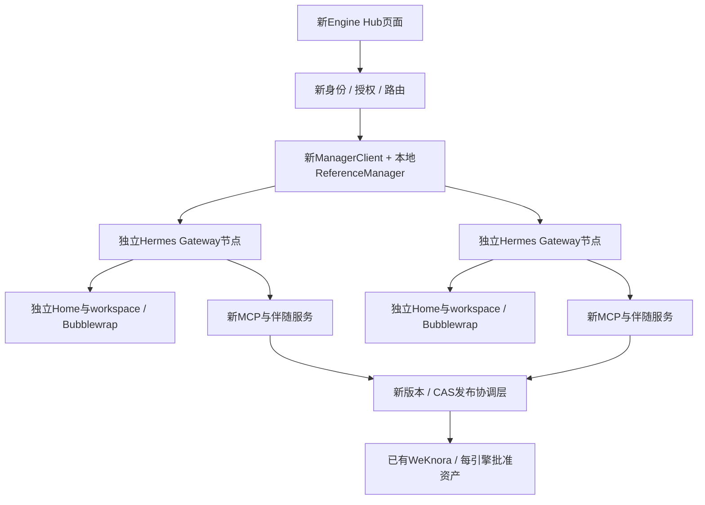

# 多引擎隔离与多节点：当前实现来自哪里

2026-10-09，代码HEAD `74437cb77829c7b301cdab8d92722315e4ebbab4`，结合当前未提交资源改动。**当前多引擎控制、隔离与节点管理主要是派生仓新增的Engine Hub；执行核心复用Hermes Gateway。当前Hub界面也主要新写，直接复用上游WebUI的CSS，并没有把原WebUI Profile/会话后端扩成多引擎节点控制面。**

[源码SHA/上游差异与边界记录](isolation-implementation-provenance-v1.json)。本轮只读源码和已有证据，没有启动服务、模型、容器或攻击验证。当前服务停止状态来自既有STATE记录，不把源码读取当现场运行验收。

## 明确入口与复用范围

上游WebUI基线 `4a0639397d1d4eb14965d9e88f39aecffa9ef345`。本轮`git diff`核对原`server.py`、`api/`、`static/`和`index.html`相对基线无差异；这些原生能力仍保留在仓库。私人派生历史/许可证保留不等于它们参与当前Hub请求链。

[lab.py:192](../../scripts/lab.py#L192)启动的是`python -m engine_hub.service ui`；[service.py:28](../../service.py#L28)实例化新`Hub`；[server.py:41](../../server.py#L41)提供新页面`engine_hub/static/index.html`、`hub.js`、`hub.css`，仅将根`static/style.css`映射为`/upstream.css`。[hub.js:6](../../static/hub.js#L6)调用新Hub的API，页面问答/状态渲染也是新实现，主要4秒轮询；没有调用原WebUI Profile/API后端。

| 能力 | 实际来源与源码 | 当前实现含义 |
|---|---|---|
| 一个浏览器入口、节点目录、问答与报告显示 | **新增**：[Hub服务](../../server.py#L18)、[Hub页面](../../static/index.html#L2)、[hub.js](../../static/hub.js#L15) | 共用上游CSS；原WebUI完整工具卡片、工作区文件浏览、Profile管理、SSO等不自动继承 |
| Admin/Viewer/Chat身份与engine/project/owner授权 | **新增**：[auth.py](../../auth.py#L8)、[server.py](../../server.py#L116) | Hub独立用户/会话状态；不是原WebUI OIDC/可信代理Profile绑定的直接适配。管理覆盖仍部分 |
| 引擎/实例/空间选择及追问固定 | **新增**：[routing.py](../../routing.py#L26) | 服务端拒绝客户端node/profile/URL/key等字段；按授权范围路由，space自动辨识尚不完整 |
| 同引擎节点池、会话固定节点、Run状态/取消 | **新增**：[manager.py](../../manager.py#L84)、[supervisor.py](../../supervisor.py#L29) | ManagerClient是内部接口适配合同；现场开发运行的是本地ReferenceManager，不是内部Manager上线 |
| Agent推理、原生Session/Run、MCP调用 | **复用Hermes**：[启动Gateway](../../scripts/lab.py#L163)、[POST /v1/runs](../../manager.py#L175) | 每个节点启动真实Hermes Gateway；不是启动六个完整WebUI服务。返回的gateway_run映射到Manager Run |
| 各节点Home/工作区/配置/端口/密钥 | **新增部署封装＋Hermes状态能力**：[lab.py](../../scripts/lab.py#L124) | 各节点单独磁盘目录映射到自己的`/state`和`/workspace`，进程设置`HERMES_HOME=/state`；`multiplex_profiles=false` |
| 文件系统/进程命名空间隔离 | **新增组合，复用Linux/Bubblewrap机制**：[bwrap](../../scripts/lab.py#L99) | 仅绑定自身可写状态/工作区；源码/运行库只读；user/pid/ipc/uts及隔离文件挂载；网络和内核仍共享 |
| 远端Memory/工作区、私有草稿和批准缓存 | **新增**：[companion.py](../../companion.py#L50) | 伴随服务提供状态allowlist/CAS和按版本消费；不是原WebUI通用远端工作区能力。当前固定状态文件/Skill验证包限制仍在 |
| 同引擎批准知识/Skill共享 | **复用WeKnora存储＋新增发布层**：[assets.py](../../assets.py#L9)、[RemoteSkillProvider](../../companion.py#L17)、[node_mcp](../../node_mcp.py#L1) | 每引擎独立身份/KB；发布指针/版本CAS由新协调层维护；各节点按固定release/hash分别缓存消费 |
| 总资源限制和按需启停 | **新增组合，复用systemd/cgroup**：[resources.py](../../resources.py#L16)、[启动器](../../scripts/lab.py#L54) | 当前代码3GiB总硬上限/2.5GiB高水位/0swap/192tasks；CPU为单核亲和性，非已生效CPU配额 |

## 原WebUI本来有什么，为什么不能说它就是这套隔离

上游[api/profiles.py:53](../../../api/profiles.py#L53)已有按请求Profile上下文；[isolated profile模式](../../../api/profiles.py#L221)可显式固定单Profile、拒绝跨Profile操作；[workspace.py](../../../api/workspace.py#L52)按Profile保存工作区配置。它也有Gateway适配、原生会话恢复、工具/富文本显示等能力。

这些有复用价值，但当前Hub没接它们。Hub隔离实际来自独立Gateway进程、独立Home、Bubblewrap挂载、API身份与服务端scope校验。Profile是逻辑状态边界，不自动成为多引擎业务授权或任意脚本的操作系统安全边界。不能用“支持多个Profile”代替跨引擎/跨节点隔离验收。

这是调用/隔离结构，不证明图中两个节点在现版本同时运行过。

## “六节点”的实际形态

[seed.py:14](../../scripts/seed.py#L14)的默认拓扑为MySQL=node-01、PG=node-03、Cassandra=node-02/node-05、Redis=node-04/node-06。每节点是本机独立Hermes Gateway进程及伴随服务，具有单独地址、身份和状态；不是六台物理主机、六个WebUI实例或当前全部常驻的六个节点。运行配置可覆盖默认拓扑，本轮未读取含凭据的运行config。

同引擎共享来自每个节点指向同一engine批准release/WeKnora身份范围，不是共享可写Home。Manager把会话固定到原节点，追问继续同一绑定；这是新Manager控制逻辑，不来自WebUI Profile切换。

## 当前隔离边界和未完成项

- **业务/API隔离**：新授权检查和独立密钥；历史测试覆盖错误密钥、消费身份写拒绝、受限用户目录和追问节点固定。项目/配置管理范围仍有缺口，不能称完整RBAC覆盖。
- **节点文件/进程隔离**：独立Home和Bubblewrap；共享宿主、内核、网络（未配置`--unshare-net`），不构成强租户网络隔离或每Issue隔离。
- **I01脚本权限缺口仍在**：伴随服务挂`/control/config.json`，含state_admin_key；批准脚本通过prlimit运行但继承同一服务身份和挂载，可见控制目录。静态确认，越权攻击NOT_RUN；原生Gateway不挂控制目录不意味着伴随脚本也安全。
- **I02同时双节点仍未验**：[supervisor.py:40](../../supervisor.py#L40)仍保留一个热Gateway，忙碌时拒绝唤醒另一个；手工启动器上限两个。预算变为3GiB没有同步把自动策略改成两个热节点。[历史证据](../../evidence/guarded-hub-20261008T170041.json)明确one warm node at a time；不能算当前同时双节点通过，也不是缺第二物理主机导致。
- **节点状态与发布适配不是通用资产运行平台**：Memory关闭、mcp-ops工具白名单、固定Skill脚本/引用及状态文件仍是受测实现边界；自进化原生接入另有已确认设计，尚未实现。

因此应准确描述为：**在私人WebUI派生仓中新建了多引擎Hub控制与交互层，复用Hermes Gateway及WeKnora，自己组合隔离与节点运行管理。** 不能把新增控制面说成原WebUI现成功能，也不能把新Hub称为已经保留原WebUI完整功能的增量版本。原合同允许声明本地ReferenceManager；内部Manager仍F30 NOT_RUN。本轮只厘清归属，未决定或实施新的前端集成路线，整体R01/R05仍部分完成。
