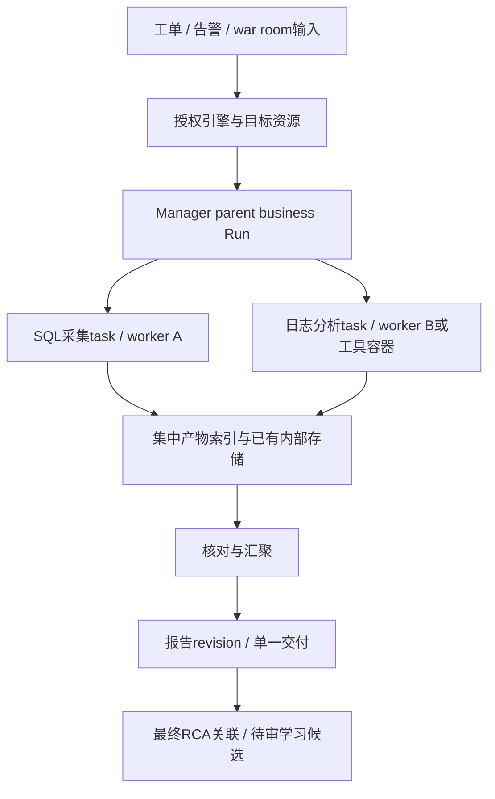

# 同一引擎跨VM/容器：路由与产物管理分析 v1

2026-10-09。范围为架构分析；没有部署VM/容器、启动服务/模型或修改产品代码。**建议由现有Manager统一持有业务Run、资源分配与产物索引，Hermes节点负责执行；一个引擎对应一个可扩展节点池，产物归属工单/业务Run而不是主机。** 本文为PROPOSED，尚未用户定选或实现，不改变既有原生RCA进化设计与六目标验收状态。

## 先判断多个资源承担什么职责

| 场景 | 推荐处理 |
|---|---|
| 多个工单需要更高并发 | 同引擎多个等价Hermes worker，每个Run选一个节点；各节点独立Home和任务工作区 |
| 被诊断的数据库/业务系统本身跨多个VM或容器 | target_resource_ids表示诊断对象；一个Hermes Run可以通过MCP取多个目标证据，不必为每个目标启动Agent |
| 一个工单确实需要多个执行环境共同工作 | 一个parent business Run下拆有限子任务，分配具备相应能力的worker或临时工具容器；汇聚后形成一个正式报告 |

worker_node_id表示哪里执行Agent，target_resource_id表示分析哪个业务实例/主机；两者不能混同，也不能通过切换worker改变业务权限。普通多目标证据采集优先用已有MCP；需要并行或专门算力时才拆执行任务。

## 两级路由：业务范围先定，执行位置后选

第一层由业务接入/Hub确定身份和授权的engine/project/environment/instance及目标资源；按可信资源目录关联实例，歧义时澄清。第二层由Manager从该引擎允许的节点池选择执行资源，依据：健康/接收状态、目标可达且有权限、能力/版本/依赖、内存/并发/模型预算，最后按实际占用与排队情况择优。

浏览器和模型不能直接提交任意Gateway URL、凭据、主机路径或node_id来绕过调度。引擎/能力标签由可信注册/部署方维护，节点自称属于某引擎不能直接取得其身份和知识权限。

最小节点登记：node_id、所属engine及允许scope、worker实例代际、端点/身份引用、能力与版本、所在host、容量、心跳/租约和enabled/draining状态。稳定逻辑node_id与本次VM/容器实例代际分别记录，避免重建后旧实例回来冒充新worker。

| 路由规则 | 设计含义 |
|---|---|
| 同一Run的attempt固定执行节点 | 正在运行的Session/工具状态不在负载均衡过程中漂移 |
| 会话追问优先原节点 | 节点健康、授权和预算允许时保持连续性；忙碌时排队/拒绝，不暗中迁移 |
| 故障迁移需新attempt | 由Manager根据持久输入/批准版本/必要检查点恢复；逻辑conversation不变，Gateway Session/运行实例可变；不能假装继承未持久状态 |
| 只读任务可有限重试 | 固定输入版本与预算，旧attempt留证；重试后结果由当前attempt认领 |
| 写操作结果未知 | 先核实副作用/幂等键，不能因超时就在另一VM重复执行；危险操作仍需原审批 |

不要复制完整Hermes Home迁移会话；Home可能含凭据、私有记忆和其它任务状态。使用已授权会话快照/证据引用、必要工作检查点及同一批准资产版本，在新节点重新建立运行上下文。支持哪些工具状态恢复要逐项验证，不声称可无损迁移任意活跃Agent。

## 同一工单多资源协作：先做有限子任务

例：PG工单需要SQL锁证据和日志关联。Manager创建业务Run，分别分配SQL只读采集、日志分析两个task；它们访问明确授权的目标资源，产出独立证据/局部结论。协调步骤核对引用、冲突和缺失，生成一个报告revision。不是两节点各自在原工单写一份“最终报告”。

首期支持明确的少量子任务及必需/可选标记即可，不引入外部工作流或Agent Team项目。必需子任务失败/缺证据时输出PARTIAL或失败并列明缺口，不能把其它任务成功当整体完成。子任务读取parent固定的input_revision和knowledge/skill release/hash；不同专门Skill版本若确有必要，也应在plan中明确冻结。

## 产物归业务Run，节点只持临时工作副本

| 数据 | 权威/存放建议 | 分享边界 |
|---|---|---|
| Run/task/attempt、分配、状态、manifest和交付回执 | 现有Manager持久保存元数据 | 按owner、project、engine及既有授权 |
| 日志片段、指标快照、附件、脚本输出和中间报告 | 已有内部文件/对象存储；轻量首期可用Manager管理的集中产物目录 | 按具体Run授权，节点只得必要读/写能力 |
| 最终报告 | Manager创建不可覆盖的report_revision并关联产物manifest；业务入口收一个明确delivery | 汇总后不扩大子任务数据权限 |
| 正式可复用知识/Skill | 已有WeKnora与发布指针，经RCA评测及周期人审后发布 | 同引擎、授权scope内消费；不自动跨引擎分享 |
| 节点Memory、凭据、临时工作目录、学习草稿 | 节点或任务私有环境；仅上传明确选定且脱敏的证据/候选 | 不共享可写Home，不作为共享产物包复制 |

关键产物索引：artifact_id、business_run_id、task_id、attempt_id、input_revision、engine/project/owner、target_resource_ids、产生节点与实例代际、类型、存储引用、SHA256/大小、证据时间、知识/Skill/工具版本、上传/验收状态。存储路径由服务端生成；目录分区有助组织，但不能代替授权检查。

每个task/attempt使用独立暂存路径，上传登记按id+hash幂等。接收方确认当前有效attempt/授权、校验内容，提交不可变manifest后才算产物就绪。节点说“执行完成”却未上传成功，不应显示为业务产物已交付；节点销毁前等待中央确认或明确保留失败/缺失状态。多个worker不能覆盖同一个report.md。

后续追问通过业务Run/conversation和manifest读已授权历史证据，重新取得执行节点；不能要求原VM永久存在。工作节点缓存可重建，业务证据和正式版本应在节点丢失后仍能追溯。普通报告/原始trace不自动进同引擎公共知识库。

## 重试、晚到结果和取消需要同一个Manager裁决

- task派发先持久化attempt、节点实例代际、租约/递增epoch及幂等键；只有当前有效epoch可以提交正式产物或推进业务状态。
- 节点A失联，Manager撤销/失效旧attempt再分配B；A随后恢复的输出保留为旧尝试证据，不能覆盖B的正式结果。
- 租约过期不等于旧进程已停止。对修改业务状态的MCP动作，授权/epoch检查要在动作端执行；若无法证明旧操作已停或幂等成立，先停在未知/待核查状态。
- 取消parent应持久化意图、关闭新任务派发并通知所有活跃子任务。失联子任务不能靠收到通知的假设认定已停止；晚到报告不能自动恢复取消的Run。
- 最终report_revision和delivery仅由有效parent状态创建；交付成功也不自动关闭外部工单或确认最终RCA。

同节点不同Run应使用独立任务工作目录和受限凭据；路径子目录只是组织方式，若执行不可信脚本，还需按task挂载/容器隔离。当前I01控制凭据可见性问题必须先修，不能扩大多VM规模后继续继承管理身份。

## 容量管理：跨主机仍要有引擎总预算

每台host/容器需要真实本机CPU/内存/pids/swap硬限制；Manager同时控制engine、Run、task和模型调用总并发/总预算。当前3GiB是本机项目包络，不能复制为每worker各3GiB后声称全局还是3GiB。容器销毁/节点失联后的资源回收与预算释放要有可核对回执或租约状态。

当前模型单并发依赖本地flock，跨VM各有自己的锁文件，不构成跨主机互斥；需要由现有Manager分配模型调用额度/租约。当前CPU亲和性和cgroup也只管本机。跨VM的身份、网络通道、端点重建和启动资源由内部部署方提供安全配置，不能直接对外开放本机服务来当分布式部署。

## 当前已经有的基础与确实没有的部分

| 能力 | 当前源码事实 |
|---|---|
| engine筛选/节点启用/运行数约束/健康检查 | [manager.py:84](../../manager.py#L84)已实现简单节点池；轮换按累计历史Run，不是实时CPU/RAM负载调度 |
| 追问固定节点、幂等派发、固定release | [manager.py:139](../../manager.py#L139)、[dispatch:175](../../manager.py#L175)；attempt字段当前固定1，没有跨节点attempt迁移管理 |
| 节点不可达 | [reconcile:244](../../manager.py#L244)记录target_unavailable；没有自动创建另节点的新attempt接管 |
| 报告产物 | [manager.py:213](../../manager.py#L213)把Gateway输出及SHA写入本地Store；delivery标注local-reference/external NOT_RUN。没有通用文件产物上传/manifest与子任务汇聚 |
| 服务与节点部署 | [service.py:30](../../service.py#L30)绑定127.0.0.1；配置节点表静态，当前启动器和模型锁为本机逻辑；不是已验收跨VM注册/心跳/调度 |
| 远端正式资产 | [Companion](../../companion.py#L17)已有按批准版本/hash分别缓存；不意味着节点产生的所有业务文件已集中管理 |
| 当前并发边界 | [supervisor.py:40](../../supervisor.py#L40)仍单热Gateway，同时双节点验收仍未通过；F21第二主机、F30内部接入也未验 |

这些是本轮静态核对；没有进行新的运行/故障验证。内部Manager可能已有部分能力，但当前F30接口不可核查，不能重复造一个生产调度权威，也不能把本地ReferenceManager当成内部已上线。

## 建议实施顺序与验收

先修I01并完成本机同时双节点；随后把节点池/集中产物接口接现有Manager，先验证不同独立Run路由到同引擎两worker。再按有明确业务收益的场景支持一个parent+两个受限task及汇聚；跨VM验证身份/网络/资源与故障迁移，不默认同时启动六节点。本文不新增已承诺产品范围，具体实施优先级随用户指令确定。

最低验收：正确授权资源/能力选择；多worker不会覆盖文件；固定版本和完整manifest可读回；节点执行完成但产物未上传保持未交付；断线/重建/晚到旧attempt不能改正式结果；结果未知的写动作不自动重试；必需task失败保留PARTIAL/失败；取消阻止新任务和晚到发布；节点丢失后集中证据仍可读；同引擎批准资产共享、私有状态/跨项目/跨引擎拒绝访问；总容量不因多VM或子任务数量被放大。所有新增场景当前NOT_RUN。

## MCP、本地目录与自进化的关系

节点不通过共享可写Home互读，也不是直接通过MCP调用其它节点。当前实际链为：`Hermes → 本节点stdio MCP → HTTP调用本节点Companion → HTTP读取批准资产服务/WeKnora`。Companion把Skill包按hash缓存到本节点`/state/approved-cache/<sha>`，读取方法/引用并执行固定脚本，结构化结果返回给Agent；知识当前为固定批准版本内容。MCP是工具接口，不是共享文件系统或存储权威。

Hermes原生的Skill/Memory确实在本地目录。本轮已确认的受控学习设计要求：业务学习先写私有pending/草稿，不进入正常Skill扫描或知识检索；确认RCA、内部评测和周期人审后，由独立发布身份CAS发布正式版本。其它同引擎节点在新Run前拉取该版本为本地只读快照，再按受管加载路径读取；已有Run固定原版本。不能先改活跃skills目录、先对业务生效，再等周期审核。

当前**未实现**完整原生学习→candidate链及通用本地Skill加载；不能把验证包approved-cache的存在等同于已经安装到Hermes原生skills目录。后续可以利用受管Skill加载目录/外部目录机制，但要确保私有候选不会覆盖同名已批准Skill，并用实际只读挂载/写入口门禁保证批准内容不被Agent改写。节点Memory、凭据、会话与可写Home不自动同步。

已有内部文件/对象存储可用来集中保存Run产物，节点通过授权API/MCP按需读取；必要的任务专用只读挂载也可另验。这与让所有节点共同挂载并修改同一个Hermes Home是不同的边界。已批准的同引擎知识/Skill共享“版本和内容”，每节点保有各自副本与私有状态。
