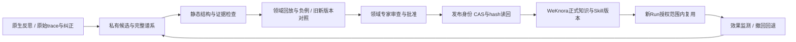

# Hermes原生自进化的质量门禁：项目核对与接入建议 v1

2026-10-09。用户要保留原生学习，配合外部系统、人工、静态检查与门禁，防止trace中看似有用但业务语义错误的经验进入正式知识/Skill。**已有相关项目，但没有找到经本域验收、开箱即用且能保证业务语义正确的Hermes插件。建议保留原生候选生成，把晋升正式资产的权限交给独立质量门禁。**

范围：公开第一方源码/文档和社区原帖选读；没有安装项目、运行第三方优化器、模型评测或业务回放。另按用户授权实际调整资源保护并读取kernel值，见[预算实证](resource-budget-v3-applied.json)及[13项资源检查](resource-budget-v3-checks.json)。来源SHA/选读文件与hash见[来源账本](native-evolution-quality-sources-v1.json)。原六目标仍PARTIAL，质量门禁尚未集成。

## 直接扩展原生管线的项目与思路

| 项目 | 与Hermes原生的关系 / 本轮核对 | 能借鉴什么 | 尚不能证明什么 |
|---|---|---|---|
| [Hermes原生写审批](https://hermes-agent.nousresearch.com/docs/user-guide/features/skills) + [插件Hooks](https://hermes-agent.nousresearch.com/docs/user-guide/features/hooks) | 固定Hermes SHA345cd2b0已有skills.write_approval与memory.write_approval；覆盖前台/后台工具写；pre_tool_call可阻断或要求审批 | 保留原生反思产候选，先pending，显示diff；插件连接企业评测和审核 | 写审批只是同意写入；不是业务正确性判定，也不能覆盖直接文件写、所有同步/脚本路径。审批transport负责展示，不等于权限/质量策略 |
| [pingchesu/hermes-curator-evolver](https://github.com/pingchesu/hermes-curator-evolver) | 原生插件hooks采集post_tool_call/post_llm_call/session_end，私有证据→proposal→verifier；选读4核心源码 | 轻量collector、默认dry-run、来源/精确SHA/备份、可自定义verify-command与失败回滚 | 默认skill_validate只检UTF8/frontmatter/marker等；proposal grounded检查主要是计数/匹配而非逐条语义蕴含。semantic搜索是候选相关性，不是事实正确性 |
| [Carlo1911/skill-evolution](https://github.com/Carlo1911/skill-evolution) | Hermes HostAdapter；proposal与完整候选文本目标；deterministic/LLM judge/regression，human_review可选；选读evaluate/proposal/host源码 | 将门禁放在apply前、提供商失败关闭、历史基线、可扩展evaluator和人工否决 | 默认LLM judge评价正文的正确性/格式/简洁并平均；regression比历史分数，并未执行本域数据库回放。human_review不在默认集；可配置majority，关键门禁不能允许多数投票绕过 |
| [AnimaApp/smarter-agent](https://github.com/AnimaApp/smarter-agent) | 可装为Hermes Skill；社区作者以trace再现和反思改进原生行为；选读说明与simulation/runtime-gating方法 | 无后见信息的旧版/候选对照、正/反/边界例、冲突扫描、独立审查、决策与工具动作证据 | 是验证协议和Skill，不是覆盖每个写入入口的强制门禁；模型“脑内模拟”不能替代真实工具/业务评测。项目自身也区分单次验证和runtime coverage |
| [MisEvolve / SafeEvolve](https://github.com/henrymao2004/misevolve) | 研究框架含Hermes-native原生后台学习实验路径及治理模块；选读hermes_native/safeevolve与审查提示 | 写入时结合lineage审查，修改只删除/收窄风险跨度；复用时考虑风险/使用结果，撤退污染资产 | 不是开箱Hermes插件；native实验限制前台skill_manage、控制后台review触发。SafeEvolve源码有audit-retain-native/无deleter仍ADMIT分支，不能当严格拒绝门禁；论文结果不是本业务语义效果 |
| [blueif16/hermes-skill-system](https://github.com/blueif16/hermes-skill-system) | 借鉴Hermes研究的Claude Code协作Skill，不是Hermes runtime fork | 人工质量责任、原子可回退修改、最小耐久改动、完整系统地图 | 方法/约定为主，不替代自动业务评测。其对Hermes机制的二手概述不覆盖当前源码事实 |
| [Nous独立self-evolution](https://github.com/NousResearch/hermes-agent-self-evolution) | 前轮已核对，优化作业内核方向 | GEPA候选探索可接同一门禁 | 不必用它替换原生学习；Phase5/planned与正文回写疑点保留，不能充当质量权威 |

### 三个源码细节，直接影响是否能当“门禁”

**Curator Evolver**：`verifier.py`的grounded判定主要是proposal和report证据计数均>0；`skill_validate.py`只做结构检查。`guarded_apply.py`在未提供verify_command时返回enabled=false/passed=true，并且验证通常发生在写入后、失败回滚。生产正式库应先在隔离候选副本验证，不能允许“先写正式文件再回滚”短暂污染其它Run；验证命令由维护者固定，不接受候选指定任意shell命令。

**Carlo项目**：`host.py`的HermesAdapter返回后续由Agent执行的写指令；`proposal.py`却已将proposal标成APPLIED。本轮静态核对确认状态与实际持久写入之间有窗口，未运行复现。实际Hermes写入可能还要经过原生审批或失败；必须读回候选hash与版本，再标正式发布，不能把该APPLIED作为知识已正确生效的证据。

**SafeEvolve**：critic/repair和风险谱系有价值，但`governance/safeevolve.py`发现risk后可能保留native candidate附带audit。我们要的业务正式资产策略必须另设严格quarantine/reject，不照搬研究中的非阻塞策略。即使换一个模型当critic，也只是额外意见，不能替代领域真值。

## 原生接入：保留学习能力、分离正式写权限

固定版原生说明支持：

```yaml
skills:
  write_approval: true
memory:
  write_approval: true
```

以上为建议配置，**本轮没有写到任何真实Hermes Home或启用学习**。Skill前台/后台写暂存到pending；memory交互可inline审批、其它路径暂存。我们还应把有业务语义的记忆/事实导入同一candidate门禁；仅审批Skill会漏掉Memory污染。`display.memory_notifications`只控制显示，关通知不会停止学习。

插件pre_tool_call适合拦模型工具写和触发受控候选入队；post_tool_call/session_end适合采集和展示，不能事后把已生效改动认证为预先通过。原生审批本身也不是不可绕过的执行隔离：当前源码配置/模块加载失败有允许分支，终端/脚本直接写或同步路径不必调用skill_manage。正式库/挂载只读、独立发布身份和服务端CAS必须形成第二层强制边界；I01脚本可见管理凭据必须先修。



建议企业分工：Agent Core接原生pending/插件与隔离执行；领域维护者定义事实来源、业务约束与回放oracle；Manager保存业务结果、候选/评测/审批状态及身份；CI/隔离评测服务跑静态和回放；知识平台WeKnora存正式版本，薄release coordinator管理唯一发布指针。MCP仅提供授权证据/候选提交/验收调用/版本读取，不允许生成者获得发布密钥。仍保持五个既有一级模块，不新增“评测平台”一级模块。

## trace只能提出候选：晋升条件必须是业务语义

“命令成功”“报告写回”“任务done”“用户点赞”“出现同一错误100次”都可以是信号，但不能直接等于事实或正确方法。trace常混有模型推断、工具原文、用户转述、临时绕行和已经过时的环境；明确标注来源身份和时间，并将事实、推断、候选规则分开。

例子：一次查询慢，在重启后恢复。可以保存“该版本/实例在这个时间观察到重启后指标恢复”的有界事件，不能晋升为“慢查询应重启数据库”。测试必须包含锁等待、执行计划退化、资源耗尽、正常长事务等不同原因，检查是否先取证、是否提出未经许可的重启、能否识别证据不足。不能让成功消除一个症状掩盖错误归因或危险操作。

每条新事实/规则应显式描述：原始证据引用、engine/instance/project、产品版本与时间、成立前提、例外/不适用场景、拟改变的业务决策、反例、风险和责任人。无法找到独立可信依据的“方法”留在候选/假设；不能进入默认检索库或作为其它Skill的新证据。

| 门禁 | 真正检查什么 | 失败后的结果 |
|---|---|---|
| G0 来源与scope | 引用定位/身份/时间、脱敏、训练/测试分离；不是只看evidence_count | 隔离候选，不给正式检索器返回 |
| G1 静态与程序安全 | 包完整性、引用/依赖、路径/密钥泄漏、禁用动作/权限、必需前提；语义检查覆盖有限 | 拒绝进入运行评测；不宣称已验证业务正确 |
| G2 领域语义 | 独立oracle/权威资料/领域专家；逐claim冲突与适用范围；unknown可保留，错误不可平均掉 | 保持待审或拒绝；LLM自评高分不能豁免 |
| G3 行为与回归 | 同输入旧/新版本实际Run，时间顺序不泄漏未来；正/反/边界、未知、跨版本/实例、权限负例及新会话复用 | 关键项任一退化拒绝；holdout不用于反复调参 |
| G4 人工与原子发布 | 人审绑定candidate hash、base revision、题集/评分器版本、完整diff；独立发布者CAS/读回 | 超时/未审/基线变更/发布冲突无新正式版 |
| G5 复用监测与退出 | 新Run版本固定；实际失败/禁忌/条件漂移导致撤回、重评、回退 | 不因旧版已批准永久豁免，也不把污染trace继续强化 |

G1/G2/G3/G4是必须分别通过的约束，不用一个加权平均分或majority决定。自评/他评模型可筛选、找冲突、发现反例，但同源judge或两个相同训练偏好的模型不是独立业务真值。生成者不能同时编写真值、删掉失败题、调整门槛，再批准自己的候选。

静态检查无法证明任意业务文本/程序的正确性。对于已有确定性领域规则，可做配置schema/状态机、SQL输出/模拟状态、业务不变量等可执行检查；对开放诊断与因果知识，必须依赖领域来源、带反例回放和专家。候选同时生成的测试只能补充，不当唯一验收。

## 三种资产不同晋升策略

- 事实知识：独立来源可核查、版本/时间/scope明确；冲突挂起，不用最新生成文本覆盖旧事实。
- 方法/Skill：必须改变实际正确决策，保留所有安全前提，回放通过与领域审核；不是增加一句话即完成。
- 个人偏好/临时经验：仅在用户或节点私有范围保留，不能自动升成同引擎共享业务规则。

隔离区应在检索、技能发现、cache和训练池同时隔离；只加draft标签但仍可被默认RAG读出不是门禁。问题路由、读取发布manifest、检索filter、支持文件与脚本都要按批准状态和授权scope校验，不能仅在UI隐藏候选。

## 不替换原生的最小实施顺序

1. 先修I01物理/凭据隔离。正式远端资产只读、发布身份独立，Memory/Skill所有写路径列出并测绕过。
2. 使用原生写审批和collector产完整候选/谱系；默认不自动apply。没有candidate进入运行消费。
3. 加领域evaluator；先以一个低风险Skill，旧版/候选的独立新会话回放和反例验证。为语义错误但格式/trace合法的案例保留必失败证据。
4. 领域人审绑定hash，CAS发布读回后才认定已生效；同引擎两节点分别消费相同获批hash，私有候选不共享。
5. 获批后监测，冲突/副作用/质量退化进入撤回回退。依次扩展到事实知识、其它Skill与更多入口，不靠定时无限循环。

角色/下一步/通过条件：Core维护者负责I01及pending→candidate接入、拦截遗漏/错误时拒绝；领域维护者负责不依赖生成者的判据和反例集；知识维护者负责候选检索隔离、固定版本/支持包/CAS；Manager维护者负责评测和审批的状态机、取消/恢复与身份；PM协调专家签收。不新增并行重负载，继续共享模型槽/资源门槛。本轮仅研究与预算代码调整，以上质量管线全部INTEGRATION_NOT_RUN。

## 证据边界

社区[提案审查讨论](https://www.reddit.com/r/hermesagent/comments/1uvqmyx/hermes_should_review_its_own_skillimprovement/)和[模拟复验作者原帖](https://www.reddit.com/r/hermesagent/comments/1vrna7d/how_i_improved_my_hermes_agents_skill_changes/)支持问题线索，不是本域质量实证。第一方研究[Skill Misevolution](https://arxiv.org/abs/2608.12851v2)提醒写入与复用都可能传播错误/危险行为；[Trajectory Poisoning](https://arxiv.org/abs/2608.05563)讨论经验升为指令的攻击面。论文受控环境/方法结果不证明我们的数据库逻辑正确。本轮沒有复现论文、安装插件、调用模型、运行真实业务回放或改变正式知识。
