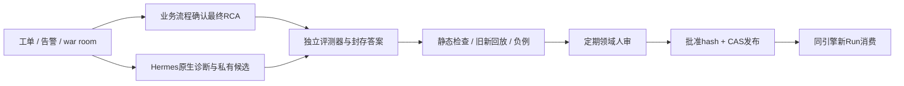

# 以最终根因为门禁的Hermes原生进化：路线建议 v2

2026-10-09。用户新增业务事实：专家系统处理工单、告警、war room，内部流程最终填写根因。来源是用户报告；本轮没有读取内部接口/记录，实际字段、确认状态与根因质量仍UNKNOWN。

**本轮推荐：以内部经确认的最终RCA为业务监督信号，保留Hermes原生候选生成；由根因对照/行为回放/定期领域人审控制正式知识和Skill的合入。** 优先小范围修改原生受管写入与approve路径，采用成熟评测/优化组件作为可选能力；此前低星插件作为参考与原型，不建议成为核心发布权威。此为建议，用户尚未正式定选；没有实施原生改动、接入内部系统或运行业务评测。

此文把[质量门禁v1](native-evolution-quality-gates-v1.md)的通用独立真值来源具体化为最终RCA，未撤销静态、安全、作用域、人审与发布门禁。预算沿用已应用3GiB硬/2.5GiB高水位，继续不启动服务/模型。新版[结构化合同](evolution-quality-contract-v2.json)、[第一方来源与社区规模快照](rca-evolution-route-sources-v1.json)。

## 根因门禁和定期人审相互配合

最终RCA是本案诊断结论的首要参考；trace用于还原Agent看到了什么、做了什么、在哪一步发生偏差。根因对照的价值是发现“流程跑通、结论却错”的学习；人工合入审查则判断从个案提出的通用规则是否成立、前提/例外是否完整、方法是否安全。

建议自动完成关联、候选、静态检查和可执行评测；候选一直pending，按周期交领域维护者审查后合入。可以先每周安排一个批次，具体周期由业务量与评审容量确定；改变修复操作/权限/升级规则等高影响内容要专门review。合入后的抽查用于发现残余错误，不能替代合入前审批。缺评审能力时暂停晋升，不自动默认为批准。

[Google SRE复盘实践](https://sre.google/sre-book/postmortem-culture/)把根因、缓解/解决动作和后续行动分别记录，并要求正式审查与发布；这支持把“根因已填”与“结论/行动已经被复核”分开。[云事故RCA研究](https://arxiv.org/abs/2401.13810)也使用真实事故负责人评价诊断正确性；不是我们的效果证明。

## 最终根因如何成为可用的验收答案

1. **确认版本与身份**：进入golden pool的RCA应有责任人确认状态、根因版本、时间和证据链接；未确认、重开、冲突或仅写“系统异常”的记录保持待审。用户说有最终字段，不代表本轮已核实每条都经人审。
2. **关联同一事件**：工单、告警、war room、原生Run、报告版本对应同一incident；一场事故的几十个告警不是几十个独立样本。可靠instance/engine/project/时间范围不可由自由文本猜测。
3. **区分证据与答案**：回放输入是诊断当时可得的告警/日志/指标/对话/MCP证据；最终RCA仅交给评测器。不得提前向Agent、RAG或工具暴露holdout答案及事后war room总结。
4. **分离开发与验收**：按incident族群和时间拆分train/dev/holdout，同事件追问、重复告警和同一事故衍生票据不能跨split；候选生成只看开发样本，最终验收集固定。
5. **防止互相确认**：如果最终根因复制自Agent报告、尚无人独立核实，不是独立监督。模型可以把长RCA标准化为类别/因果链，但生成的标签转换需要复核或可信规则，不能取代来源。
6. **根因变更要传播**：RCA被纠正/撤回时，关联旧评测报告和从它学习的资产应失效/待重审；新Run不继续把旧标签当权威。

所需标准化信息：incident_id、ticket/alert/warroom关联、rca_revision、确认状态/责任人/时间、根因及促成因素、版本/实例/scope、证据、实际缓解/永久修复。这些是适配合同需求，不宣称内部系统已经使用同名字段。

## 三件事不能由“根因相同”一并证明

| 评价对象 | 最终RCA的作用 | 还需要什么 |
|---|---|---|
| 本案事实知识 | 验证根因与因果链、对象/时间/版本；批准为有范围的历史案例 | RCA确认、原证据、冲突处理；不是把案例当普遍规则 |
| 通用排查Skill | 作为多案例的预期结论，并指出旧版误判 | 实际排查行为、相似症状不同根因的负例、前提/例外、跨事件holdout、人审 |
| 修复/自动动作Skill | 根因帮助判断该采取什么动作 | 审批/权限、状态前后效果、业务副作用、失败退出/回滚；根因猜对不豁免这些门禁 |

例如最终RCA是长期事务造成锁等待。旧版误判资源问题，重启后症状消失；不能因此提炼“慢查询需要重启”。候选应改变实际行为：先查锁链与事务，并在证据不足时继续取证；负例必须包含同样慢查询但由执行计划退化等原因造成的事件。即使给出正确根因，也不能凭空终止事务或重启服务。

根因一致性应检查类别、具体组件/实例、关键因果链、促成因素及证据一致性；自由文本同义改写可由校准过的judge辅助判读。文本相似度与标签名称命中不足以通过。领域关键错误、危险动作、权限违规不能被整体准确率或平均分抵消。

没有历史MCP/工具状态快照时，可以先做报告结论对照和专家审查，但需明确它不是完整工具/业务行为回放。不能把文本重评称为真实诊断链重验。

## 可选项目：规模更大，但职责不同

2026-10-09 GitHub API现场快照，星数只反映社区规模；不是生产质量证明。准确快照与检索边界见[来源账本](rca-evolution-route-sources-v1.json)。

| 组件 | 快照星数 | 适合负责什么 | 在本方案的位置 |
|---|---:|---|---|
| [GEPA](https://github.com/gepa-ai/gepa) | 6,910 | 根据外部evaluator的分数/错误反馈探索文本候选 | 有稳定RCA评测后，按需优化Skill；不用优化器定义根因真值 |
| [Langfuse](https://github.com/langfuse/langfuse) | 35,538 | 数据集/实验对比/专家标注队列与自定义评测，支持self-hosted工作流 | 审查量增长时辅助人审和结果查看；正式审批/发布权仍在业务系统 |
| [Promptfoo](https://github.com/promptfoo/promptfoo) | 25,820 | 确定性/自定义断言、批量评测与CI | 可作回放门禁runner；需真正调用Hermes/我们的领域适配，不能只测一段裸模型提示 |
| [Nous独立self-evolution](https://github.com/NousResearch/hermes-agent-self-evolution) | 5,480 | Hermes专门优化作业方向 | 仍是Phase1/若干静态疑点的研究候选，星数高于小插件不代表完整闭环交付 |
| Curator Evolver / Carlo / smarter-agent | 45 / 6 / 9 | 原生collector、门禁原型、行为验证协议 | 可借鉴选读部分，当前不建议做不可替代的生产依赖 |

[Langfuse官方说明](https://langfuse.com/docs/evaluation/overview)支持expected-output数据集、自动/人工评分、实验与CI；[标注队列](https://langfuse.com/docs/evaluation/evaluation-methods/annotation-queues)适合领域专家补纠正/意见。[Promptfoo断言](https://www.promptfoo.dev/docs/configuration/expected-outputs/)支持结构/确定性与自定义函数。它们不会自动理解你们的根因口径，也不代替人审或Hermes原生写入控制。

首期建议复用已有Manager/内部CI和轻量领域evaluator；有明确需求再接一个评测/审核组件。无需同时部署上述平台，本轮也未测其在当前3GiB预算里的容量。GEPA优化作业与原生反思共用预算/互斥，不并行拉起多个模型。

## 直接修改原生流程，修改什么

固定Hermes SHA `345cd2b057a452236de401d3534b8502a7465e8d`。候选生成入口是`agent/background_review.py`，写控制在`tools/skill_manager_tool.py`/`tools/write_approval.py`，人工approve路径在`hermes_cli/write_approval_commands.py`。这些是源码定位，尚未在上游检出或实际Home写补丁。

建议对受管节点引入共享的candidate writer/发布检查：

- 原生前台/后台反思可创建私有pending；正式业务Memory与Skill写入必须变成candidate，正式版本保持只读。
- 内部RCA确认事件通过业务接入/MCP关联Run与报告，触发候选对照和有限评测；session结束不再等于业务学习完成。
- 评测执行器绑定候选hash、旧版本、RCA版本、题集与评分器版本；人审看到业务失败原因、完整diff、正/负例变化。
- `/skills approve`、Memory审批、API、Curator和sync的正式生效都经过同一晋升检查；不能从某个approve路径直接绕过业务验收。外部终端/脚本写靠物理只读和独立发布身份保护。
- 通过后CAS发布远端WeKnora指针并读回；新Run固定获批版本；学习草稿与最终答案不参与正常RAG，仍不跨引擎抽取公共知识。

优先用原生审批/插件扩展；当其公开接口不能保证状态/写入口闭合时，对共同写口做小范围核心补丁。将RCA接入、评价口径和评测器置于业务适配层，减少上游版本维护负担。实际实现使用隔离checkout/派生版本，不改已有共享Hermes环境来验证。

## 当前选择与下一步边界

| 路线 | 本轮建议 |
|---|---|
| 直接采纳低星自进化插件作为整链 | 不建议作为生产基础；参考或隔离原型 |
| 原生生成 + RCA监督 + 轻量受管写口 + 定期人审 | **首选建议**，最贴合已有业务事实与资产发布合同 |
| 首选路线加GEPA搜索 | 可选后续增强，先有可信评测与holdout |
| 首选路线加Langfuse或Promptfoo | 按审核/评测管理需求选一个补能力，需另验部署/许可与内部适配 |

F11不再笼统描述为“完全没有领域答案”：已有最终RCA来源为USER_REPORTED。但数据关联、读取权限、独立确认、题集与效果阈值尚未验证；仍没有真实领域质量结果。I01脚本权限隔离、I02双节点实测和I03候选/真实评测链依然未完成。

本轮完成路线研究/持久化；没有用户正式选型、原生补丁、内部RCA读取、模型调用或质量提升实证。质量/实现状态保持PROPOSED/NOT_RUN。下一步：业务接入维护者核对RCA关联与确认字段，领域维护者认领真值/负例；Core先修I01再实施受管候选与统一写入检查；Manager/知识维护者闭合评测、人审、发布和撤回链。
